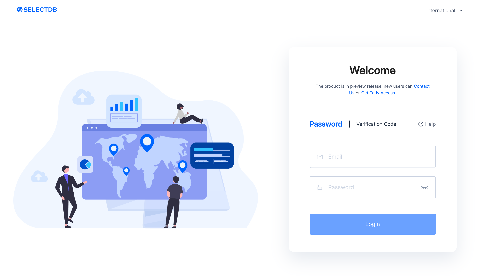
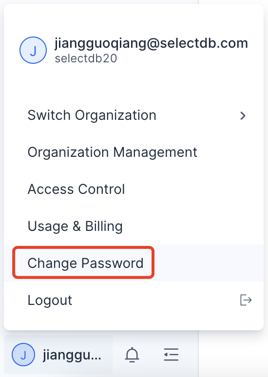
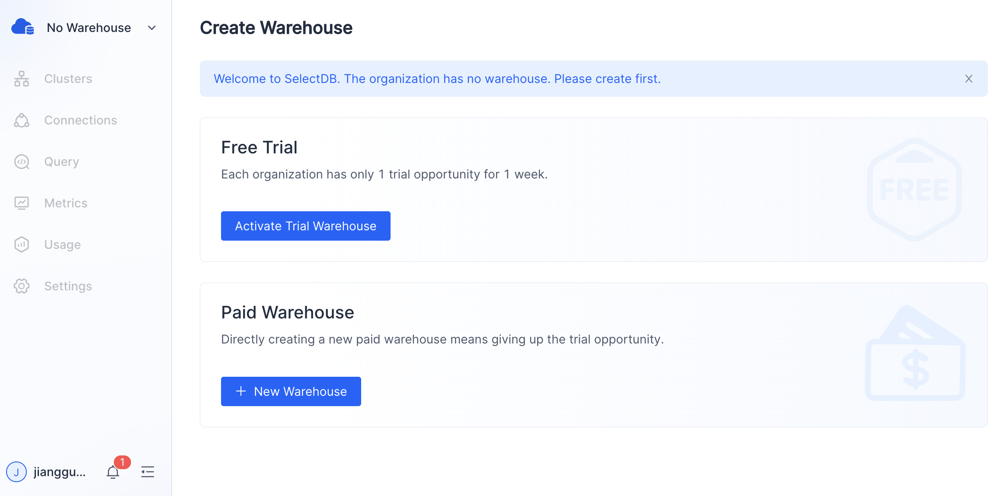
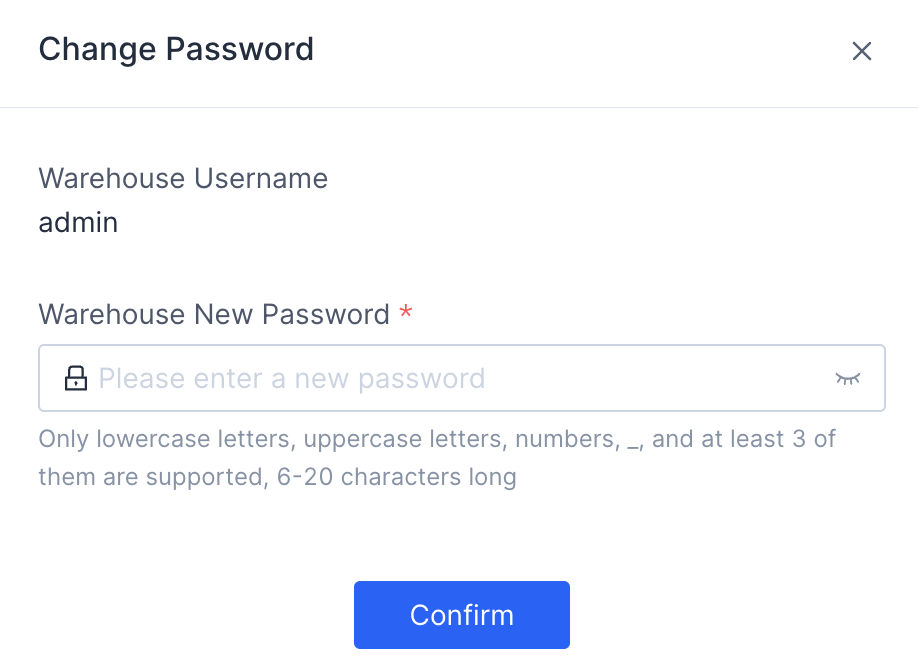
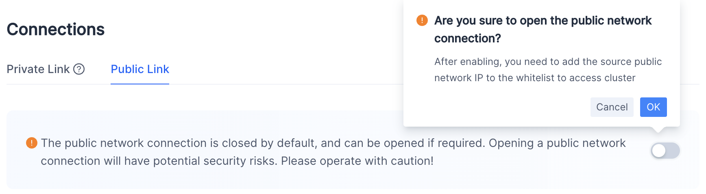
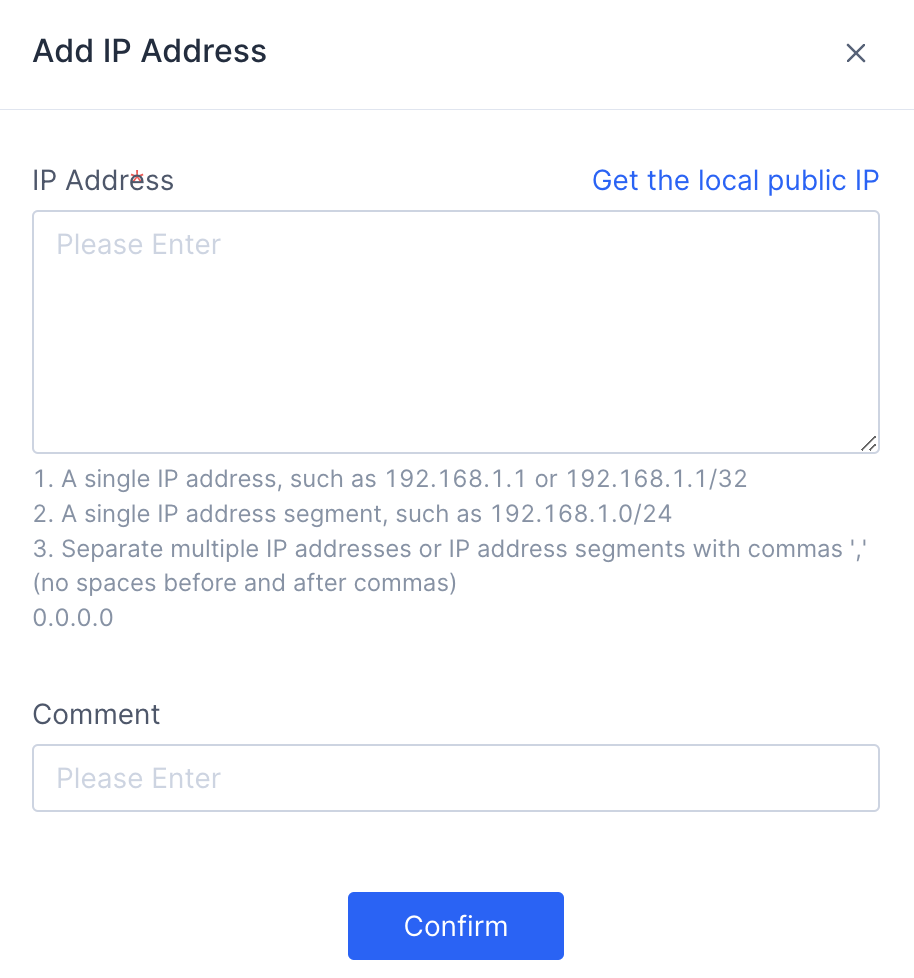

# Getting Started

## New User Registration and Organization Creation

### User Login

SelectDB Cloud supports a login-as-registration scheme. Registration is done the first time you log in with a verification code. Registered users can log in with a verification code or a password.

Click [http://en.selectdb.cloud](http://en.selectdb.cloud/) to enter the SelectDB Cloud International login page.




### Create Organization

Organization is the billing unit. Each organization will be billed individually. We recommend that you divide organizations by cost unit, and one user can be affiliated to multiple organizations. Multiple warehouses can be created under one organization.

If you haven't been a member of any organizations, after login, you will see a wizard page about how to create your first organization.

### Change Password

After login, click **User Menu** > **Change Password** to change the login password for the SelectDB Cloud console.



Once you have successfully changed the password for the first time, you can use the password for subsequent logins.


## Warehouse and Cluster Creation

In SelectDB Cloud, the warehouse is a logical concept that includes physical objects such as warehouse metadata, clusters, and data storage.

Under each organization, you can create multiple warehouses to meet the needs of different business systems, and the resources and data between these warehouses are isolated.

### Create Warehouse and Cluster

A wizard page will be displayed if the organization does not have a warehouse. You can create the first warehouse following the prompts.



You can choose to **Activate Trial Warehouse** for a free trial. Each organization gets a 7-day free trial. 

### Cluster

If you have activated the trial warehouse,  you will see a trial cluster in that warehouse.

In the trial warehouse, you may try the features by importing small amounts of data. You may not create paid clusters under the trial warehouse. If you are happy with the trial experience, you can upgrade the trial warehouse to a paid one, and then you can create paid clusters under the paid warehouse.

## Change Warehouse Password

The username and password are required when connecting to a warehouse. SelectDB Cloud initializes the user name ('admin') and password for you. You can change the password on the **Settings** page.



**Warning** The password only supports lowercase letters (a-z), uppercase letters (A-Z), numbers (0-9), and underscores (_). The password must be a combination of at least three of the above symbol types, with a length of 6-20 characters.


## Connect to Warehouse Using MySQL Client

### Enable Public Link

You may enable public link on the SelectDB Cloud console.

On the **Connections** page, switch to the **Public Link** tab to open the public network connection.



**IP Whitelist Management**

After the user opens the public network connection, an IP whitelist appears on the page. Click **Add** to add new IP addresses.



In the IP whitelist, users can add or delete IP addresses to enable or disable their access to the warehouse.

### MySQL Client

You may download MySQL Client from the official website of MySQL. [Here we provide a Linux-free version of [MySQL Client](https://doris-build-hk.oss-cn-hongkong.aliyuncs.com/mysql-client/mysql-5.7.22-linux-glibc2.12-x86_64.tar.gz); if you need MySQL Client for Mac and Windows, please go to the MySQL official website.]

Currently, SelectDB is compatible with MySQL Client 5.7 and above.

You may read details about connections by clicking "Connections" on the target warehouse on the SelectDB Cloud console. 


> Note:
>
> 1. Warehouses support public link and private link, and the details of them might differ.
>
> 2. If you have enables the IP Whitelist, you need to add the Client IP address to the whitelist for warehouse connection.
>
> 3. SelectDB Cloud initializes the user name ('admin') and password for you. You can change the password on the **Settings** page of the corresponding warehouse.

Supposing that you are connecting to a warehouse using the following public link:


Download MySQL Client and unzip the file, find the `mysql` command line tool under the `bin/` directory. Execute the folowing command to connect to SelectDB.

```bash
mysql -h 59.110.10.92 -P 11827 -u admin 
```

After login, if you see the following snippet, that usually means that your Client IP address has not been added to the connection whitelist on the console.

```bash
ERROR 2013 (HY000): Lost connection to MySQL server at 'reading initial communication packet', system error: 2
```

If the following is displayed, that means the connection succeeds.

```bash
Welcome to the MySQL monitor.  Commands end with ; or \g.
Your MySQL connection id is 119952
Server version: 5.7.37 SelectDB Core version: 2.0.0

Copyright (c) 2000, 2022, Oracle and/or its affiliates.

Oracle is a registered trademark of Oracle Corporation and/or its
affiliates. Other names may be trademarks of their respective
owners.

Type 'help;' or '\h' for help. Type '\c' to clear the current input statement.

mysql> 
```


## Create Database and Table

### Create Database

```sql
create database demo;
```

### Create Table

```sql
use demo;

create table mytable
(
    k1 TINYINT,
    k2 DECIMAL(10, 2) DEFAULT "10.05",
    k3 CHAR(10) COMMENT "string column",
    k4 INT NOT NULL DEFAULT "1" COMMENT "int column"
)
COMMENT "my first table"
DISTRIBUTED BY HASH(k1) BUCKETS 1;
```

You may check details of `mytable` via  `desc mytable`.

### Load Data

Save the following sample data in the local data.csv:

```
1,0.14,a1,20
2,1.04,b2,21
3,3.14,c3,22
4,4.35,d4,23
```

Supposing that you are connecting to a warehouse using the following public link:


**Upload data via HTTP protocol**:

```bash
curl -u admin:admin_123 -H "fileName:dir1/data.csv" -T data.csv -L '59.110.10.92:41686/copy/upload'
```

You can call and upload multiple files be repeating this command.

**Load data by the copy into command:**

****

```bash
curl -u admin:admin_123 -H "Content-Type: application/json" '59.110.10.92:41686/copy/query' -d '{"sql": "copy into demo.mytable from @~(\"dir1/data.csv\") PROPERTIES (\"file.column_separator\"=\",\", \"copy.async\"=\"false\")"}'
```

`dir1/data.csv` refers to the file uploaded in the previous step. Wildcard and glob pattern matching are supported here.

The service side can automatically identify general formats such as csv.

`file.column_separator=","` specifies comma as the separator in the csv format。

Since the copy into command is submitted asychronously by default,  `"copy.async"="false"`  is specified here to implement synchronous submission. That is, the command will only return after the data are loaded successfully.

If you see the following response, that means the data are successfully loaded.

```bash
{"msg":"success","code":0,"data":{"result":{"msg":"","loadedRows":"4","id":"d33e62f655c4a1a-9827d5561adfb93d","state":"FINISHED","type":"","filterRows":"0","unselectRows":"0","url":null},"time":5007,"type":"result_set"},"count":0}%  
```

## Query Data

After table creation and data loading, you may execute queries on the data. 

```sql
mysql> use demo;
Reading table information for completion of table and column names
You can turn off this feature to get a quicker startup with -A

Database changed
mysql> select * from mytable;
+------+------+------+------+
| k1   | k2   | k3   | k4   |
+------+------+------+------+
|    1 | 0.14 | a1   |   20 |
|    2 | 1.04 | b2   |   21 |
|    3 | 3.14 | c3   |   22 |
|    4 | 4.35 | d4   |   23 |
+------+------+------+------+
4 rows in set (0.15 sec)
```