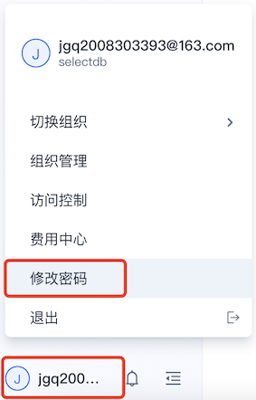

# 快速开始

## 注册用户和创建组织

### 用户登录

SelectDB Cloud 支持登录即注册方案，新用户第一次使用邮箱验证码登录即为注册。已注册用户可通过验证码和密码两种方式进行登录。

点击 [http://cn.selectdb.cloud](http://cn.selectdb.cloud/) 进入 SelectDB Cloud 中国站登录页面。


### 建立组织

组织是计费单位，同一组织下共享账单。我们推荐你以**成本结算单位**划分组织，一个用户可以属于多个组织。一个组织下可以创建多个仓库。

用户登录后，如果没有加入过任何组织，会提示用户建立自己的第一个组织。

### 修改密码

用户登录后，可以点击 **用户菜单** > **修改密码** ，修改 SelectDB Cloud 控制台的登录密码。



新用户第一次修改密码成功后，后续即可使用密码方式登录了。


## 创建仓库和计算集群

在 SelectDB Cloud，仓库是一个逻辑概念，包括仓库元数据、集群、数据存储这些物理对象。每个组织可以创建多个仓库，仓库之间资源和数据相互隔离，以满足不同业务系统的需要。

### 创建仓库

当前的组织尚无仓库时，会进入一个引导页，你可以参照提示创建第一个仓库。


你可以选择 **激活试用仓库** 免费试用。每个组织只有 1 次试用机会，试用时长为 1 周。

### 计算集群

激活试用仓库后，同时会为你建立第一个试用计算集群。

试用仓库仅适用于小规模数据量场景下的功能体验，试用仓库不能创建付费集群，如果已完成试用体验，可以转成付费仓库，转换成功后，方可创建付费集群。

### 修改仓库admin密码

连接仓库时需要用户名和密码，SelectDB Cloud 帮用户初始化了仓库的 admin 用户名及其密码。用户可以在 **设置** 页修改密码。


> **注意** 密码仅支持小写字母、大写字母、数字、_ ，并且至少包含其中 3 种，长度 6-20 字符。


## 使用MySQL Client连接仓库

### 允许公网连接

在管理控制台上，打开公网连接。

在连接页，切到 **公网连接** Tab 中可以开通公网连接。


**IP 白名单管理**

开通公网连接后，页面出现 IP 白名单列表，单击列表右上角的  **添加** ，增加新的 IP 白名单。


在 IP 白名单管理过程中，你可以添加 IP 地址（授予其连接访问 SelectDB Cloud 仓库公网 IP 的权限），删除已有的 IP 地址（取消其连接访问 SelectDB Cloud 仓库公网 IP 的权限）。

### 使用MySQL Client连接

从MySQL官方网站下载MySQL Client【或者下载我们提供的免安装Linux的 [MySQL 客户端](https://doris-build-hk.oss-cn-hongkong.aliyuncs.com/mysql-client/mysql-5.7.22-linux-glibc2.12-x86_64.tar.gz)，Mac和Windows上的MySQL Client请从MySQL官方网站下载】。

当前SelectDB主要兼容MySQL 5.7及其以上的客户端。

从SelectDB Cloud的管理控制台中需要连接的仓库下的“连接”中，获得连接相关的信息。

> 注意：
>
> 1. 仓库支持公网连接和私网（Privatelink）连接，不同的连接方式，连接信息不同
>
> 2. 如果开启了IP白名单，需要让将客户端的IP加入仓库连接的白名单。
>
> 3. SelectDB Cloud帮用户初始化了仓库的 admin 用户名及其密码。用户可以在管理控制台相应的仓库 **设置** 页修改密码。

假如我们要连接的仓库公网连接如下：


解压下载的 MySQL 客户端，在 `bin/` 目录下可以找到 `mysql` 命令行工具。 然后执行下面的命令连接 SelectDB。

```bash
mysql -h 59.110.10.92 -P 11827 -u admin 
```

登录后，如果显示如下，一般是由于你客户端的IP未加入到管理控制台的连接白名单中。

```bash
ERROR 2013 (HY000): Lost connection to MySQL server at 'reading initial communication packet', system error: 2
```

显示如下，则代表你连接成功了。

```bash
Welcome to the MySQL monitor.  Commands end with ; or \g.
Your MySQL connection id is 119952
Server version: 5.7.37 SelectDB Core version: 2.0.0

Copyright (c) 2000, 2022, Oracle and/or its affiliates.

Oracle is a registered trademark of Oracle Corporation and/or its
affiliates. Other names may be trademarks of their respective
owners.

Type 'help;' or '\h' for help. Type '\c' to clear the current input statement.

mysql> 
```


## 创建数据库和数据表

### 创建一个数据库

```sql
create database demo;
```

### 创建数据表

```sql
use demo;

create table mytable
(
    k1 TINYINT,
    k2 DECIMAL(10, 2) DEFAULT "10.05",
    k3 CHAR(10) COMMENT "string column",
    k4 INT NOT NULL DEFAULT "1" COMMENT "int column"
)
COMMENT "my first table"
DISTRIBUTED BY HASH(k1) BUCKETS 1;
```

可以通过desc mytable看到mytable的字段情况。

### 导入数据

将以下示例数据，保存在本地的data.csv

```
1,0.14,a1,20
2,1.04,b2,21
3,3.14,c3,22
4,4.35,d4,23
```

假如我们要连接的仓库公网连接如下：


**使用http协议来上传数据:**

```bash
curl -u admin:admin_123 -H "fileName:dir1/data.csv" -T data.csv -L '59.110.10.92:41686/copy/upload'
```

这里也可以反复多次调用上传多个文件。

**发送copy into命令导入数据：**

```bash
curl -u admin:admin_123 -H "Content-Type: application/json" '59.110.10.92:41686/copy/query' -d '{"sql": "copy into demo.mytable from @~(\"dir1/data.csv\") PROPERTIES (\"file.column_separator\"=\",\", \"copy.async\"=\"false\")"}'
```

其中dir1/data.csv是刚才上传的文件，这里可以使用wildcard通配符，支持glob模式匹配。

服务端会自动识别csv等一些通用格式。

通过file.column_separator=",", 指定csv格式使用逗号分隔。

"copy.async"="false", 因为copy into默认为异步提交，这里指定为false，代表采用同步提交，即等待数据导入成功后，才返回。

看到如下响应，即表示成功。

```bash
{"msg":"success","code":0,"data":{"result":{"msg":"","loadedRows":"4","id":"d33e62f655c4a1a-9827d5561adfb93d","state":"FINISHED","type":"","filterRows":"0","unselectRows":"0","url":null},"time":5007,"type":"result_set"},"count":0}%  
```

## 查询数据

上面完成了建表和数据导入，下面就可以对其进行查询了。

```sql
mysql> use demo;
Reading table information for completion of table and column names
You can turn off this feature to get a quicker startup with -A

Database changed
mysql> select * from mytable;
+------+------+------+------+
| k1   | k2   | k3   | k4   |
+------+------+------+------+
|    1 | 0.14 | a1   |   20 |
|    2 | 1.04 | b2   |   21 |
|    3 | 3.14 | c3   |   22 |
|    4 | 4.35 | d4   |   23 |
+------+------+------+------+
4 rows in set (0.15 sec)
```
