In each paid warehouse, you can create multiple clusters to support different workloads, such as writing data, customer-facing reporting, user profiles, and behavior analytics.

Clusters only contain computing resources and cache data, and clusters of the same warehouse share the data storage.

## New Cluster

To create a new cluster in a paid warehouse, you can click **Clusters** on the navigation bar. If there is no existing cluster in the current warehouse, a wizard page will be displayed.

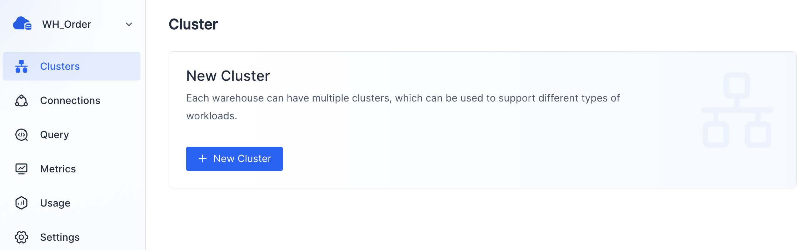

If there is, you will see the Cluster Overview page.

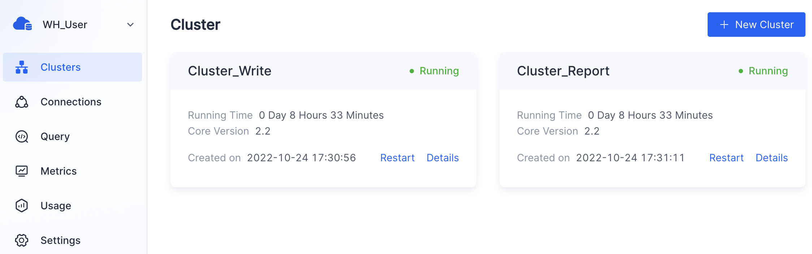

Click **New Cluster** on the wizard page or Cluster Overview page to create a new cluster.

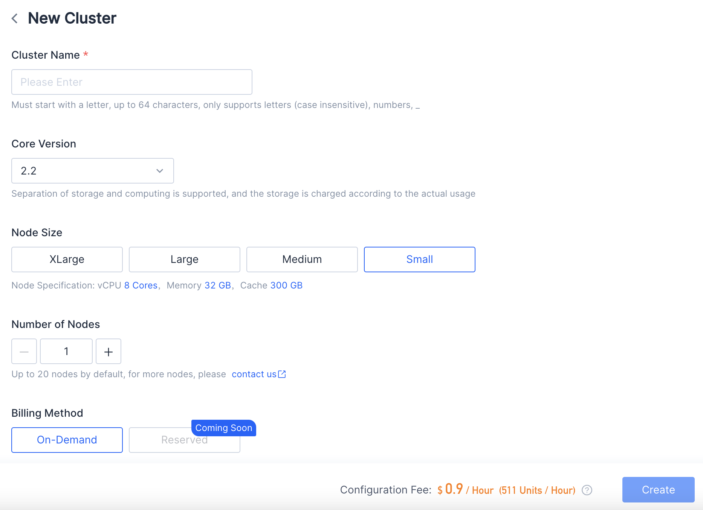

| **Parameter**   | **Description**                                              |
| --------------- | ------------------------------------------------------------ |
| Cluster Name    | Required. Must start with a letter, no more than 64 characters in length, only supports letters (case insensitive), numbers, and "_". |
| Core Version    | Required. SelectDB Core 2.0 and the later versions support the separation of storage and computing. Storage is billed based on actual usage, and there is no need to pre-configure capacity space. |
| Node Size       | Required. Supports 4 node sizes: XLarge, Large, Medium, and Small. |
| Number of Nodes | Required. No more than 20 nodes by default. If you need more than that, please [Contact us](https://en.selectdb.com/company#anchor). |
| Billing Method  | Required. For scenarios that need to be flexibly changed or deleted at any time, such as temporary test verification, you can choose the **On-Demand** clusters. For long-term stable use scenarios, such as a production environment, it is more cost-effective to choose the **Reserved** clusters (coming soon). |

The specifications of node sizes are as follows:

| **Node size** | **vCPU** | **Memory (GB)** | **Cache (GB)** |
| ------------- | -------- | --------------- | -------------- |
| Small         | 8        | 32              | 300            |
| Medium        | 16       | 64              | 600            |
| Large         | 32       | 128             | 1200           |
| XLarge        | 64       | 256             | 2400           |

> **Note**
>
> 1.Some regions or zones may not support this.
>
> 2.After confirming the creation, you can see the new cluster on the **Cluster overview** page. It takes about 1 minute to complete the creation, and the cluster status will change from "**Creating**" to "**Running**".

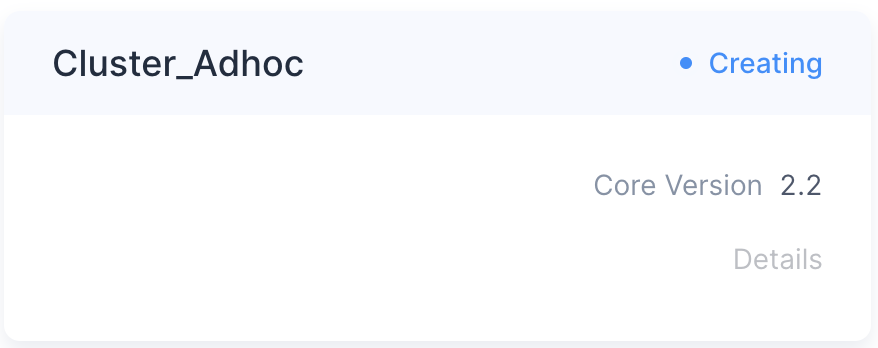

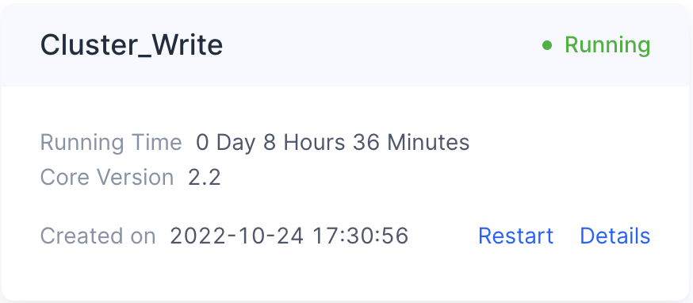

Creating a new cluster will incur a charge. Therefore, before creation, please ensure sufficient remaining **Units** or activate another deduction channel. Otherwise, you will see the following error prompt.

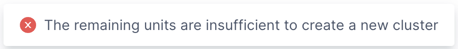
## Cluster Details

You can find the target cluster card on the cluster overview page and click **Details**.

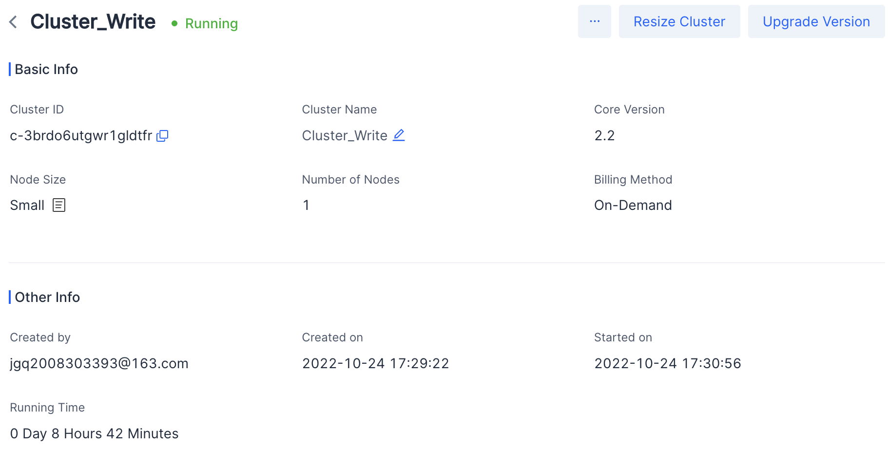

Cluster details include the following information:

| **Parameter**   | **Description**                                              |
| --------------- | ------------------------------------------------------------ |
| Cluster ID      | The globally unique ID of the cluster.                       |
| Cluster Name    | It is unique in a warehouse. If you need to modify the cluster name, you can edit and modify it directly in the original place. It is recommended that the class name is meaningful.After connecting to the warehouse, you can choose the cluster to use through SQL: use cluster [cluster name]The cluster name must start with a letter. It can be 64 characters at most. It only supports letters (case insensitive), numbers, _ |
| Core Version    | The version of SelectDB Core. If the current version is too low, you can directly click**Upgrade Version**to upgrade to the target version. |
| Node Size       | Displays the current node size of the cluster. If the performance or cache space of the current node size does not meet the business requirements, you can delete the cluster and create a new cluster configured with other node sizes. |
| Number of Nodes | Displays the current number of nodes of the cluster. If the current cluster is a paid cluster, you can directly click**Resize** **Cluster**to increase or decrease the number of nodes. |
| Billing Method  | Displays the current billing method.                         |
| Created by      | The user who created the cluster. Multiple users in the same organization can perform corresponding operations on warehouses and their clusters according to their privileges. |
| Create on       | The time when the cluster was created.                       |
| Start on        | The time when the cluster was last started.                  |
| Running Time    | The running time of the cluster since it was last started.   |
| Expire on       | The trial cluster and the**Reserved**cluster (coming soon) will have an expiration time. Users may need to upgrade payment or renew before the cluster expires. |

## Restart  Cluster

You can find the target cluster card on the **Cluster Overview** page and click **Restart**. When restarting, you cannot perform other operations on the cluster.

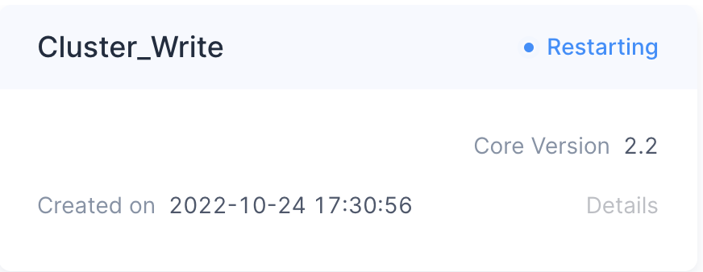

> **Note** It takes about 1 minute for the cluster to restart. When it is done, the cluster status will change from "**Restarting**" to "**Running**".

## Resize Cluster

Based on your business requirements, you can increase or decrease the number of nodes to adjust the capacity of the current cluster.

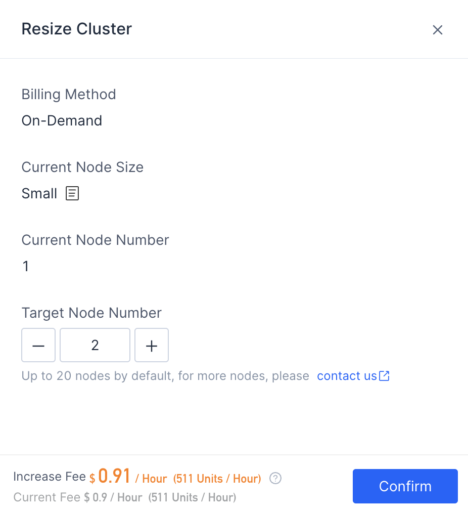

It takes about 1 minute to complete, and the cluster status will change from "**Resizing**" to "**Running**".

You can also delete the cluster and create a new cluster with reconfigured node size and node number to meet your business needs.

> **Warning** The trial cluster does not support resizing.

## Upgrade Version

If the version of the current cluster is too low to meet the business requirements, or you want to experience new features, you can click **Upgrade Version** to upgrade the cluster.

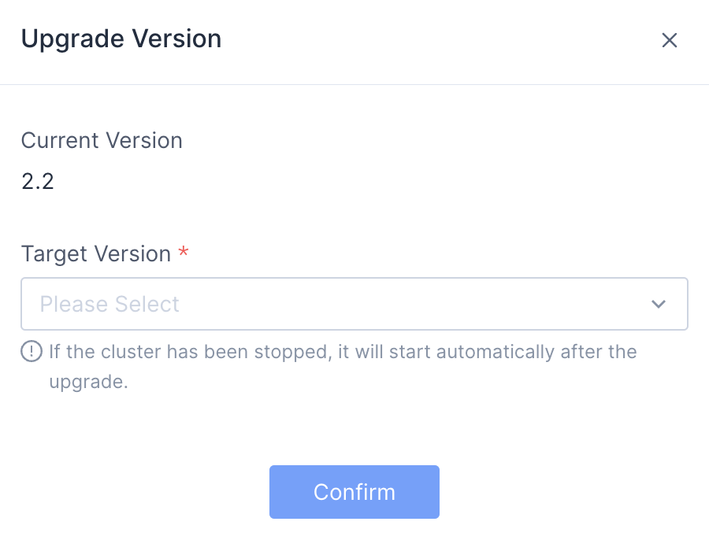

It takes about 1 minute to complete, and the cluster status will change from "**Upgrading**" to "**Running**".

## Delete Cluster

If you no longer need the current cluster, you can delete it by clicking **Delete Cluster.**

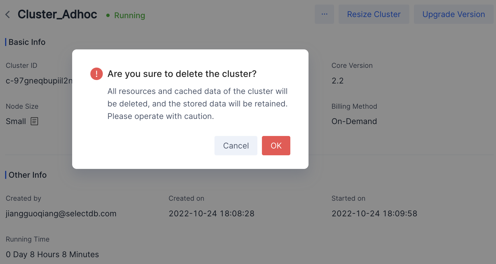

> **Warning** Deleting a trial cluster means to give up the trial opportunity and all related resources and cache data will be released. New cluster creation is not supported in a trial warehouse.