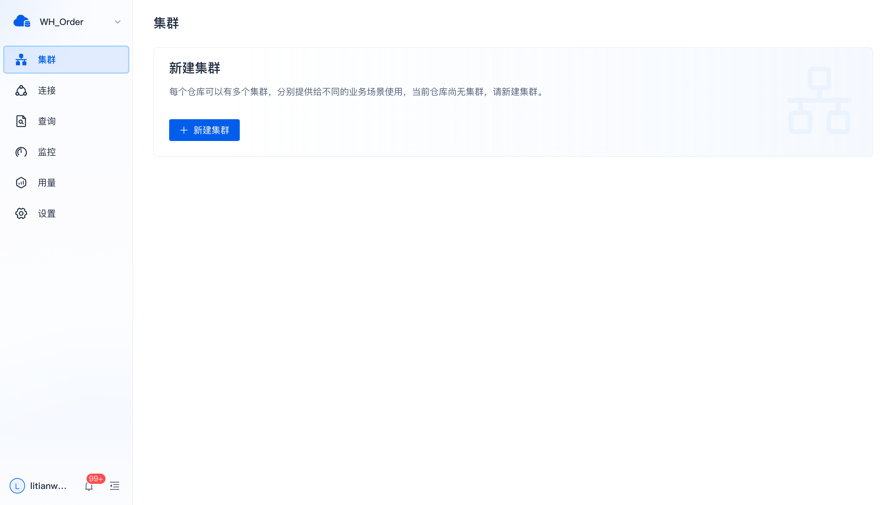
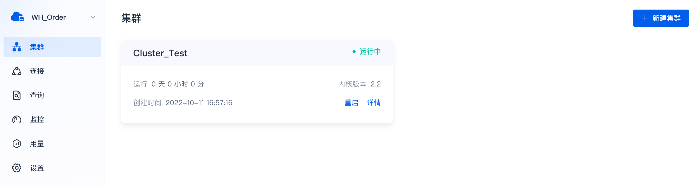
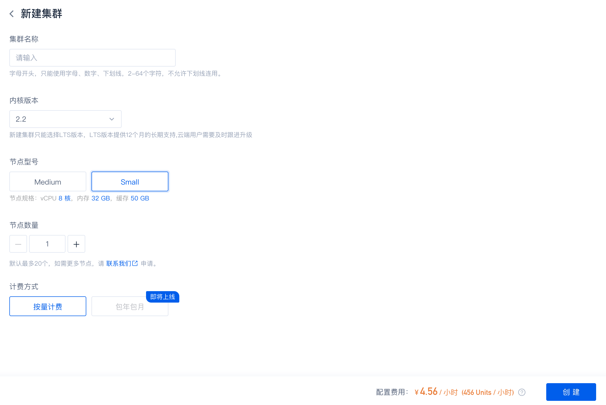
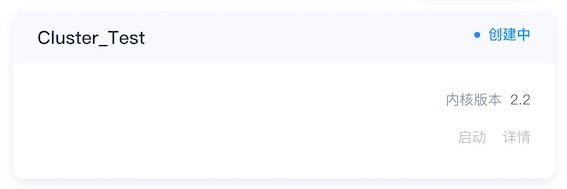
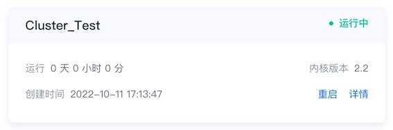
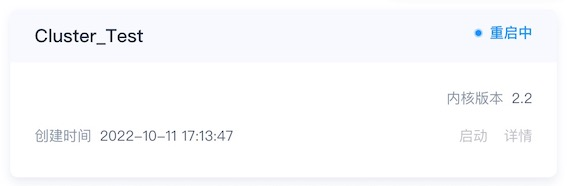
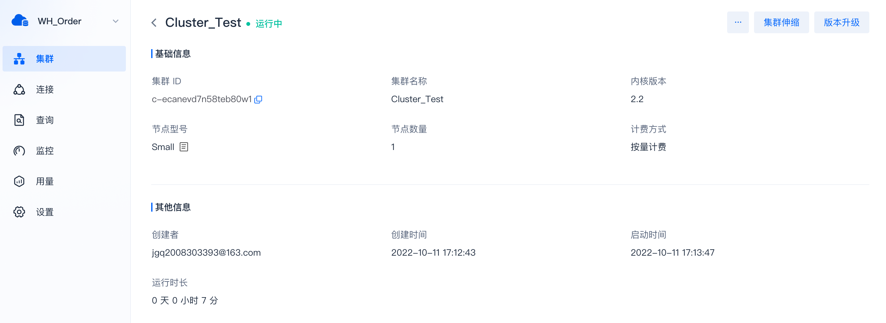
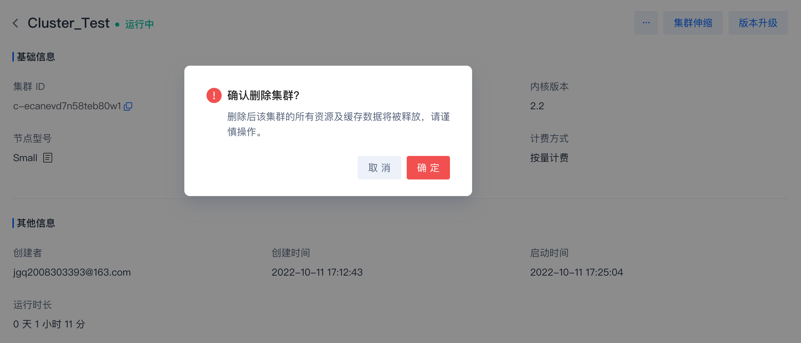

# 集群管理

在 SelectDB Cloud，集群只包含计算资源和缓存数据，同一仓库的多个集群共享数据存储。每个付费仓库都可以有多个集群，可以用于支持不同的工作负载，如写入、报表查询等。

需要灵活变更或者随时删除的场景（如：临时测试验证），可选择按量计费方式；长期稳定使用的场景（如：生产环境），选择包年包月更优惠。

## 新建集群

当前仓库为付费仓库且无集群时，单击左侧导航栏的  **集群** ，会进入一个新建集群引导页。

如果当前仓库有至少 1 个集群，则会进入集群概览页。

在新建集群引导页或者集群概览页，单击  **新建集群** ，进入集群配置页。

| **参数** | **说明**                                                     |
| -------- | ------------------------------------------------------------ |
| 集群名称 | 必填项。当前仓库内唯一，必须字母开头，最多 64 个字符，只支持包含字母（大小写不敏感）、数字、_ |
| 内核版本 | 必选项。SelectDB Core 的版本，从 2.0 版本开始，支持存算分离，共享存储，数据存储性价比高，按实际使用量计费，无需预先配置容量空间。 |
| 节点型号 | 必选项。支持 4 种型号，分别为：XLarge、Large、Medium、Small。 |
| 节点数量 | 必填项。最少 1 个，默认最多 20 个，如需更多节点，请[联系我们](https://cn.selectdb.com/company#anchor)申请。 |
| 计费方式 | 必选项。目前支持按量计费、包年包月。需要灵活使用随时删除的场景（如：临时测试验证），可选择按量计费；长期稳定使用的场景（如：生产环境），选择包年包月更优惠。 |

新建集群会产生费用，因此在创建之前，请确保 Units 余额充足或者已开通使用其他扣费渠道，否则会报错。

各节点型号规格配置如下：

| **节点型号** | **vCPU（核）** | **内存（GB）** |
| ------------ | -------------- | -------------- |
| Small        | 8              | 32             |
| Medium       | 16             | 64             |
| Large        | 32             | 128            |
| XLarge       | 64             | 256            |

> **说明**
>
> * 不同云厂商节点的缓存大小可能不同
> * 云厂商的部分地域或可用区可能不支持
> * 确认创建后，用户就可以在集群概览页中看到新建的集群，状态为“创建中”，需要约 1 分钟完成创建。创建完成后，集群状态会从“创建中”变为“运行中”。

## 重启集群

如果你需要重启集群，可以在集群概览页，找到目标集群卡片后点击 **重启**即可。集群状态会变为“重启中”，此时不可以对集群进行其他操作。

> **说明** 集群需要约 1 分钟完成重启。重启完成后，集群状态会从“重启中”变回“运行中”。

## 集群详情

如果你想要了解集群详细信息，可以在集群概览页，找到目标集群卡片后单击  **详情** **。**

集群详情包括集群 ID、集群名称、内核版本、节点型号、节点数量、计费方式、创建者、创建时间、启动时间、运行时长、到期时间等信息。具体说明如下：

| **参数** | **说明**                                                     |
| -------- | ------------------------------------------------------------ |
| 集群 ID  | 当前仓库内唯一，与 SelectDB Core 编码规则一致。              |
| 集群名称 | 当前仓库内唯一，如果需要修改集群名称，可以在原地直接编辑修改，输入新的集群名称（建议命名能够见名知意），回车确认即可。注意：SelectDB Core 语法中会用到集群名称，例如：use cluster [集群名称]；集群名称必须字母开头，最多 64 个字符，只支持包含字母（大小写不敏感）、数字、_ |
| 内核版本 | SelectDB Core 的版本，从 2.0 版本开始支持存算分离，采用共享存储，数据存储性价比高，按实际使用量计费，无需预先配置容量空间。如果当前版本过低，用户可以直接单击右上角的**版本升级**进行升级。 |
| 节点型号 | 显示集群当前的节点型号，用户可以展开查看其详细规格配置信息。如果当前节点型号的性能或缓存空间不符合业务需求，用户可新建一个其它节点型号的集群。 |
| 节点数量 | 显示集群当前的节点数，如果当前集群是付费集群，用户可以直接单击右上角的 **集群伸缩** ，增减节点数。 |
| 计费方式 | 显示集群当前的计费方式。                                     |
| 创建者   | 该集群的创建用户，有可能不是当前用户，而是同组织的其它用户。同组织的多个用户可以对有权限的仓库及其集群进行相应的操作。 |
| 创建时间 | 集群创建成功时的时间。                                       |
| 启动时间 | 集群上次启动的时间。                                         |
| 运行时长 | 集群自上次启动以来的运行时长。                               |
| 到期时间 | 试用集群与包年包月集群会有到期时间。用户可能需要在集群到期之前转付费或者续费。 |

## 集群伸缩

如果集群当前的算力不符合业务需求情况，你可以删除集群，新建一个重新配置节点型号和节点数的集群，也可以在现有集群节点型号的基础上，通过增减节点数来调整算力。

在集群详情页，直接单击右上角的  **集群伸缩** ，配置期望的目标节点数。

配置目标节点数并确定后，集群状态变为“伸缩中”，需要约 1 分钟完成伸缩。完成伸缩后，集群状态会从“伸缩中”变回“运行中”。

> **注意** 试用集群不支持伸缩。

## 版本升级

如果集群当前版本过低，不符合业务需求情况，或者你想在当前集群上体验新版本能力，则可以在集群详情页，单击右上角的 **版本升级**进行升级。

选择目标版本并确定后，集群状态变为“升级中”，后台会自动完成版本升级过程，需要约 1 分钟完成。完成版本升级后，集群状态会从“升级中”变回“运行中”。

## 删除集群

如果业务不再需要当前集群，或者当前集群的算力不符合业务需求情况，你可以删除它。在集群详情页右上角的下拉菜单，单击 **删除集群**即可。

> **注意** 删除试用集群代表放弃试用机会，该集群的所有资源及缓存数据都会被释放。试用仓库不支持新建集群。请谨慎操作。

# 
