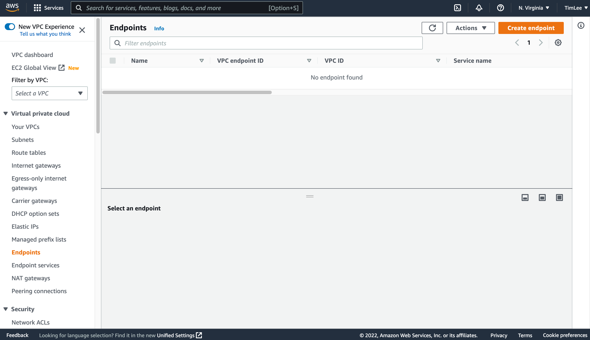

## Private Link

Private Link can help users safely and stably access services deployed in other VPCs through the private network in their VPCs, greatly simplify the network architecture, and avoid the security risks caused by accessing services through the public network.

The SelectDB Cloud warehouse is created and run in the SelectDB VPC. The application/client in your VPC can access the warehouse across the VPC through PrivateLink. PrivateLink includes two parts: Endpoint Service and Endpoint. The Endpoint Service is created and managed by SelectDB Cloud, and the Endpoint is created and managed by the user.

> **Warning** As part of the limitations imposed by the cloud providers, the endpoint and endpoint service must be deployed in the same zone. You may find the endpoint service in its corresponding region according to the service ID/service name and create the endpoint in the same zone.

**Take AWS PrivateLink as an example:**

1. Switch to the target warehouse, click **Connections** on the navigation bar, and click **Add** on the **Private Link** tab to allow a principal to access the endpoint service of SelectDB warehouse.

2. After allowing a principal to access the endpoint service, you can click **Go to Create** to go to the cloud provider's PrivateLink product console and create an endpoint.

3. On the cloud provider's PrivateLink product console, you need to confirm that the current region is the same as the warehouse's endpoint service (limited by the cloud provider's PrivateLink product) and click **Create endpoint**.

4. Follow the wizard prompts to fill in the form as follows:

| **Parameter**    | **Description**                                              |
| ---------------- | ------------------------------------------------------------ |
| Name tag         | Optional. Creates a tag with a key of 'Name' and a value that you specify. |
| Service category | Required. Select the service category. The endpoint service of the SelectDB warehouse belongs to other endpoint services. |
| Service name     | Required. One-click shortcut to copy the Service Name of the SelectDB warehouse, fill in the input box and click **Verify service** . |
| VPC              | Required. Select the VPC in which to create your endpoint.   |
| Subnets          | Required. Select the same Availability Zone as the one where the endpoint service of the SelectDB warehouse is located (limited by the cloud vendor's PrivateLink product), and then select an appropriate subnet ID under it. |
| Security groups  | Required. Select a preset security group. Note that the security rules should allow the protocol and port used by the SelectDB warehouse, as well as the IP address of the machine where the application/client connects to the SelectDB warehouse. |
| Tags             | Optional. You can add tags associated with the resource.     |

5. After the endpoint is created, its status changes from " **Pending** " to " **Available** ", indicating that the endpoint has successfully connected with the warehouse's endpoint service.

6. After refreshing the **Connections** page of the SelectDB warehouse, the endpoint list will display the connection information of the endpoint.

7. The application/client can access the SelectDB warehouse through the DNS name of the endpoint by MySQL protocol or HTTP protocol. For the specific connection method, refer to the pop-up bubble for  **Connection Examples** .

> **Note**
>
> * SelectDB Cloud includes two independent account systems: One is used to connect to the warehouse, as described in this topic. The other one is used to log into the console, which is described in the Registration and Login topic.
> * For first-time connection, please use the admin username and password, which can be changed on the **Settings** page.

**Allow Principals**

After you allow a principal to access the endpoint service, the principal authorization management portal appears on the right side of the endpoint service. Click **Allow Principals** to manage the authorization.

You can remove the existing principal to cancel their access to the SelectDB warehouse or add new principals to allow them to access the endpoint service of the SelectDB warehouse.

## Public Link

On the **Connections** page, switch to the **Public Link** tab to open the public network connection.

After that, you need to add the source public IP address to the whitelist before accessing the SelectDB Cloud warehouse through the public network. For the specific connection method, refer to the pop-up bubble for the **Connection Examples**.

> **Warning** The public network connection is closed by default. If necessary, please get in touch with the administrator to open it. Please be aware that opening a public network connection will have potential security risks.

**IP Whitelist Management**

After the user opens the public network connection, an IP whitelist appears on the page. Click **Add** to add new IP addresses.

In the IP whitelist, users can add or delete IP addresses to enable or disable their access to the warehouse.
