# 连接设置

## 私网连接

私网连接（PrivateLink） 能够帮助你在 VPC 环境中，通过私有网络安全稳定地访问部署在其他 VPC 中的服务，大幅简化网络架构，同时避免通过公网访问服务所带来的安全风险。

SelectDB Cloud 仓库创建并运行在 SelectDB VPC 中，用户 VPC 内的应用系统或客户端，可通过 PrivateLink 跨 VPC 访问 SelectDB Cloud 仓库。PrivateLink 包括终端节点服务（Endpoint Service）与终端节点（Endpoint）两部分。其中，Endpoint Service 由 SelectDB Cloud 创建和管理，Endpoint 由用户创建和管理。

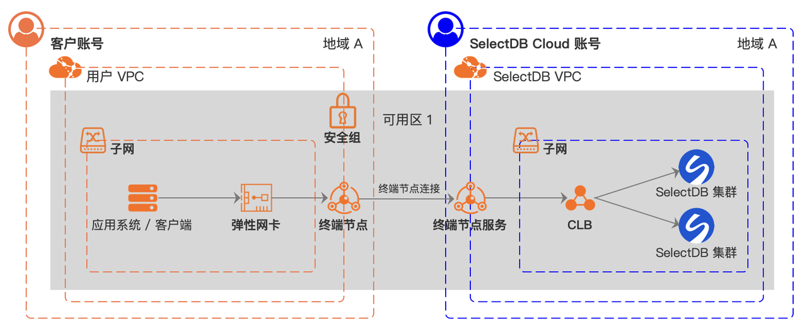

> **注意** 由于云厂商限制 Endpoint 和 Endpoint Service 必须部署在一个可用区内才可以建立连接，你需要前往 Endpoint Service 所在的地域，通过服务 ID 或 服务名称找到 Endpoint Service，选择相同的可用区，创建 Endpoint。

**操作步骤（以阿里云私网连接为例）：**

1. 切到目标仓库，单击左侧导航栏的  **连接** ，在私网连接 Tab 页内单击  **添加，** 将用户的云主账号添加到 SelectDB Cloud 仓库的 Endpoint Service 的白名单内。

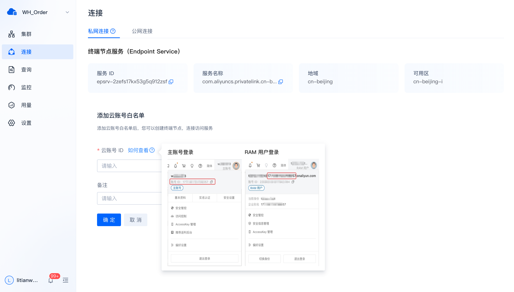

> **说明** 如果仓库创建在腾讯云上，由于腾讯云的 PrivateLink 产品限制，这里添加云主账号白名单时，除了要填入用户的腾讯云主账号 ID，还要填入 APP ID。

2. 云主账号添加白名单成功后，表示此账号已获得连接访问 SelectDB Cloud 仓库的 Endpoint Service 的权限，此时页面出现终端节点列表（暂无数据）。SelectDB 仓库的 Endpoint Service 在等待用户的 Endpoint 连接过来。用户可以单击列表右上角的  **前往创建** ，跳转到云厂商的 PrivateLink 产品控制台去创建 Endpoint。

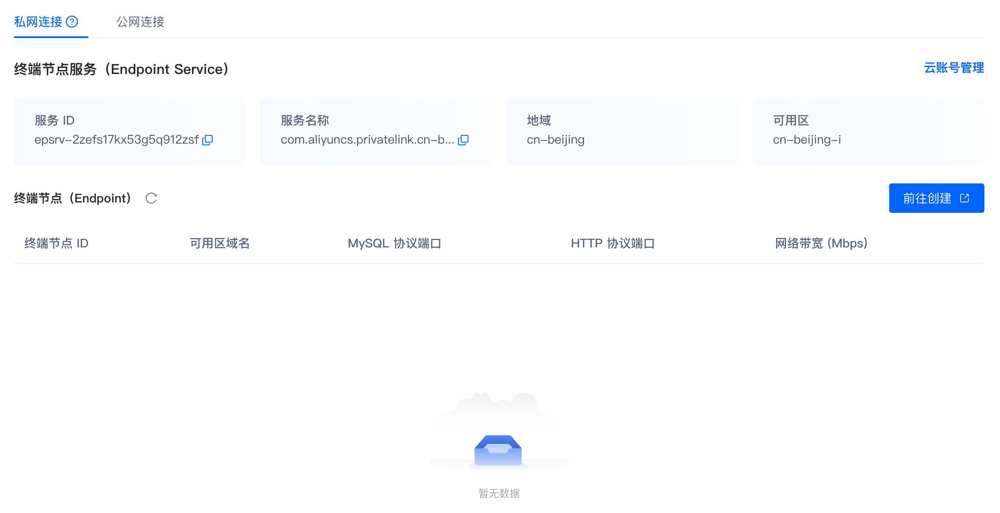

3. 在云厂商的 PrivateLink 产品控制台，用户需要确认当前地域与 SelectDB Cloud 仓库的 Endpoint Service 的地域相同（云厂商的 PrivateLink 产品限制），然后单击  **创建终端节点** 。

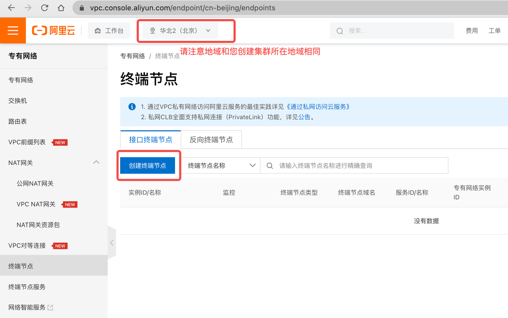

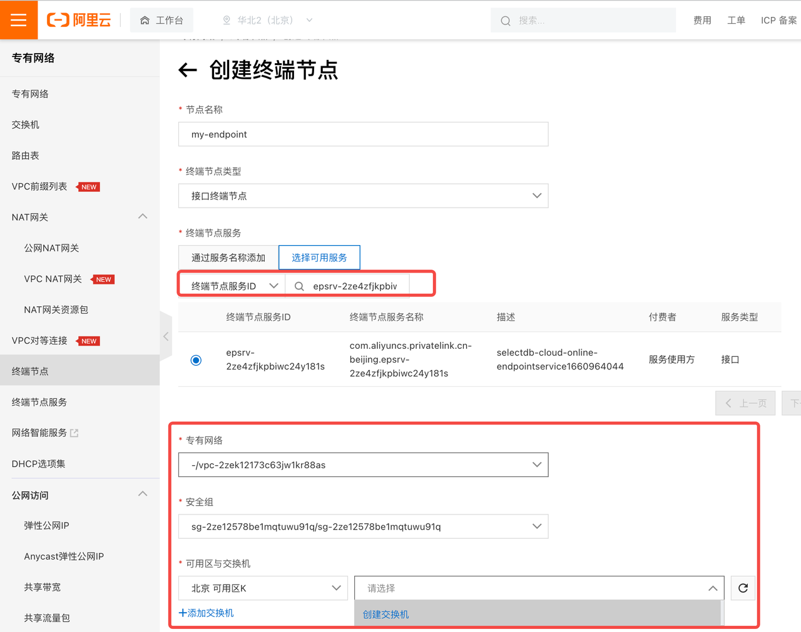

| **参数**       | **说明**                                                     |
| -------------- | ------------------------------------------------------------ |
| 节点名称       | 必填项。建议命名能够见名知意。                               |
| 终端节点类型   | 必选项。选择“接口终端节点”。                                 |
| 终端节点服务   | 必选项。选择可用服务，通过“终端节点服务 ID”找到 SelectDB 仓库的 Endpoint Service，选中该记录。 |
| 专有网络       | 必选项。选择 VPC，也就是要连接 SelectDB 仓库的应用系统或客户端所在的 VPC。 |
| 安全组         | 必选项。选择预设的安全组。注意安全规则要放行 SelectDB 仓库用到的协议和端口，以及要连接 SelectDB 仓库的应用系统或客户端所在机器的 IP 地址。 |
| 可用区与交换机 | 必选项。选择与 SelectDB 仓库的 Endpoint Service 所在可用区相同的可用区（云厂商的 PrivateLink 产品限制），交换机也必须创建在该可用区，下拉框下方有创建交换机的指南。 |

> **说明** 如果仓库创建在腾讯云上，这里创建终端节点时，需要填入服务提供方的 UIN 账号（也就是 SelectDB Cloud 的腾讯云主账号 ID：100022740614）。

4. 终端节点创建完成后，状态从“创建中”变为“可用”，连接状态从“连接中”变为“已连接”，表示该终端节点已经和 SelectDB Cloud 仓库的 Endpoint Service 连接成功了。

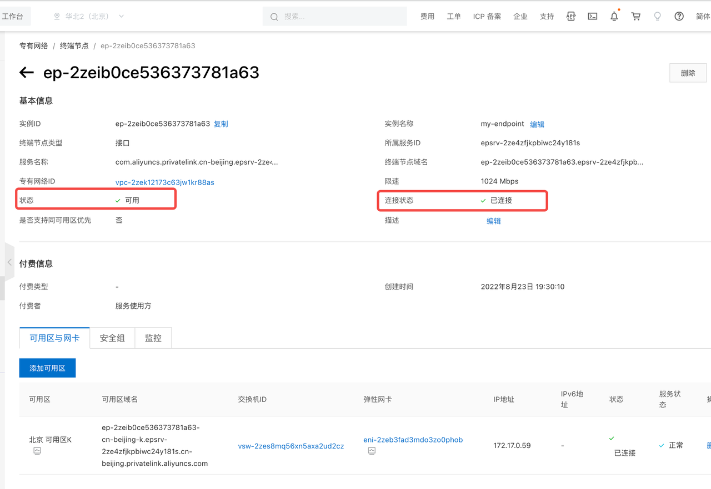

5. 刷新 SelectDB Cloud 仓库的连接页面后，终端节点列表会出现该 Endpoint 的连接信息。

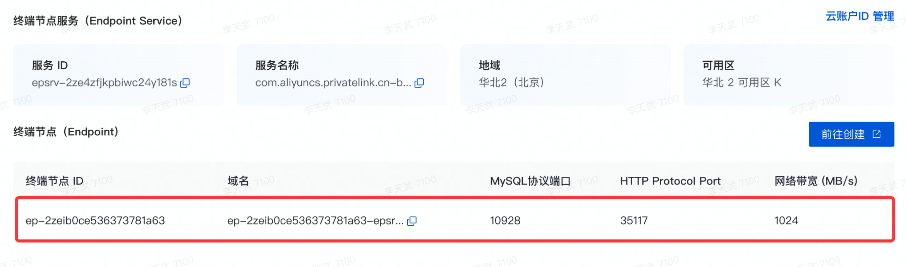

6. 要连接 SelectDB 仓库的应用系统或客户端，使用终端节点的可用区域名或者 IP 地址，以及 SelectDB Cloud 分配的 MySQL 协议端口或者 HTTP 协议端口，就可以通过 MySQL 协议或者 HTTP 协议，访问 SelectDB Cloud 仓库了。具体连接方式可参考 **连接举例** 弹出的气泡提示内容。

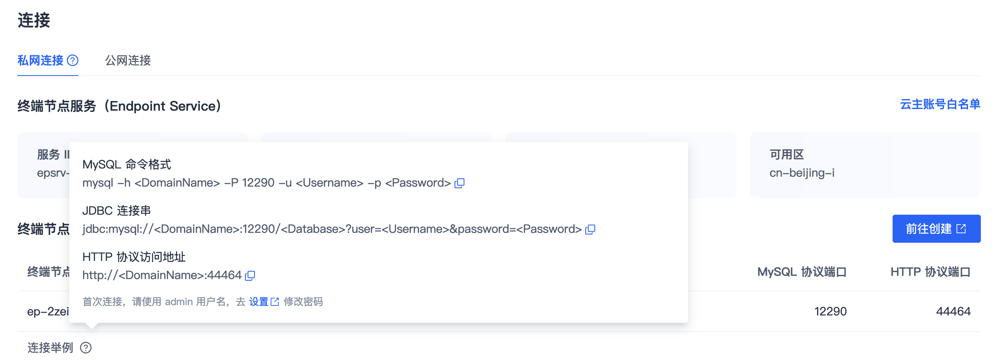

> **说明**
>
> * SelectDB Cloud 产品中包含两套独立的账号，一套用于连接 SelectDB Cloud 仓库，即本节使用的账号。另一套用于登录控制台，请参考注册和登录章节。
> * 首次连接，请使用 admin 用户名，可以在 **设置** 页 **修改密码** 功能来初始化密码。

**云账号白名单管理**

添加云账号白名单后，终端节点服务右侧出现云账号白名单管理入口，单击 **云账号白名单**可进行管理。

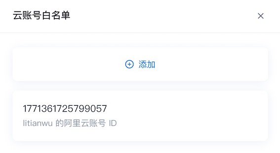

在云账号白名单中，用户可去除已有云账号的白名单（取消其连接访问 SelectDB Cloud 仓库的 Endpoint Service 的权限），或者添加新的云账号进入白名单（授予其连接访问 SelectDB 仓库的 Endpoint Service 的权限）。

> **说明**  如果在创建 SelectDB Cloud 仓库选择可用区时，没有用户业务所在的可用区，可通过如下方案解决：用户可选择其中任意一个可用区（如可用区 1）创建 SelectDB Cloud 仓库，然后在用户 VPC 中新建一个位于可用区 1 的子网，并在其中创建连接 SelectDB Cloud 服务的终端节点。由于同一个 VPC 下的所有子网是免费互通的，因此用户可以放心的通过终端节点访问 SelectDB Cloud 服务了。

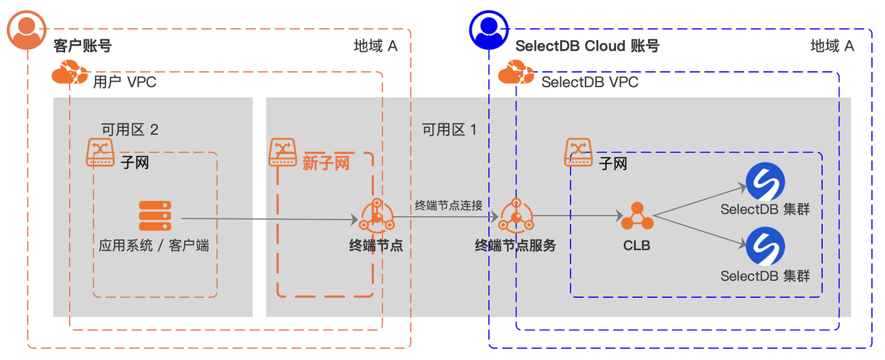

## 公网连接

在连接页，切到 **公网连接** Tab 中可以开通公网连接。

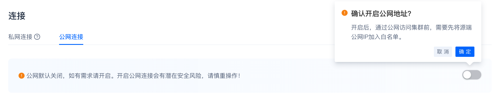

开通后，需要先将源端公网 IP 加入白名单，才可以通过公网访问 SelectDB Cloud 仓库。具体连接方式可参考 **连接举例** 弹出的气泡提示内容。

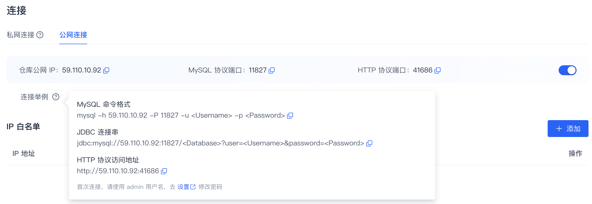

> **注意** 默认关闭公网连接，如有需求可开通。开通公网连接会有潜在安全风险，请慎重操作！

**IP 白名单管理**

开通公网连接后，页面出现 IP 白名单列表，单击列表右上角的  **添加** ，增加新的 IP 白名单。

在 IP 白名单管理过程中，你可以添加 IP 地址（授予其连接访问 SelectDB Cloud 仓库公网 IP 的权限），删除已有的 IP 地址（取消其连接访问 SelectDB Cloud 仓库公网 IP 的权限）。
