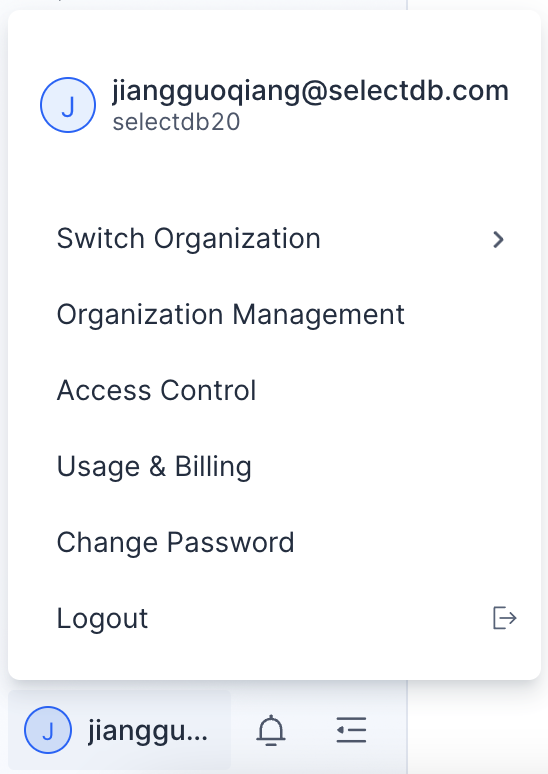

# Overview

SelectDB Cloud is a cloud-native data warehouse that runs on multiple clouds, providing a consistent user experience and fully managed service. It is extremely fast, cost-effective, single-unified, and easy to use.

This topic gives a brief overview of the main features the SelectDB Cloud console includes and how to navigate it. Later topics provide detailed descriptions of the specific features.

## Main Features

**1. Registration and Login.**

**2. Warehouse Management:** Provides free trial, paid warehouse creation, warehouse list, etc.

**3. Cluster Management:** Provides one-click creation, elastic resizing, fast upgrade, deletion, etc.

**4. Connections:** Provides the connection methods of the warehouses in the private network (VPC) and the public network. The public network connection supports whitelists.

**5. Query:** Provides an easy-to-use SQL query editor, including query execution, query profile, query history, etc.

**6. Metrics:** Provides metrics in dimensions such as resource usage, query, and write and supports flexible and easy-to-use alarm capability.

**7. Usage and Billing:** Provides usage statistics for the internal parts of organizations and warehouses. Billing is based on usage statistics.

**8. Others:** Including organization management, access control, notification, etc.

## Navigate SelectDB Cloud

The overall layout of SelectDB Cloud console web interface is as follows:

Some of the key sections:

### Navigation Bar

Located on the left side of the web interface, **Navigation Bar** provides the main features of SelectDB Cloud's most crucial concept, **Warehouse**, including cluster management, connections, query, metrics, usage statistics, etc.

### Warehouse Selector

Located at the top of the left navigation bar,**Warehouse Selector** displays all the warehouses under the current organization. You can switch warehouses, view warehouse info, create a new warehouse, etc.

After switching to a warehouse, you can use it to experience all the features in the left navigation bar.

### User Menu

Located at the bottom of the left navigation bar, **User Menu** provides some management features related to users and organizations, including organization management, access control, usage, billing, etc.

