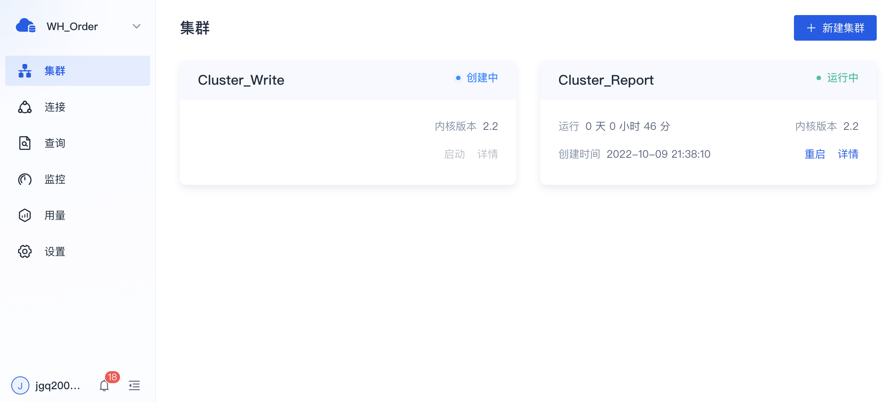
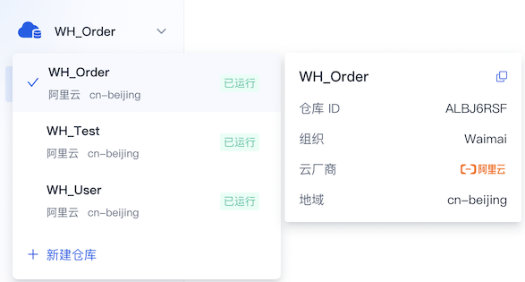
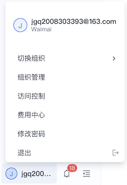

## 主要功能

SelectDB Cloud 控制台提供的主要功能如下：

**1. 用户注册和登录** 。

**2. 仓库管理** ：提供免费体验、付费创建、仓库列表等能力。

**3. 集群管理** ：提供一键创建、弹性伸缩、快速升级、删除等能力。

**4. 连接管理** ：提供仓库在私网（VPC）、公网两种环境下的连接方式，公网连接支持白名单。

**5. 数据查询** ：提供简单易用的 SQL 查询编辑器，支持查询执行、查询 Profile、历史查询记录等能力。

**6. 监控告警** ：提供基础资源、查询、写入等维度的监控指标，并支持灵活易用的告警功能。

**7. 用量计费** ：面向组织和仓库，提供其内部的用量统计信息，并基于用量信息进行计费。

**8. 其他** ：包含组织管理、访问控制、通知提醒等辅助能力。

## 功能导航

SelectDB Cloud 控制台的 Web 界面整体布局如下：

### 导航栏

位于 Web 界面的左侧，提供了 SelectDB Cloud 中最重要概念 **仓库** 的主要功能，包含集群管理、连接管理、数据查询、监控告警、仓库内的用量统计等。

### 仓库列表

位于左侧导航栏的顶部，展示当前组织下的全部仓库，包含切换当前仓库、查看仓库信息、新建仓库等功能。

当切换某个仓库为当前仓库后，你可以使用此仓库体验左侧导航栏中的相关功能。

### 用户菜单

位于左侧导航栏的底部，提供用户和所属组织相关的辅助管理功能，包含组织管理、访问控制、费用中心、通知提醒等。