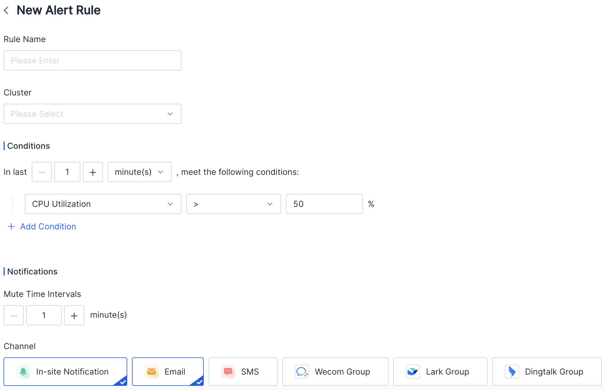
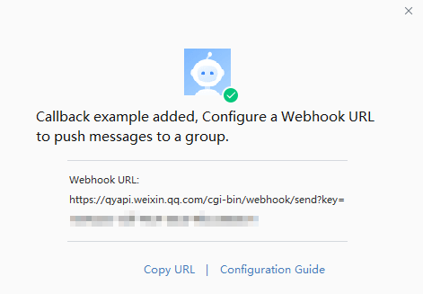
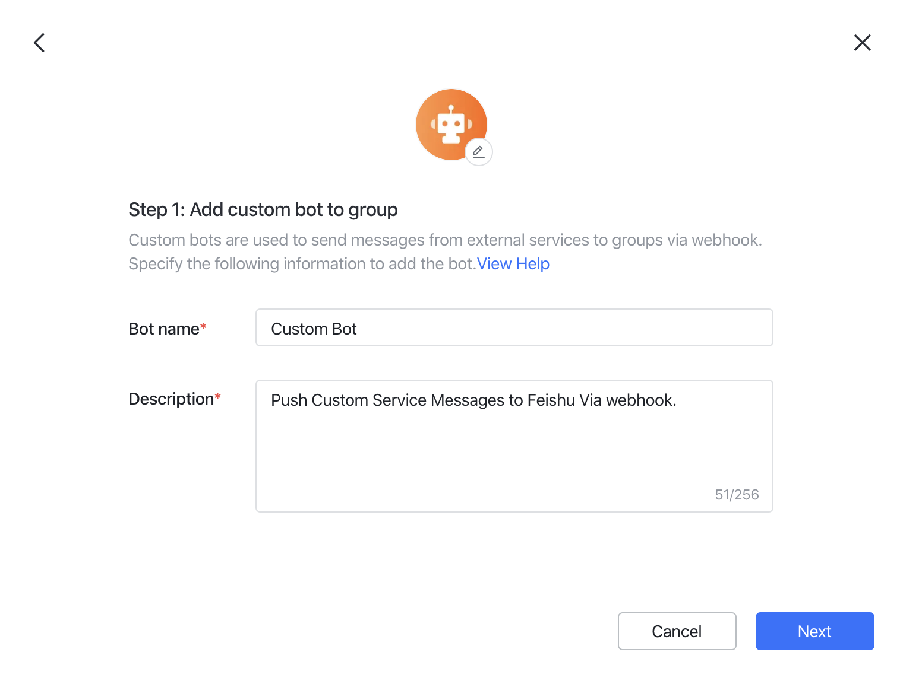
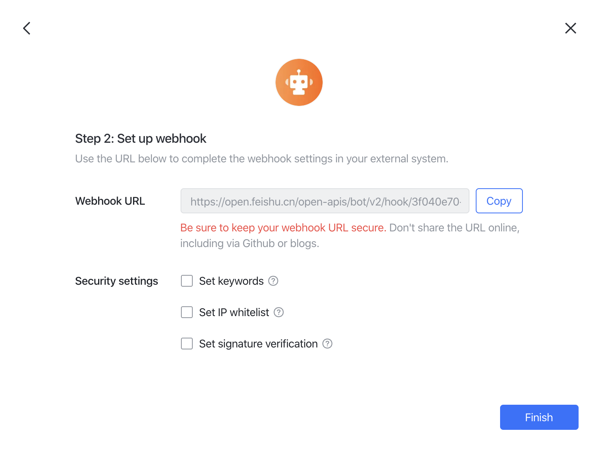
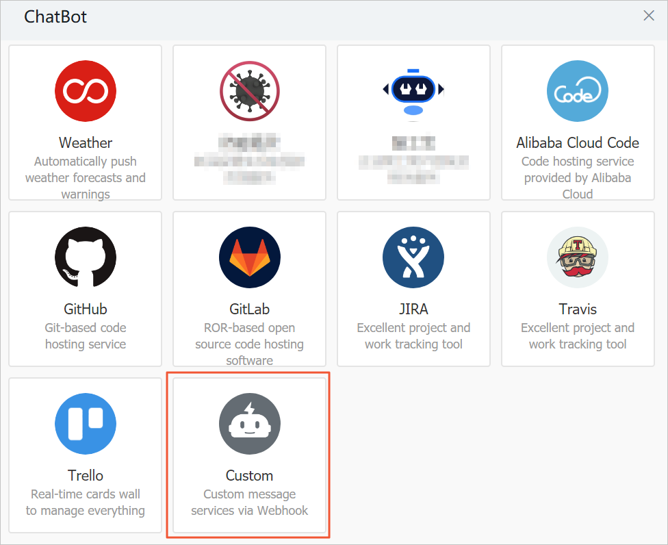
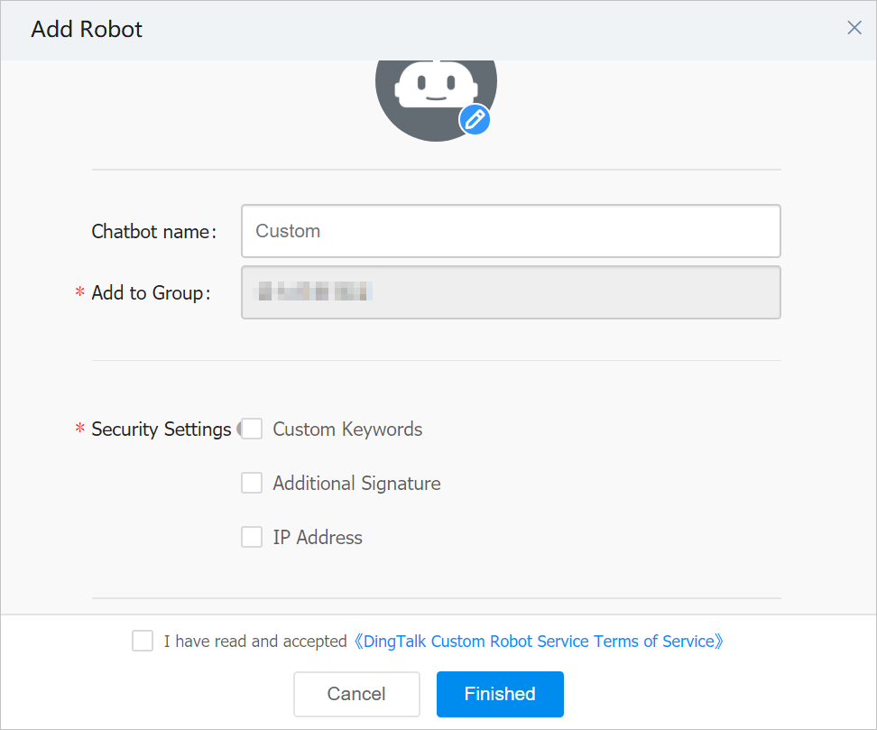
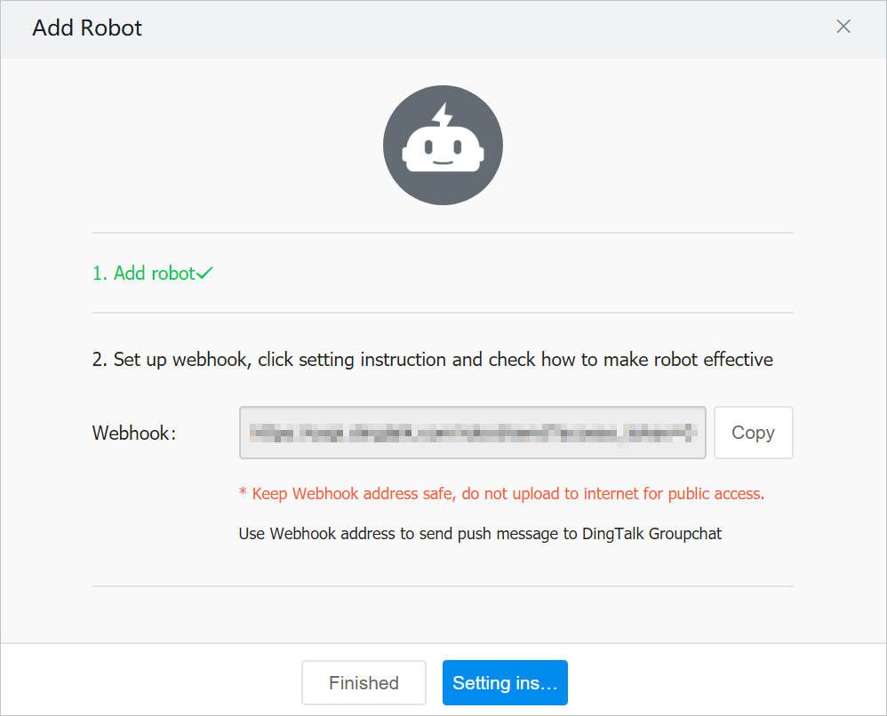

# Monitoring Overview

SelectDB Cloud provides monitoring and alerting so that you can track the health and performance of your clusters and make adjustments.

You can find the **Metrics** feature on the navigation bar, and you can

* View metrics by cluster. The metric items are the same for each cluster.
* Use **Starred** to display the metrics of interest in different clusters together.
* View historical metric data by adjusting the time selector, and you can view metric data of the past 15 days.
* Use the auto-refresh feature to update metrics in real-time (5s).

The metrics you can use in SelectDB Cloud Manager fall into two categories.

* Basic Metrics - Basic metrics data helps you monitor physical aspects of your cluster, such as CPU usage, memory usage, and network throughput.
* Query Metrics - Query performance data helps you monitor cluster activity and performance, such as QPS, query success rates, and more. It helps to understand the specific workload of the cluster.

## Basic Metrics

Basic metrics provide physical monitoring information of the cluster by "node" dimension.

You can determine whether the cluster is abnormal within a specified time frame by using the cluster's basic metrics. You can also see if historical or current queries are impacting cluster performance.

You can use the cluster base metrics to diagnose the cause of slow queries and take possible measures such as expanding and reducing the cluster capacity, optimizing SQL statements, etc.

We provide the following cluster base metrics.

### CPU Utilization

Displays the CPU utilization percentage of all nodes. You can find the lowest cluster utilization time from this chart before planning to resize a cluster and other resource-consuming operations.

### Memory Usage

Displays the memory usage of all nodes. If memory usage is consistently high, you should consider expanding your cluster.

### Network Read Throughput

Displays the read throughput per second over the network in MB/s. Queries that read data over the web are slower, and you should set up the cache correctly to minimize network reads.

### Network Write Throughput

Displays the write throughput per second over the network in MB/s.

### I/O Utilization

Displays the utilization of hard disk I/O. If I/O utilization is always maintained at a high level, you may consider expanding more nodes for better query performance.

### Cache Read Throughput

Displays the read throughput per second over the cache in MB/s.

### Cache Write Throughput

Displays the write throughput per second over the cache in MB/s.

## Query Metrics

### Query Per Second (QPS)

Displays the number of query requests per second. The required cluster node size or number of nodes can be determined based on your system's QPS during peak time.

### Query Success Rate

Displays the percentage of successful queries to all queries updated by minutes. When the query success rate decreases abnormally, consider whether there is a cluster or node failure.

### Alive Nodes

Displays the number of current cluster alive nodes.

### Average Query Runtime

Displays the average time of queries updated by minutes. If the average query time rises abnormally, consider troubleshooting.

### Cache Hit Rate

Displays the percentage of I/O operations that hit the cache in all I/O operations. If the cache hit rate is too low, consider changing the cache policy or increasing the size.

# Alert Overview

In addition to SMS alert notifications, SelectDB Cloud provides monitoring and alerting services at no additional charge.

You can configure alert rules to be notified when cluster monitoring metrics change.

## Alert Configuration

### View Alert Rules

You can view existing alerting rules and their current alerting status on the list page.

"Red dot" means the alert rule is in effect, and "green dot" indicates the current alert rule is not triggered.

### New/Edit Alert Rule

You can create an alert rule by clicking on "New Alert Rule" or copying an existing one. You can also modify a current alert rule.

The alert rule configuration consists of four parts.

#### Rule Name

You can customize the rule name, which must be unique within the warehouse.

#### Cluster

You can specify the cluster for which the alert rule is in effect. When a cluster is deleted, its alert rules will not be deleted but invalidated.

#### In Last

"In Last" means the duration of time to meet the conditions. You should set this time appropriately to balance between timeliness and accuracy of alerts.

#### Conditions

You can set one or more rules for metrics to be met and how these conditions are combined (and, or).

### Channel

You can set one or more notification channels, and the alert messages will be pushed through the channels you set respectively.

#### In-station Notification

Configuration method: Select user.

#### Email

Configuration method: Select user.

#### SMS

Configuration mode: Select user/fill in cell phone numbers.

#### WeCom

Configuration method: fill in the robot webhook.

1. On WeCom for PC, find the target WeCom group for receiving alarm notifications.
2. Right-click the WeCom group. In the window that appears, click  **Add Group Bot** .
3. In the window that appears, click  **Create a Bot** .
4. In the window that appears, enter a custom bot name and click  **Add** .
5. Copy the webhook address.

#### Lark

Configuration method: fill in the robot webhook.

To make a custom bot instantly push messages from an external system to the group chat, you need to use a webhook to connect the group chat and your external system. Enter your target group and click **Settings** > **BOTs** >  **Add Bot** . Select  **Custom Bot** . Enter a suitable name and description for your bot and click  **Next** .

You'll then get the webhook address.

#### DingTalk

Configuration method: fill in the robot webhook.

To get the DingTalk robot webhook, please see [here](https://www.alibabacloud.com/help/en/application-real-time-monitoring-service/latest/obtain-the-webhook-url-of-a-dingtalk-chatbot)

1. Run the DingTalk client on a PC, go to the DingTalk group to which you want to add a chatbot, and then click the Group Settings icon in the upper-right corner.
2. In the **Group Settings** panel, click  **Group Assistant** .
3. In the **Group Assistant** panel, click  **Add Robot** .
4. In the **ChatBot** dialog box, click the **+** icon in the **Add Robot** section. Then, click  **Custom** .

5. In the **Robot details** dialog box, click  **Add** .
6. In the **Add Robot** dialog box, perform the following steps:

7. Set a profile picture and a name for the chatbot.
8. Select **Custom Keywords** for the **Security Settings** parameter. Then, enter  **alert** .
9. Read the terms of service and select  **I have read and accepted *DingTalk Custom Robot Service Terms of Service*** .
10. Click  **Finished** .
11. In the **Add Robot** dialog box, copy the webhook URL of the DingTalk chatbot and click  **Finished** .

## View Alert History

You can view the alert history and filter it.