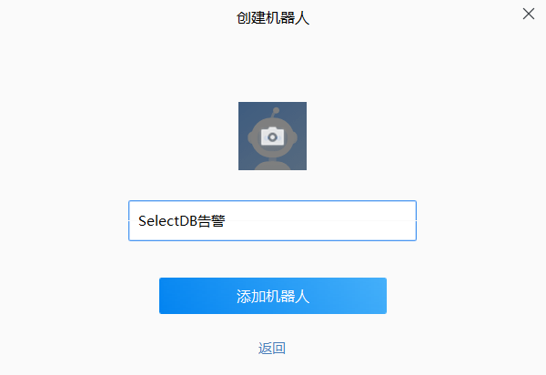
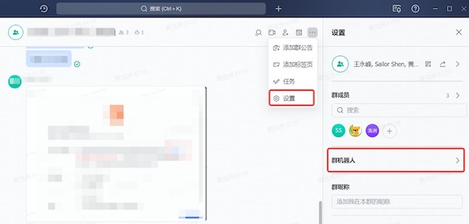
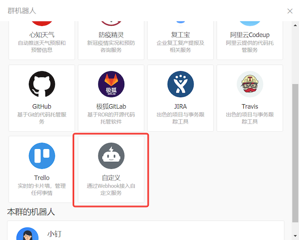

# 监控概览

SelectDB Cloud 提供性能监控和告警功能，以便你捕捉集群动态，感知集群健康状况与负载，并做出针对性的调整。

除短信告警通知外，SelectDB Cloud 提供的监控、告警服务不额外收费。

你可以在 **左侧导航栏**找到 **监控** 功能，同时，你可以：

* 按照集群查看监控，每一个集群的监控项是相同的。
* 使用“收藏”功能，将不同集群中关心的监控指标放在一起展示。
* 通过调整时间选择器，查看历史监控数据，你可以查看15天内的监控数据。
* 使用自动刷新功能，实时（5s）更新监控指标。

你可以在 SelectDB Cloud 控制台中使用的监控数据分为两类：

* **基础指标** ：基础指标数据有助于你监控集群的物理方面，例如 CPU 使用率、内存使用量和网络吞吐量等。
* **查询性能** ：查询性能数据可以帮助你监控集群活动和性能，例如 QPS、查询成功率等。有助于了解数据库的特定工作负载。

## 基础指标

基础指标 **按照“节点”维度** ，提供集群的物理监测信息。

你可以通过集群的基础指标，判断集群在指定时间范围内是否异常。也可以查看历史或当前查询是否对集群性能造成了影响。

你可以通过集群的基础指标来辅助诊断查询速度慢的原因，并采取可能的措施，如扩缩容集群，优化 SQL 语句等。

我们提供了以下的集群基础指标：

### CPU 使用率

显示所有节点的 CPU 利用率百分比，在计划集群扩缩容与其他资源消耗型操作前，可以从这个图表找到集群使用率最低的时间。

### 内存使用量

显示所有节点的内存使用量，如果内存使用量持续较高，你应该考虑扩容集群。

### 网络读吞吐量

显示每秒通过读取的平均兆字节数。通常来说，通过网络读的查询速度较慢，应当通过缓存的正确设置，尽量的减少查询时的网络读取。

### 网络写吞吐量

显示每秒通过写入的平均兆字节数。

### I/O Util

显示硬盘 I/O 的利用率。如果 I/O Util 总维持在较高的位置，你可以考虑拓展更多的节点，以获取更好的查询性能。

### 缓存读吞吐量

显示节点硬盘每秒读的平均兆字节数。在 SelectDB Cloud，缓存读吞吐量展示集群对缓存的访问情况。

### 缓存写吞吐量

显示节点硬盘每秒写平均兆字节数。在 SelectDB Cloud，缓存写吞吐量展示集群对缓存的写入情况。

## 查询性能

### 每秒查询次数(QPS)

显示每秒的响应请求数，即集群的吞吐能力；可以根据业务系统中峰值时间内的 QPS 来决定所需的集群节点大小或所需机器数量。

### 查询成功率

显示按照分钟更新的成功查询占全部查询的比例；当查询成功率发生异常下降时，考虑是否出现了集群、节点的故障。

### 节点 Alive 数

显示当前集群中存活的节点数。

### 查询平均耗时

显示按照分钟更新的查询生命周期结束的平均时间。SelectDB Cloud 是实时高性能数据库，你应该控制查询平均耗时在 1s 以下，如果查询平均耗时过高，考虑调整集群节点大小或优化查询语句。如果查询平均耗时异常上升，需要考虑故障排查。

### 缓存命中率

显示命中缓存的读写操作占所有读写操作的百分比。如果缓存命中率过低，需要考虑更改缓存策略，或者提升缓存盘大小，来提升缓存被命中的可能。

# 告警概览

你可以通过配置策略，在集群监控指标发生变化时，获得通知。

## 告警配置

### 查看告警策略

你可以在列表页查看现有告警策略，以及其当前的告警情况。

“**红色**”表示这条告警策略正在生效，“绿色”表示当前告警策略未被触发。

### 新建/编辑告警策略

你可以点击 **新建告警策略**或者复制现有的告警策略并 **修改** 来创建告警策略。

你也可以修改现存的告警策略。

告警策略配置由四部分组成：

#### 告警名称

你可以自定义告警名称，在同一个数据仓库下，告警名称不能重复。

#### 生效集群

你可以指定告警策略生效的 **一个集群** 。

当集群被销毁时，其下属的告警策略会被删除。

#### 统计时间

统计时间是指满足告警条件的持续时间，你应该妥善设置这个时间，以获得告警及时性与准确性的平衡。

#### 告警条件

你可以设置一条或多条指标满足的条件，并设置这些条件组合方式（且、或）。

### 告警渠道设置

你可以设置一条或多条告警条件，告警信息将分别从你设置的渠道中推送。

#### 站内通知

配置方式：选择用户

#### 邮箱

配置方式：选择用户

#### 短信

配置方式：选择用户 / 填写手机号

#### 企业微信

配置方式：填写机器人 Webhook

1、打开企业微信群，在群聊中选择添加群机器人，「新建」一个机器人

2、为机器人命名

2、复制 Webhook

#### 飞书

配置方式：填写机器人 Webhook

添加飞书群聊机器人并获取 Webhook 的方式：

1、打开飞书，进入群聊后，选择群聊-设置-群机器人

2、添加机器人-自定义机器人

3、点击添加

4、获取 Webhook

#### 钉钉

配置方式：填写机器人 webhook

添加钉钉机器人获取 webhook 的方式参见 [自定义机器人接入](https://open.dingtalk.com/document/robots/custom-robot-access)

1、在钉钉群中找到群设置

2、选择智能群助手

3、选择添加机器人

4、选择添加“自定义”机器人

5、进行安全配置，选择关键词，输入“Alert”

6、复制 Webhook

### 查看告警历史

你可以查看告警历史，并进行筛选。
