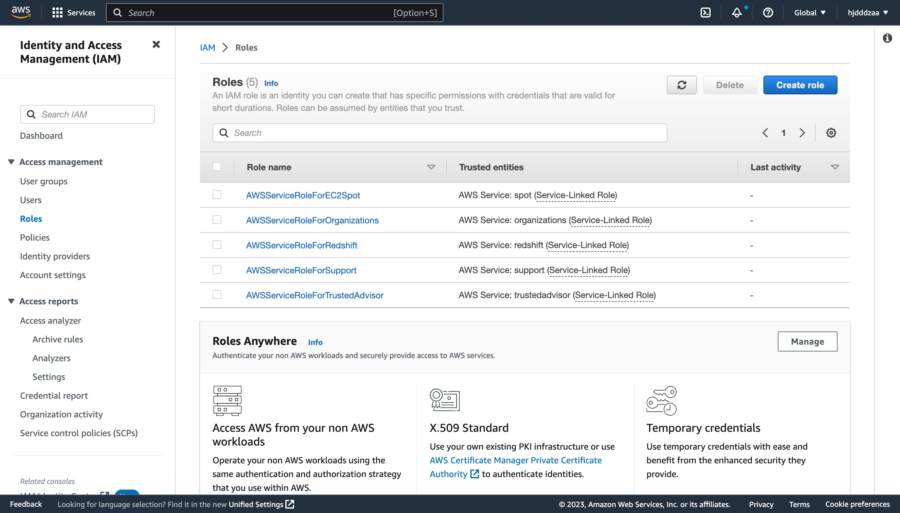
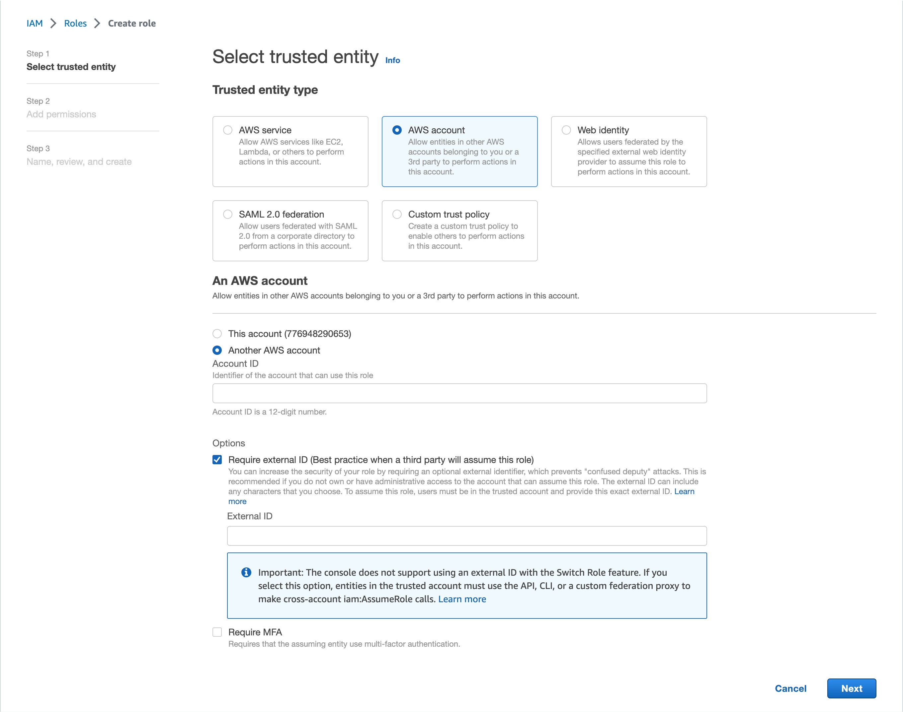
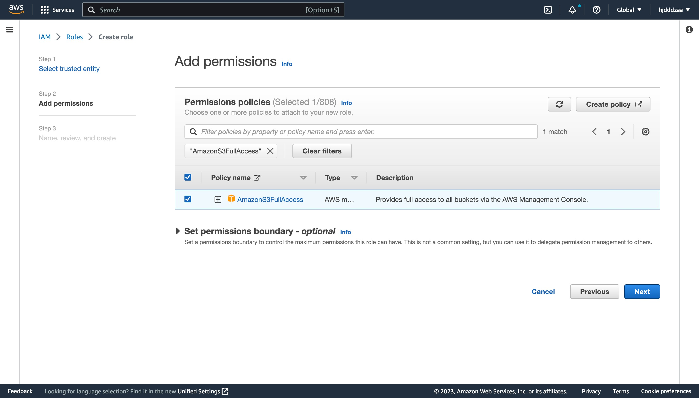
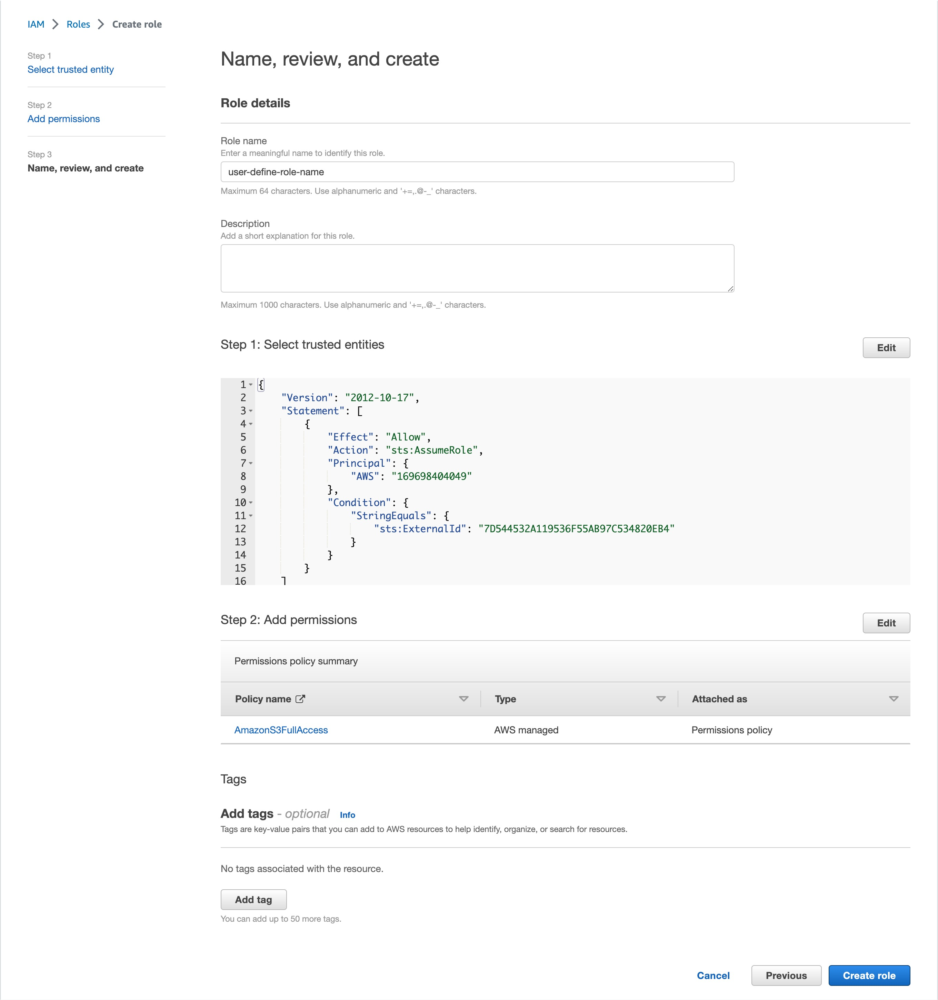
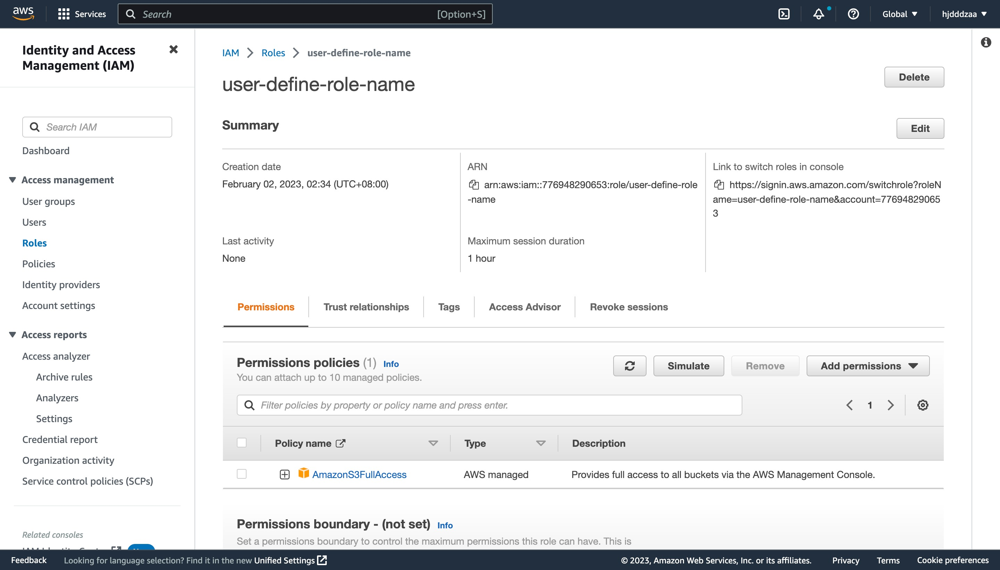

# Cross Account IAM Guide

## AWS

Please use the following steps to create the role and add permissions in your AWS console:

1. Access the **IAM** service and select **Roles** from the menu. Click on the **Create role** button.

2. Select **AWS account** in the **Select trusted entity** section. Select **Another AWS account** in the **An AWS account** section. Copy and paste **SelectDB** **AWS account ID** in the **Account ID** field. Then check **Require external ID** in options.Then copy and paste **External ID** in the **External ID** field. Click on the **Next** button.

3. Select the permission policies you would like to attach to the role. Click on the **Next** button.

4. Config **Role name**,and click on the **Create role** button to finish.

5. Click on the role name in the list of roles. Copy the value of the **Role name** and **ARN** from the **Summary** section to provide the value in SelectDB Cloud. 

