# 跨账号授权指引

## 阿里云

请通过以下步骤完成创建跨账户角色创建与授权：

1. 访问 **RAM 访问控制**，选择 **角色**菜单，点击 **创建角色**按钮。

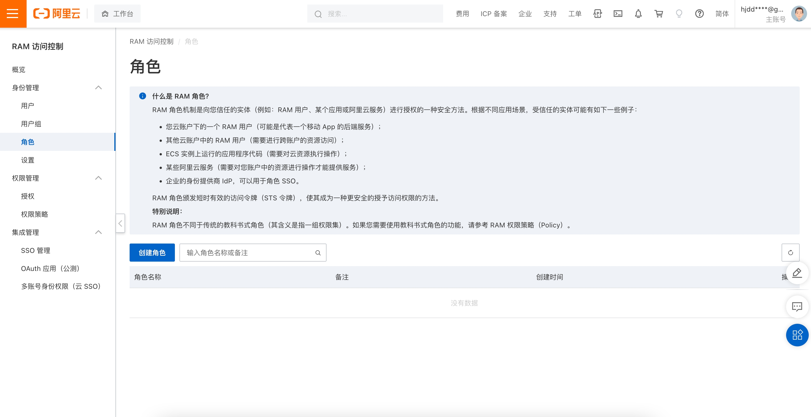

2. 在 **选择可信实体类型**中选择 **阿里云账号**，并点击**下一步**按钮。

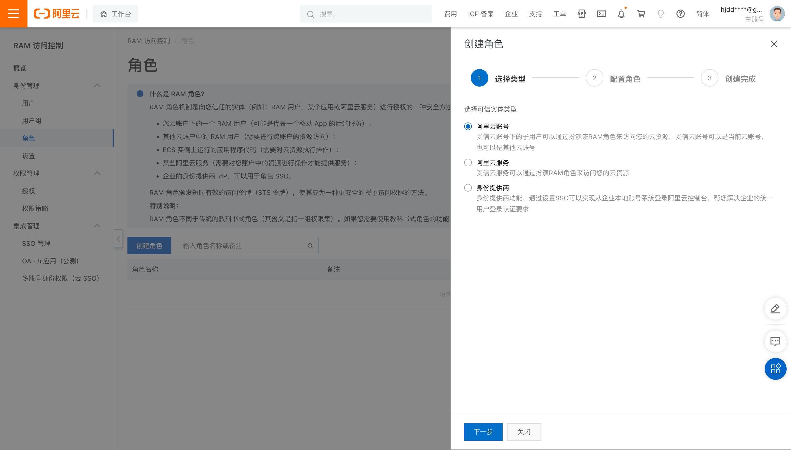

3. 配置 **角色名称**，在 **选择信任的云账号**选择 **其他云账号**并填入 SelectDB 阿里云账号，并点击 **完成**按钮。

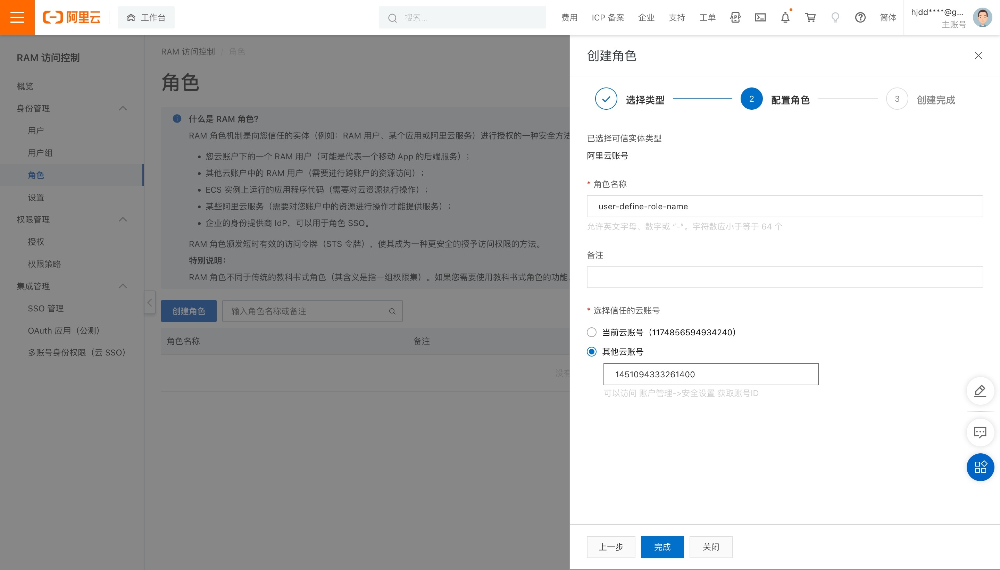

4. 接下来，点击 **为角色授权**。

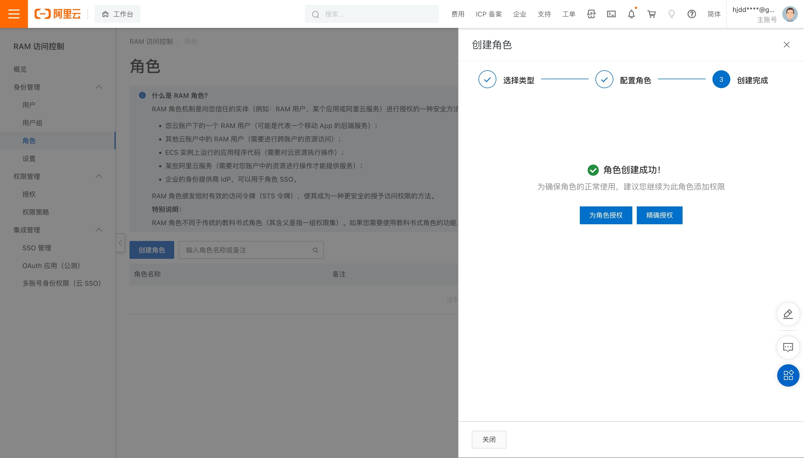

5. 我们建议您授予角色**对象存储服务（OSS）**的 **读写权限**，点击**确定**按钮完成授权。

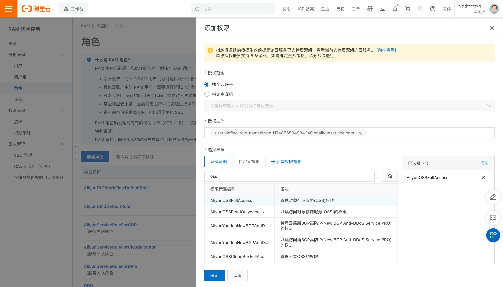

6. 点击角色列表中的角色名进入详情，将 **RAM 角色名称**与 **ARN**复制到 SelectDB Cloud 中。

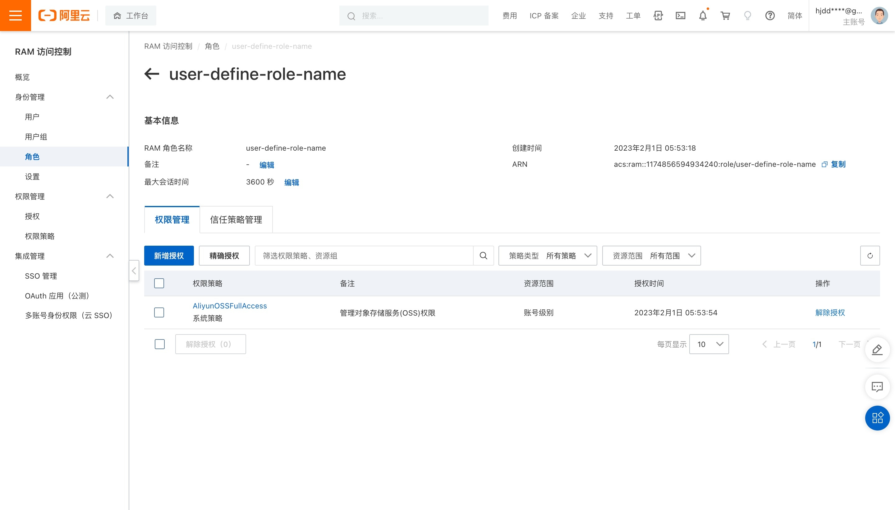

## 腾讯云

请通过以下步骤完成创建跨账户角色创建与授权：

1. 访问 **访问管理**，选择 **角色**菜单，点击 **新建角色**按钮。

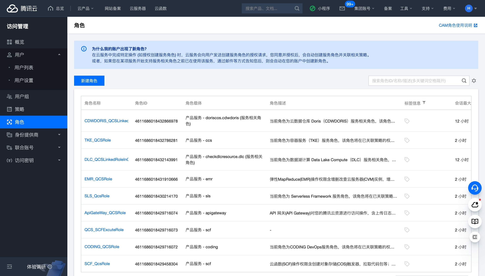

2. 在 **选择角色载体**中选择 **腾讯云账户**。

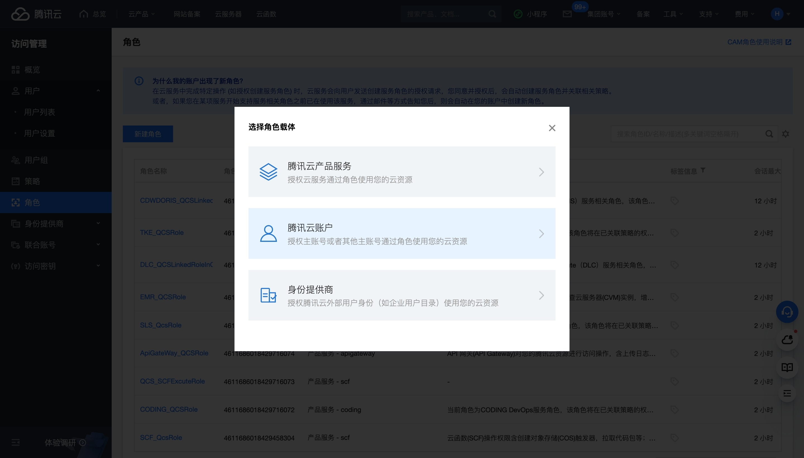

3. 在 **云账号类型**选择 **其他主账号**，并在 **账号ID**填入 **SelectDB 腾讯云ID**，在 **外部ID**勾选 **开启校验**并填入 **外部ID**，**点击 下一步**。

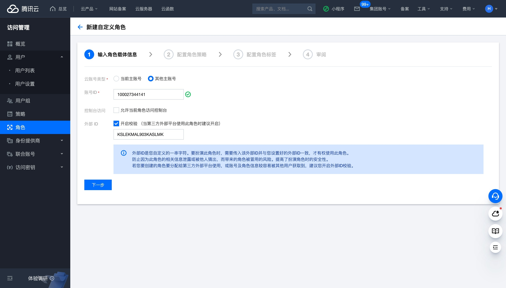

4. 我们建议您在配置角色策略中，为角色授予 **对象存储（COS）**的 **读写权限**，点击 **下一步**。

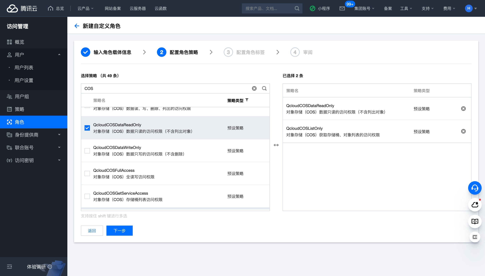

5. 你可以按照需要添加角色标签，这是非强制的，点击 **下一步。**

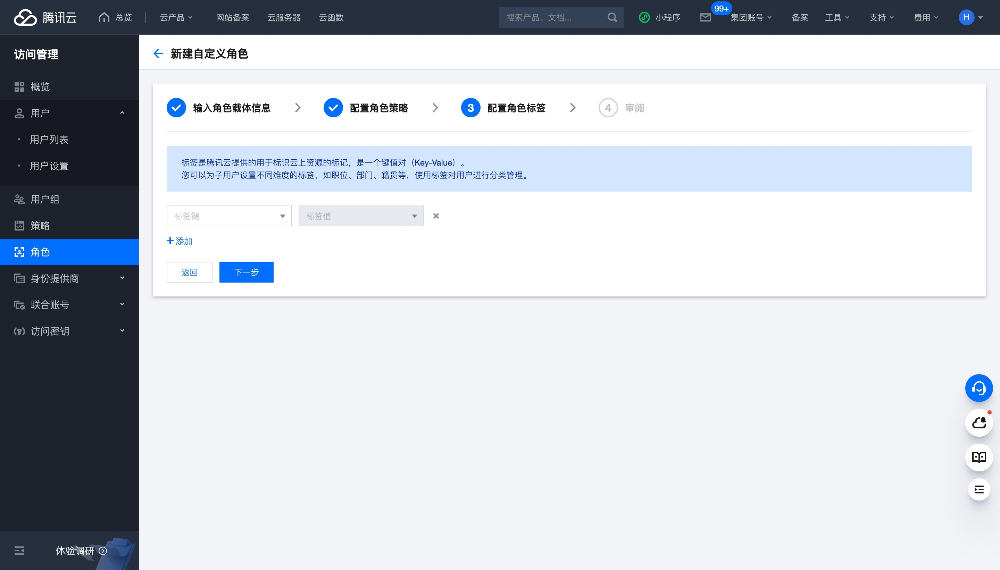

6. 配置 **角色名称**，并点击 **完成**按钮。

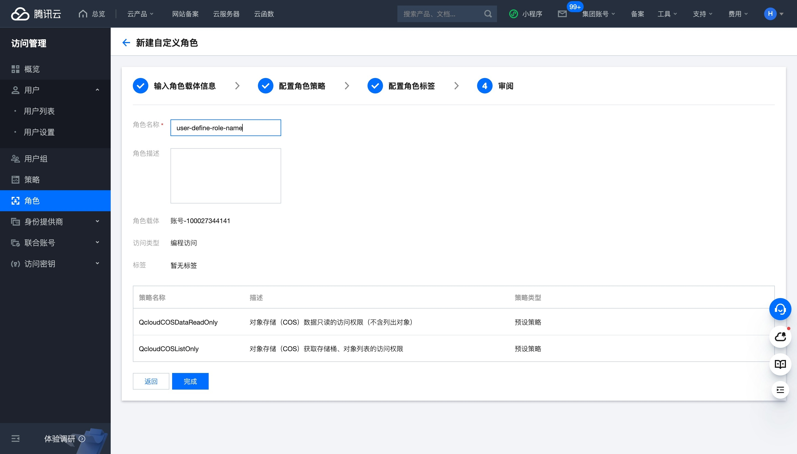

7. 点击角色列表中的角色名进入详情，将 **角色名称**与 **RoleArn**复制到 SelectDB Cloud 中。

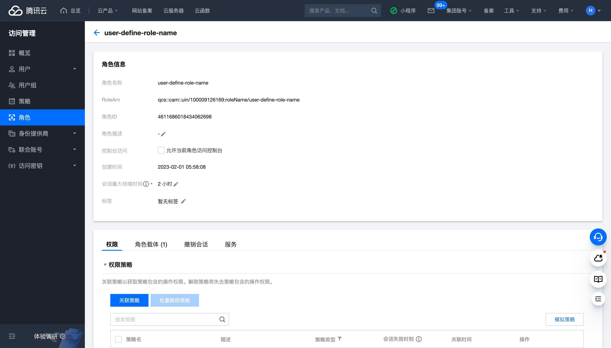

## 华为云

请通过以下步骤完成创建跨账户角色创建与授权：

1. 访问 **统一身份认证服务**，选择 **角色**菜单，点击 **创建委托**按钮。

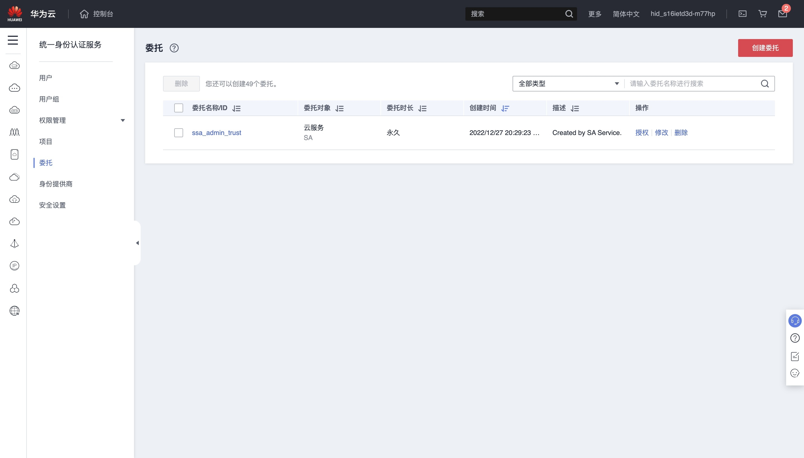

2. 配置 **委托名称**，在 **委托类型**中选择 **普通账号**，在 **委托的账号**填入 selectdb，并点击 **下一步**。

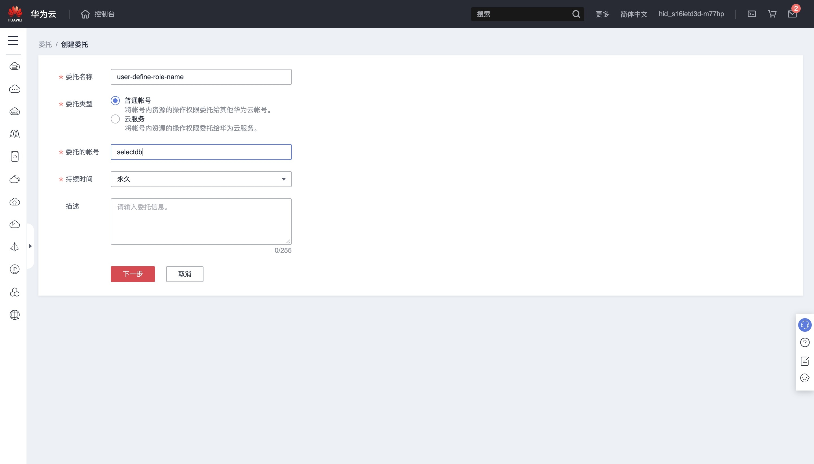

3. 对委托进行授权，我们建议您授予委托**对象存储服务（OBS）**的 **读写权限**，点击**下一步**。

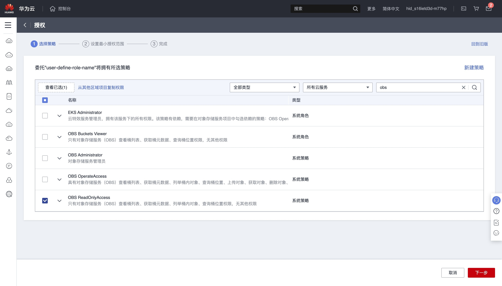

4. 选择授权的范围，并点击 **确定**完成创建。

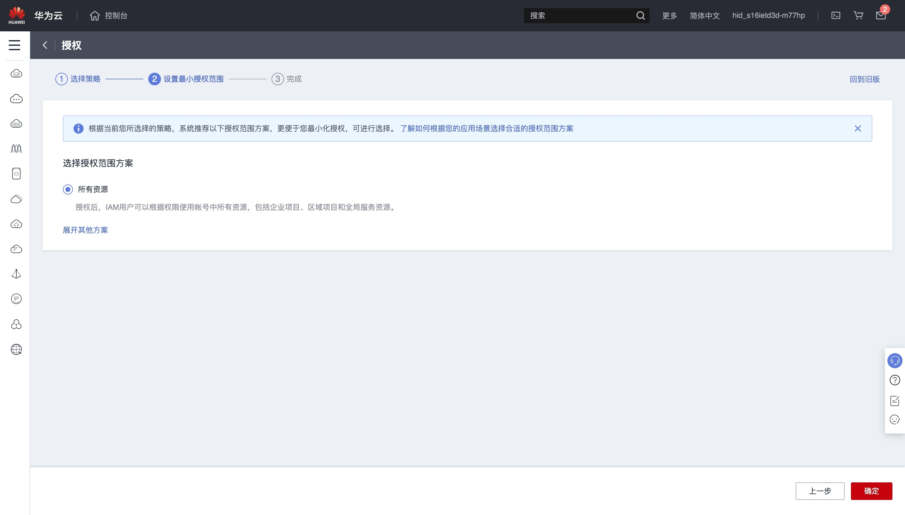

5. 在角色列表页，鼠标悬浮在角色名上，将提示信息中第一行的 **委托名称**与 **你的云账户ID** 复制到 SelectDB Cloud 中。

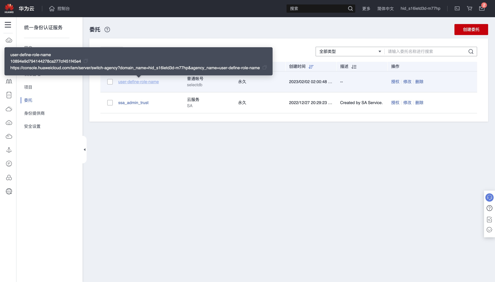

