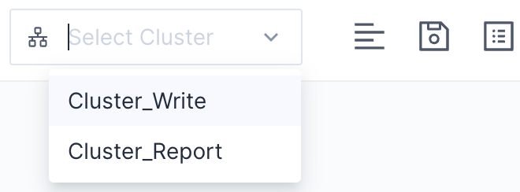
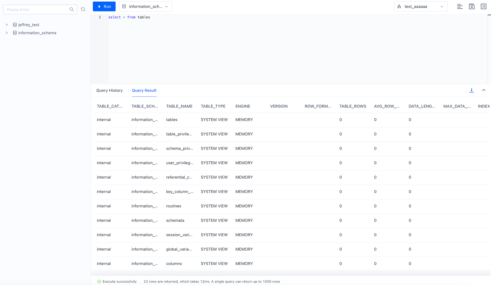
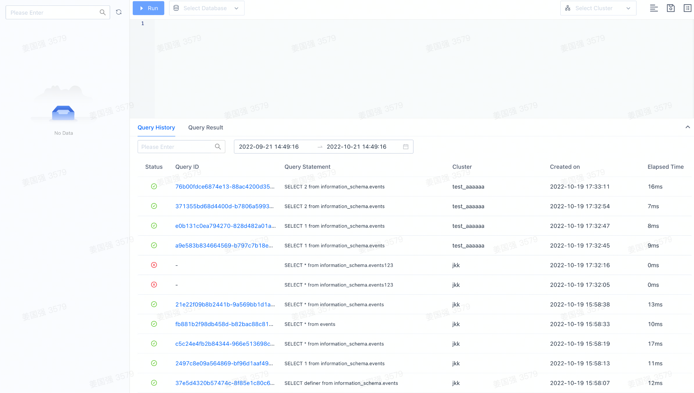
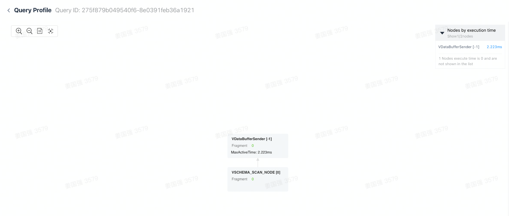
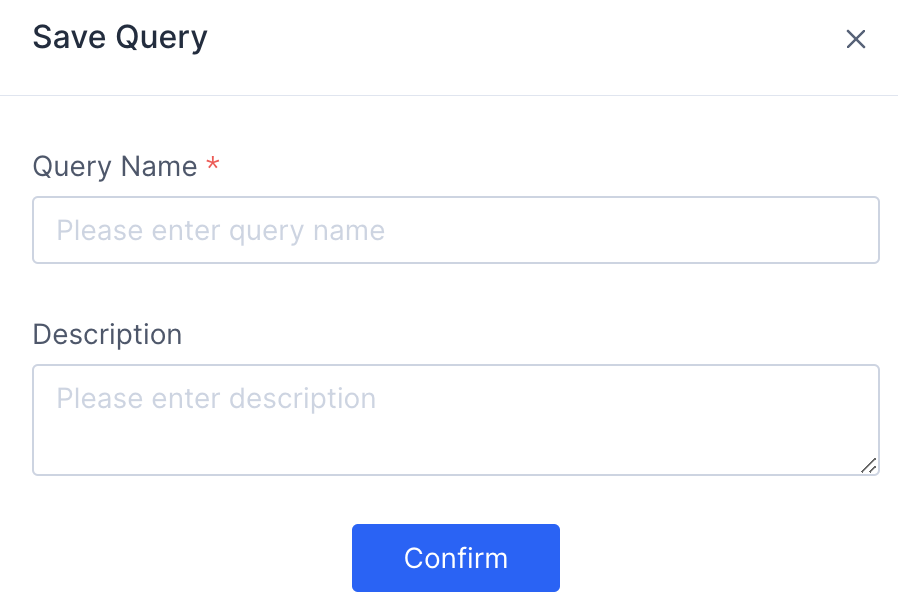
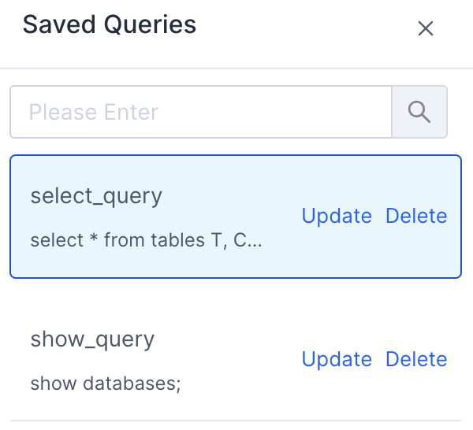

# Query Data

## Use Cluster

You can specify the cluster used for the current query in the drop-down box in the upper right corner. **You must choose a cluster before you initiate a query.**

Only clusters in the active state can be used.

## Query Result

The query result will be returned and displayed below the editor, where you can also find the Error status and other information produced by the query.

> **Note** Now, if multiple queries are executed simultaneously, the first query's result will be returned, and we will add the function of viewing other returns in later versions.

At the same time, you can download your query results by clicking **Download**.

## Query History

You can view the previous queries **launched on this page** in Query History.

You can click on the query ID to view the details of the query profile.

* Query IDs are not available for non-query statements.
* Failed queries also do not have Query IDs.

## Save Query

You can find **Save Query** and **Saved Query** in the upper right corner of the editor.

