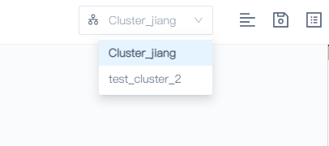
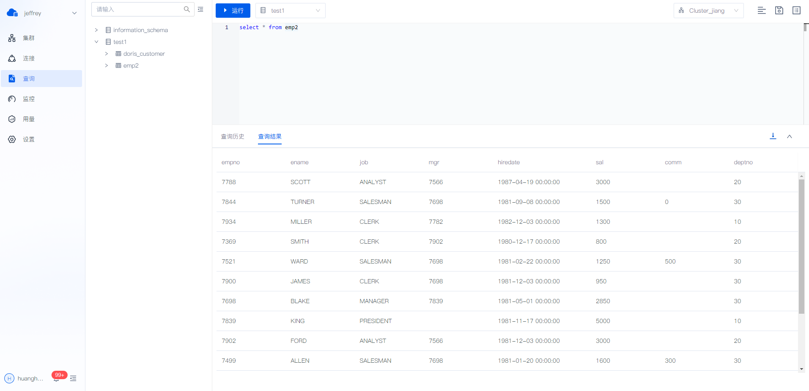
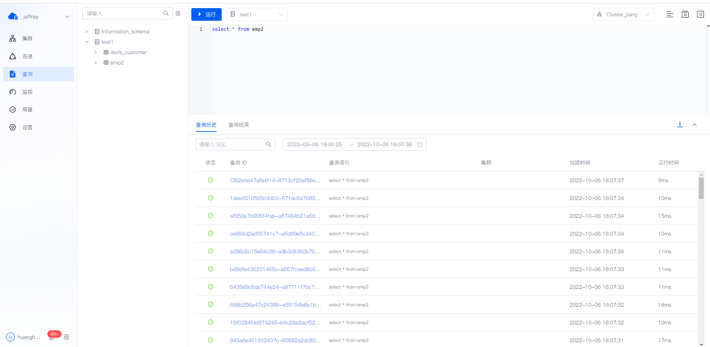
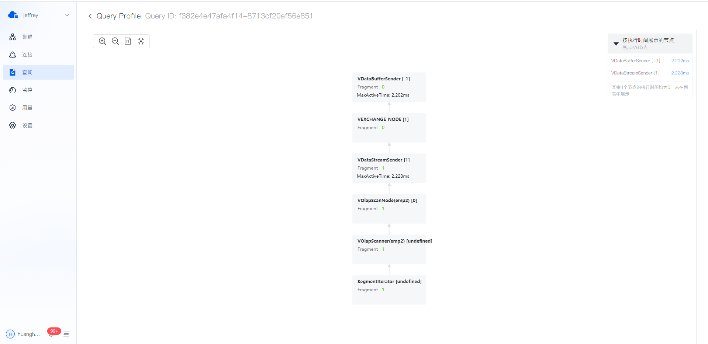
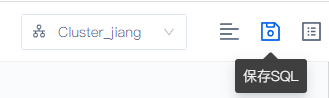
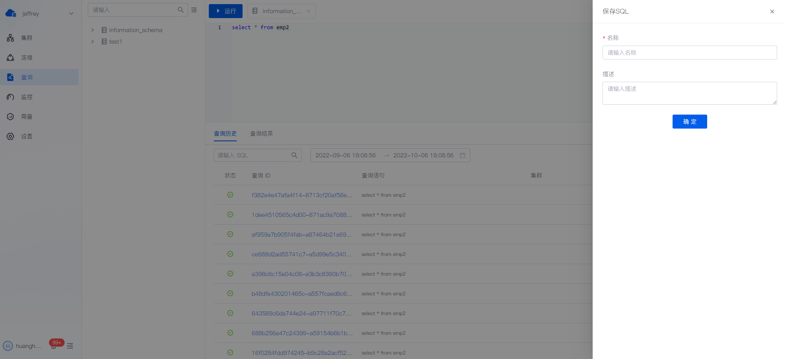
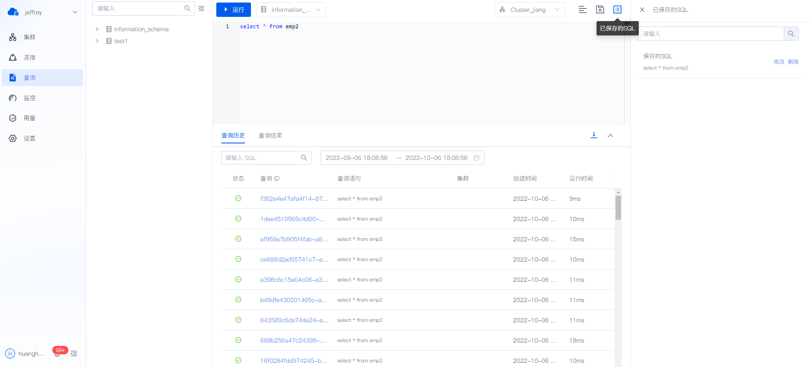

# 查询数据

## 选择集群

你可以在右上角的下拉框指定当前查询要使用的集群， **必须选择一个集群，才能发起查询** 。

只能使用当前数据仓库活跃状态的集群。

## 查询结果

查询的结果将在编辑框的下方返回，查询返回的错误或者是成功状态以及信息也会在查询结果处展示。

同时，你可以点击右侧的  **下载** ，将你的查询结果下载下来。

> **提醒** 当前，如果一次性执行了多次查询，会返回**第一条** Query 的结果，我们会在之后的版本添加查看其他返回的功能。
>
> 同时，在“查询”模块发起查询时，没有上下文关联。所以可能遇到 USE [DATABASE] 不生效等上下文缺失的问题，我们会在下一个版本添加查询时的上下文关联。

## 查看查询历史

你可以在查询历史处，查看在这个页面上发起的查询。

可以点击查询历史的 Query ID ，可以查看查询详情。

> **注意** 非查询语句没有 Query ID ，查询失败的语句也没有 Query ID。

在未来，出于性能考虑，Profile 功能不会默认开启，我们会提供开启 Profile 功能的开关，方便你在调试时查看更详细的信息。

## 保存 SQL

你可以在编辑器右上角找到“保存 SQL”与“已保存的 SQL”。

从“已保存的 SQL”打开 SQL，之后再进行修改，这些修改会被保存下来。

# 