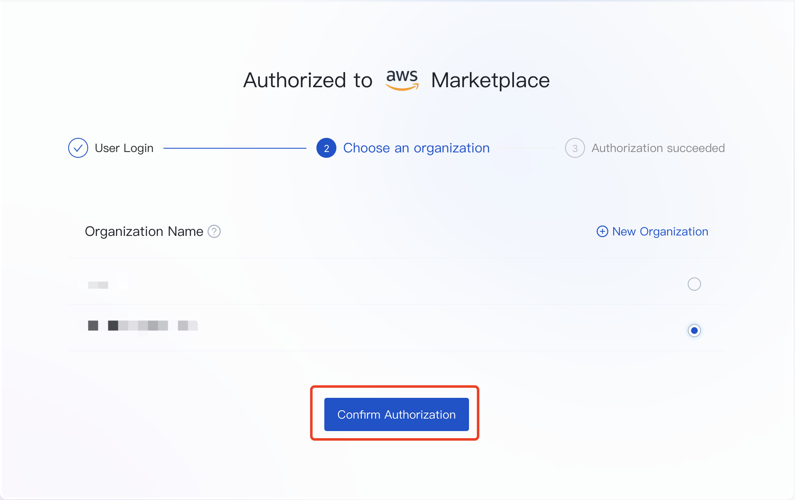

# Usage and Billing

This topic describes how to recharge units or use other deduction channels.

You can also perform cost analysis based on this topic's historical orders and warehouse-level usage statistics.

## Recharge

Click **User Account** > **Usage & Billing** to enter the billing page.

Click **Buy Now** to recharge units (100 Units = 1 Yuan). The following recharge methods are currently supported:

* Corporate Transfer: Transfer money based on the payment information. Once the transfer is successful, SelectDB Cloud will automatically recharge units for your account.

* Exchange code: Fill in the exchange code to verify, and click **Confirm** to recharge units automatically.

## Use Other Deduction Channels

This topic mainly describes how to use the AWS Marketplace deduction channel, which is similar to other cloud providers.

The specific opening process is as follows:

1. Click **Open & Authorize** on the billing overview page to go to the SelectDB Cloud service page of the AWS Marketplace.
2. Click **Continue to Subscribe** > **Subscribe** to go to the authorization page.

3. Log in with your SelectDB Cloud console account on the authorization page.

4. Select the target organization from the organization list, and click **Confirm Authorization**. Once the authorization is successful, your AWS account will deduct the subsequent expenses.

Go to the SelectDB Cloud billing overview page after completing the authorization. It is successful if **AWS Marketplace** is displayed on the other deduction channels.

## Historical Order

After recharging units or paying through the other deduction channels, you can view the order information on the historical order page.

The order information includes information such as deduction channels, fees, and time.

You can issue invoices for orders generated by corporate transfer. You can print invoices through the corresponding channels for orders generated through the other deduction channels.

## Organization Internal Usage

After creating a warehouse, SelectDB Cloud collects warehouse-level usage data every minute, deducts fees by the hour, and then displays warehouse usage statistics to help you analyze the cost of different warehouses.

If the remaining units or the balance of the other deduction channels is insufficient, SelectDB Cloud will stop the service, but the data will be retained for 7 days.

To keep the online service running continuously, please ensure that the remaining units or the balance are sufficient.

## Warehouse Internal Usage

This topic provides usage statistics in a single warehouse to help you analyze the cost of each part.

### Today's Usage

Displays usage summary statistics for the current day.

### Cluster Usage

Provides daily and hourly usage statistics of all clusters in the warehouse, which supports downloading in CSV format.

### Data Storage Usage

Provides daily and hourly usage statistics of data storage, which supports downloading in CSV format.

Clusters in the same warehouse share the underlying data storage.

### Instance Usage

Provides daily and hourly usage statistics of the warehouse instance, which supports downloading in CSV format. The usage mainly comes from warehouse metadata storage, request access, etc.

SelectDB Cloud also provides usage statistics for all warehouses under an organization, which is helpful for organization administrators. Please refer to the usage and billing module for details.