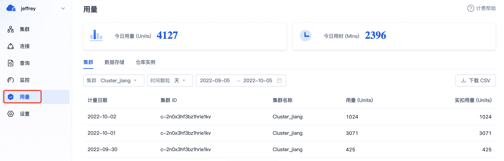

# 费用中心

在正式应用于生产环境之前，用户可通过费用中心进行充值或者开通其他扣费渠道，以保障服务持续运行。用户也可结合费用中心里的历史订单、用量信息（仓库粒度），进行成本分析。

## 充值购买

点击 **用户菜单** >  **费用中心** ，进入如下页面：

点击 **继续购买** 进行充值，即购买服务用量 Units（100 Units = 1 元）。目前支持对公转账和兑换码两种方式：

* **对公转账** ：用户按照收款信息，线下转账成功后，SelectDB Cloud 会自动给用户账户充入相应数量的 Units。

* **兑换码** ：填入兑换码信息进行查询， 在查询结果中点击 **确认兑换** 后自动充入 Units。

## 开通其他扣费渠道

本文结合阿里云云市场介绍如何开通其他扣费渠道，其他云市场开通方法类似。

具体开通流程如下：

1. 在用费中心页面中，点击 **其他扣费渠道** 中的  **去授权** ，进入云市场 SelectDB Cloud 服务页。客户也可在云市场中搜索 “SelectDB” 关键词进入服务页。
2. 点击  **立即开通** ，并勾选  **同意商品在线协议及云市场平台服务协议** ，确认  **开通** 。
   
3. 提交开通请求后，页面会跳转至云市场控制台，显示已开通的服务列表，从中找到刚开通的 SelectDB Cloud 服务，点击 **详情** 查看服务详情。

> **提醒** 阿里云完成服务开通需要数秒时间，如果服务项没有 **详情** 链接，可稍候刷新页面。

4. 在服务详情中，找到激活地址并在浏览器中打开，进入到扣费渠道授权激活页面，使用 SelectDB Cloud 账号登录后，点击  **下一步** 。

5. 在显示的 SelectDB Cloud 组织列表中，选择希望开通云市场扣费渠道的目标组织，点击 **确认授权** 进行开通。如果成功，该组织后续使用 SelectDB Cloud 服务的费用，会通过云市场进行扣费。

授权成功后，你可跳转回 SelectDB Cloud 费用中心，如果 **其他扣费渠道** 显示  **阿里云云市场** ，恭喜，你已开通云市场扣费渠道。

## 查看历史订单

充值购买用量或者通过其他渠道扣费后，可以进入历史订单页面，查看历史订单记录。

历史订单会记录购买方式、状态和费用等信息。

采用对公转账方式生成的订单，可开具电子或纸质发票。通过其他扣费渠道生成的订单，可通过相应渠道开具发票。

## 仓库用量列表

SelectDB Cloud 会周期性的统计组织中仓库的用量信息，然后展示在仓库用量列表页面，可用于分析组织中不同仓库的用量情况。

仓库用量列表为粗粒度的用量信息，主要提供给组织管理进行对账和成本分析。

用量统计按分钟粒度进行，不足 1 分钟按 1 分钟计算，然后按小时扣除 Units。

如果账户 Units 剩余总量不足，且未开通其他扣费渠道，SelectDB Cloud 会把仓库置为已停服状态，但数据会继续保留 7 天。为保障线上服务持续运行，请保障剩余用量充足或者开通其他扣费渠道。

## 仓库内部用量

仓库内部用量功能提供了每个仓库内部不同资源的用量统计信息，帮助你进一步分享仓库内的成本情况。

### 今日用量

展示当前天的用量汇总数据。

### 集群

提供仓库内的不同集群在天、小时粒度的用量数据，支持以 CSV 格式下载。

### 数据存储

提供仓库内的数据存储在天、小时粒度的用量数据，同一个仓库内的多个集群共享底层数据，支持以 CSV 格式下载。

### 仓库实例

提供每个仓库实例自身在天、小时粒度的用量数据，这部分用量主要来源于仓库元数据存储、请求接入等，支持以 CSV 格式下载。

