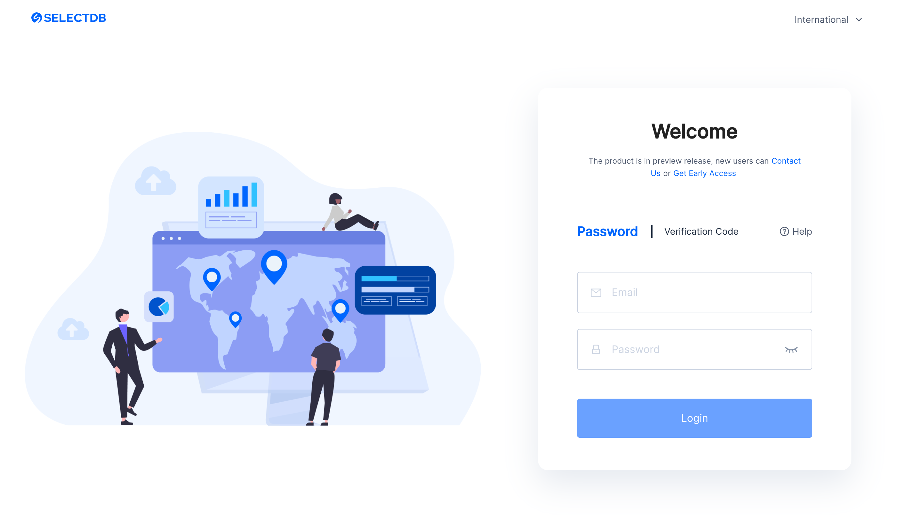
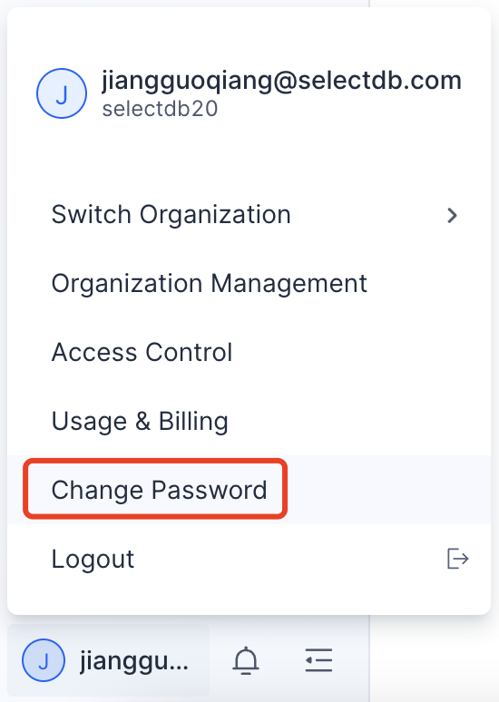
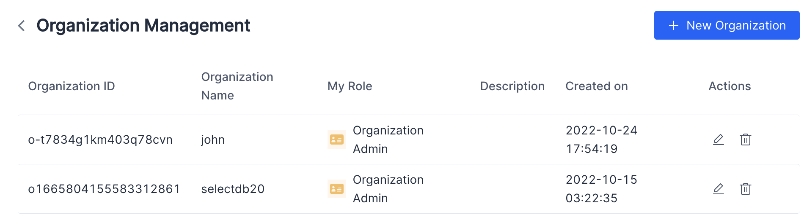
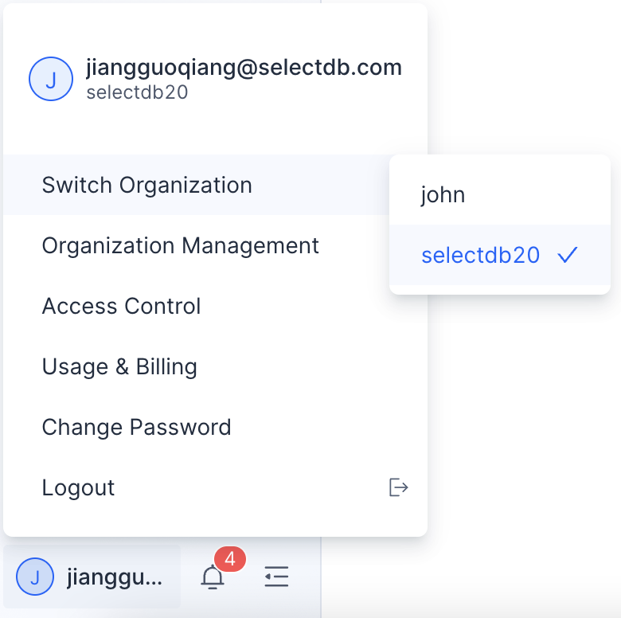
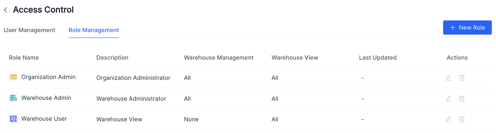
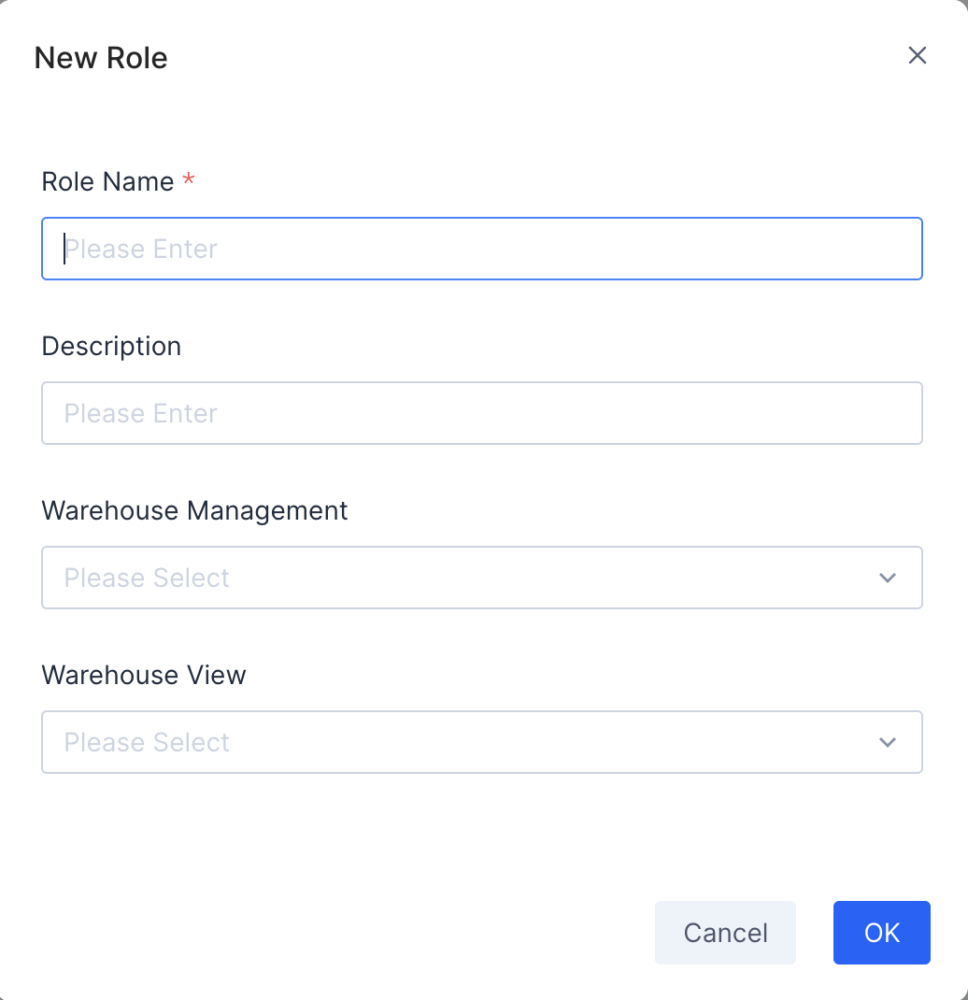
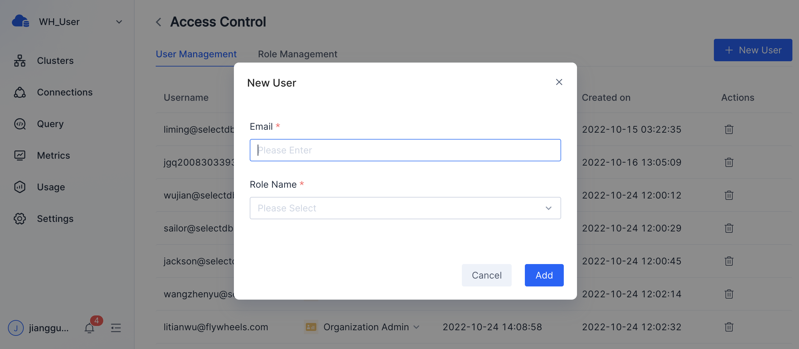
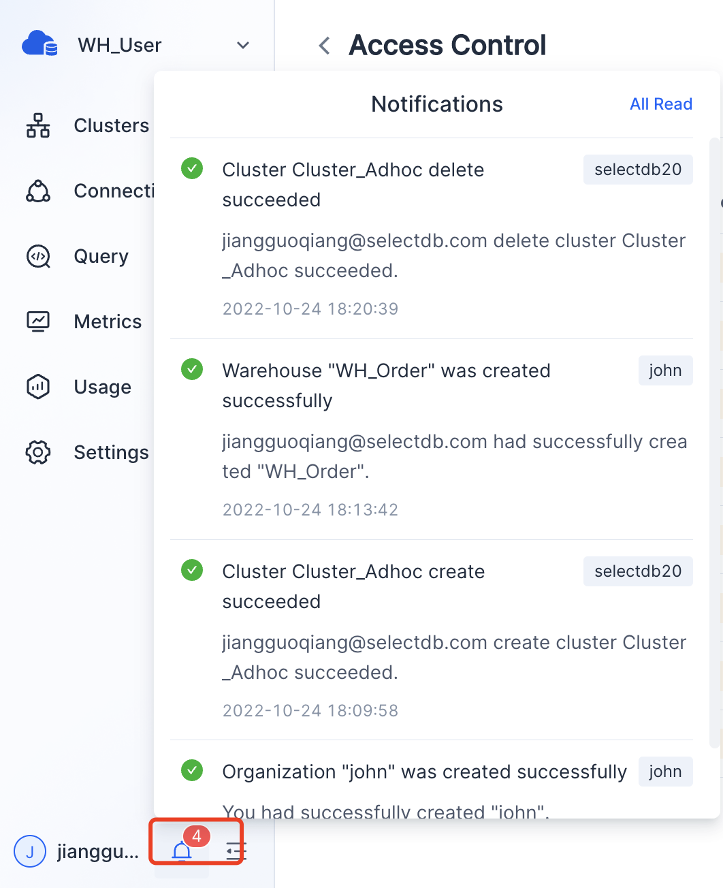

# Registration and Login

SelectDB Cloud supports a login-as-registration scheme. Registration is done the first time you log in with a verification code. Registered users can log in with a verification code or a password.

Click [http://en.selectdb.cloud](http://en.selectdb.cloud/) to enter the SelectDB Cloud International login page.

> **Tip** SelectDB Cloud includes two independent account systems: One is used for logging into the console, as described in this topic. The other one is used to connect to the warehouse, which is described in the Connections topic.

## New User Registration

New users can directly log in with a verification code, and SelectDB Cloud will automatically complete the new user registration.

> **Note** There may be a delay in receiving the verification code. Please wait or try again. If you still can't, please [contact us](https://en.selectdb.com/company/).

## Change Password

After login, click **User Menu** > **Change Password** to change the login password for the SelectDB Cloud console.

Once you have successfully changed the password for the first time, you can use the password for subsequent logins.

## User Login

Registered users can log in by password or verification code as needed.

# Organization Management

Organization is the billing unit. Each organization will be billed individually. We recommend that you divide organizations by cost unit, and one user can be affiliated to multiple organizations.

Multiple warehouses can be created under one organization, and the data of different warehouses are isolated.

In Organization Management, you can view all the organizations and roles that you are in.

You can switch the current organization in the menu bar - switch organization in the user menu.

# Access Control

## Role Management

There are three roles by default in an organization, and you can create multiple custom roles.

|                    | **Manage Access Control** | **Manage Billing** | **Manage Organization** | **Manage Warehouse**                                        |
| ------------------ | ------------------------- | ------------------ | ----------------------- | ----------------------------------------------------------- |
| Organization Admin | Yes                       | Yes                | Yes                     | Create warehouseAll warehouse:Edit / View / Query / Monitor |
| Warehouse Admin    | No                        | No                 | No                      | All warehouse: Edit / View / Query / Monitor                |
| Warehouse View     | No                        | No                 | No                      | All warehouse:  View / Query / Monitor                      |
| Custom Role        | No                        | No                 | No                      | Some warehouse: Edit/ View / Query / Monitor                |

* View existing roles:

* New role:

You can specify the role name and its corresponding privileges during creation.

Custom roles can also be deleted or edited.

The user who creates the organization will be the organization administrator role by default.

## User Management

Organization administrators can add new users to the current organization and grant different roles.

# Notification

You can find notifications in the lower left corner. Users, organizations, authorized warehouses, cluster operations, and alarms in the platform will be notified to remind users when they are triggered.

