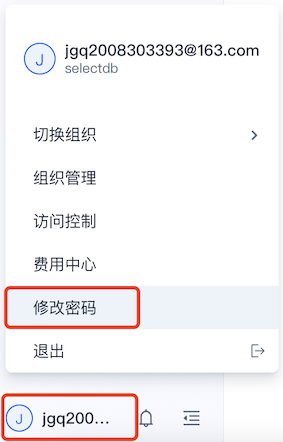
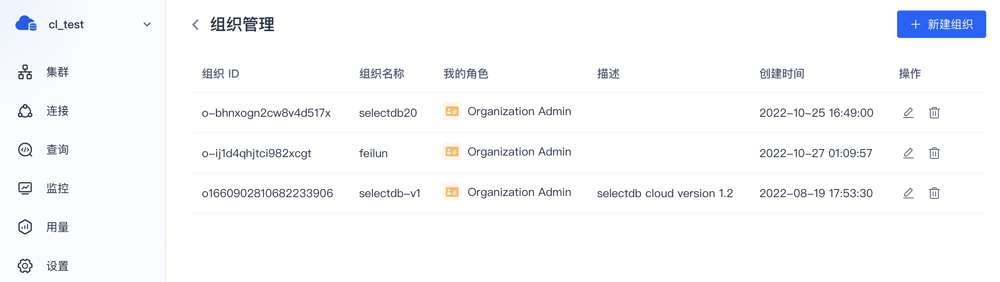
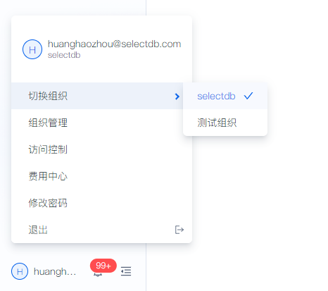
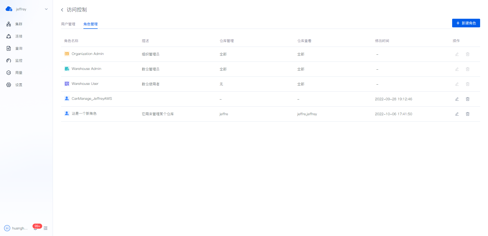
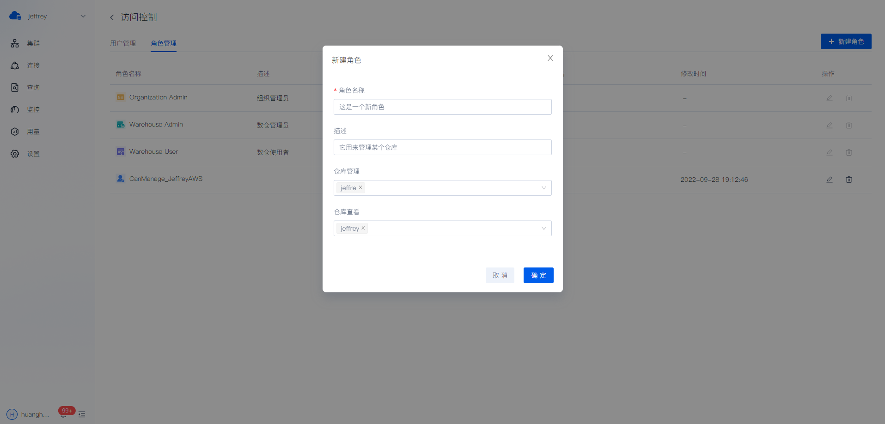
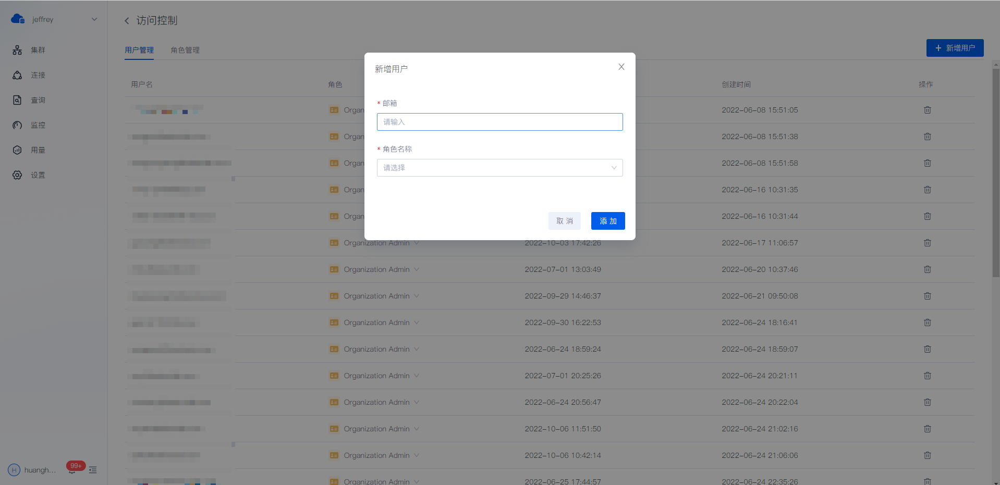
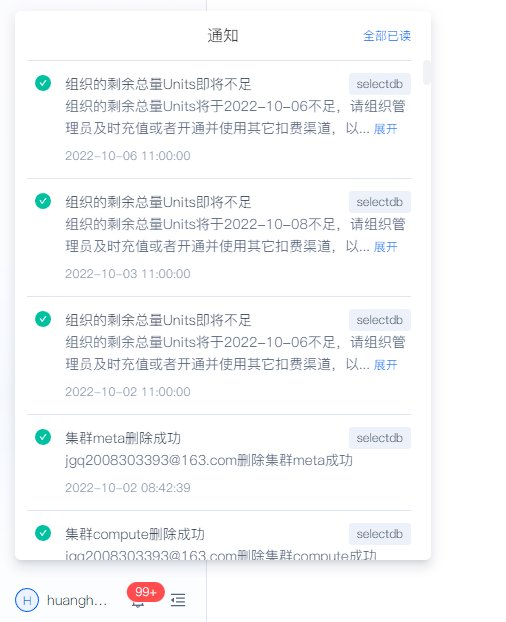

# 注册和登录

SelectDB Cloud 支持登录即注册方案，第一次验证码登录即为注册。已注册用户可通过验证码和密码两种方式进行登录。

点击 [http://cn.selectdb.cloud](http://cn.selectdb.cloud/) 进入 SelectDB Cloud 中国站登录页面。

> **提醒** 控制台的登录用户不同于仓库自身的数据库用户。控制台用户是企业组织用来购买、管理多个仓库使用。

## 新用户注册

新用户第一次使用时，可直接选择验证码方式登录，系统会自动完成新用户注册。

> **提醒** 邮箱接收验证码可能存在延迟，请稍候或者重试。如果重试仍无法成功，请[联系我们](https://cn.selectdb.com/company/#anchor)。

## 修改密码

用户登录后，可以点击 **用户菜单** > **修改密码** ，修改 SelectDB Cloud 控制台的登录密码。

新用户第一次修改密码成功后，后续即可使用密码方式登录了。

## 用户登录

已注册的用户可按需选择密码或者验证码登录方式。

# 组织管理

组织是计费单位，同一组织下共享账单。我们推荐你以**成本结算单位**划分组织，一个用户可以属于多个组织。

一个组织下可以创建多个仓库，每个仓库之间的数据是隔离的。

组织管理中可以查看当前用户所在的所有组织，以及在每个组织中的角色。

你可以在左下角的 **用户菜单**> **切换组织** ，切换当前所在的组织。

# 访问控制

## 角色管理

一个组织内默认有三个角色，还可以自定义多个角色。

| **角色名称**                     | **访问控制权限** | **计费权限** | **组织管理权限** | **仓库权限**                                    |
| -------------------------------- | ---------------- | ------------ | ---------------- | ----------------------------------------------- |
| Organization Admin（组织管理员） | 有               | 有           | 有               | 创建仓库所有仓库编辑 / 查看 / 查询 / 监控       |
| Warehouse Admin（仓库管理员）    | 无               | 无           | 无               | 所有仓库编辑/查看/查询/监控                     |
| Warehouse View（仓库使用者）     | 无               | 无           | 无               | 所有仓库查看/查询/监控                          |
| 自定义角色                       | 无               | 无           | 无               | 部分仓库编辑/查看/查询/监控，仓库的范围是自定义 |

查看现有角色：

新建角色：

你可以指定新建的角色名，以及其有的对应仓库的权限。

自定义角色还可以删除或者编辑修改。

> **提醒** 创建组织的用户会被默认为组织管理员角色。

## 用户管理

组织管理员可以添加新的用户进入当前组织，并且授予不同的角色。

# 通知中心

通知中心的入口在左侧导航栏底部，平台内关于用户、组织及有权限的仓库、集群的操作和告警被触发，都会通知提醒用户。

