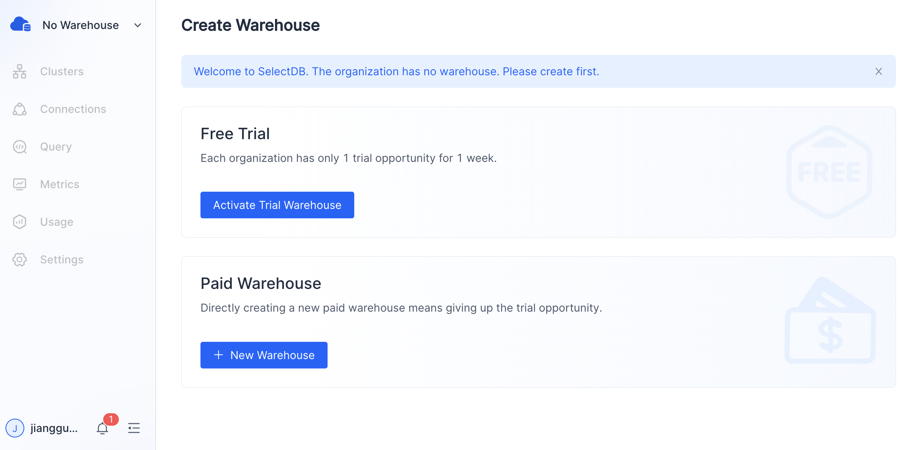
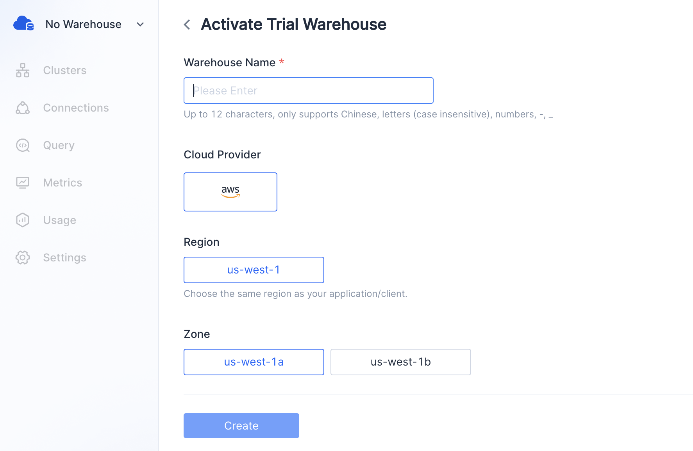
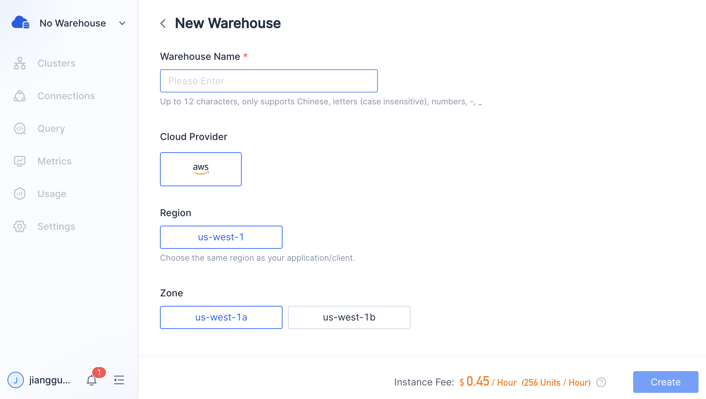
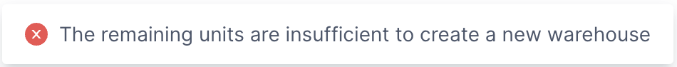
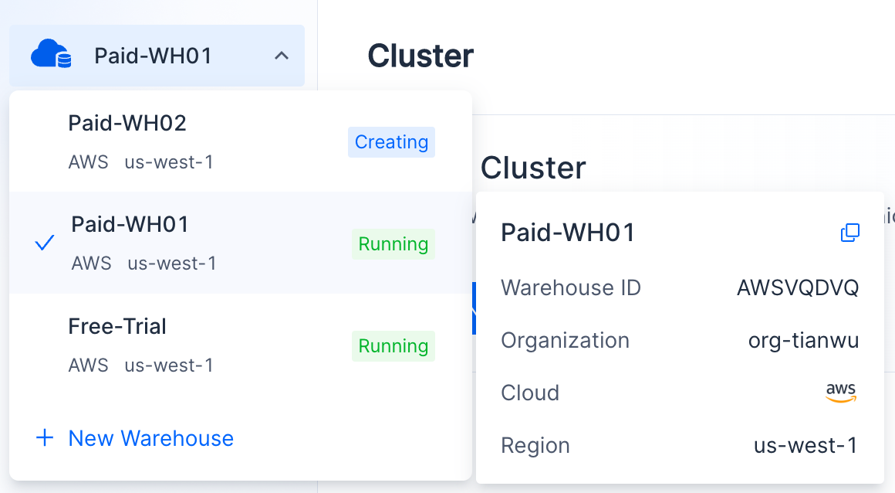
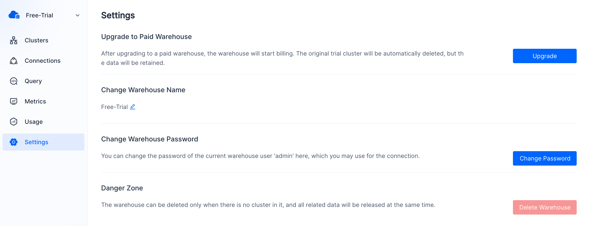
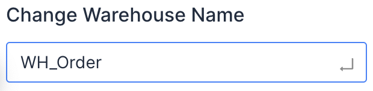
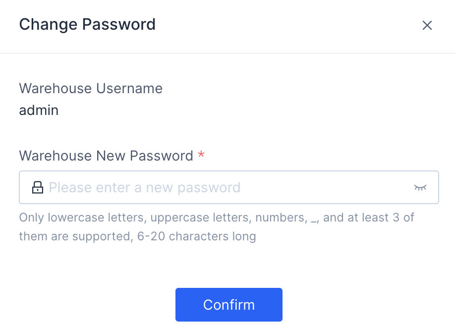
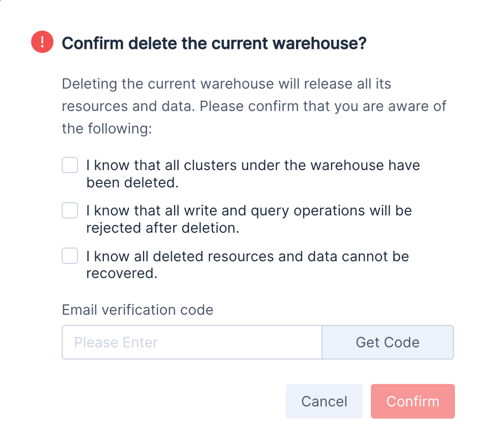

In SelectDB Cloud, the warehouse is a logical concept that includes physical objects such as warehouse metadata, clusters, and data storage.

Under each organization, you can create multiple warehouses to meet the needs of different business systems, and the resources and data between these warehouses are isolated.

## Create Warehouse

A wizard page will be displayed if the organization does not have a warehouse. You can create the first warehouse following the prompts.

You can choose to **Activate Trial Warehouse** for a free trial or **New Warehouse** for a production environment.

* Each organization gets a 7-day free trial. The trial warehouse is only applicable to the feature experience in the small-scale data volume scenario. In the trial warehouse, you cannot create new clusters, resize the trial cluster, etc. After upgrading it to the paid warehouse, you can use all the features.
* If you choose to start a new paid warehouse directly, that means you have given up the free trial opportunity for the current organization and you may not create a trial warehouse in the future. An instance fee will be incurred when a new warehouse is started. Paid warehouses are suitable for production environments with complex workload requirements.

### **Activate Trial Warehouse**

Click **Activate Trial Warehouse** to enter the following page.

After setting the parameters, click **Create Now**.

| **Parameter**  | **Description**                                              |
| -------------- | ------------------------------------------------------------ |
| Warehouse Name | Required. Unique within the organization, no more than 12 characters in length, supports English letters, Chinese, numbers, "-", "_", and the combination of them. |
| Cloud Provider | Required. Select the cloud provider where you want to create the data warehouse. Currently, SelectDB Cloud China station supports Aliyun, and will soon support Tencent Cloud and Huawei Cloud. The international station supports AWS, and will soon support Azure and GCP. |
| Region         | Required. Select the region where you want to deploy the data warehouse. To avoid the complexity of cross-regional communication and reduce latency, we recommend that you choose the same region where your application/client is. Currently, SelectDB Cloud supports several regions of various cloud providers and will expand and support more regions based on the needs of users. |
| Zone           | Required. Select the zone where you want to deploy the data warehouse. It is recommended to choose the same zone as that of your application/client. SelectDB Cloud will expand its supported zones based on user needs. |

> **Note** After confirming the activation of the trial warehouse, you can see the new warehouse in the warehouse selector. It takes about 1 minute to complete the creation. When the status of the trial warehouse changes from "**Creating**" to "**Running**", SelectDB Cloud will automatically create a trial cluster for you, which takes about 1 minute.

### **Create New Warehouse**

Click **New Warehouse** on the wizard page or at the bottom of the warehouse selector.

| **Parameter**  | **Description**                                              |
| -------------- | ------------------------------------------------------------ |
| Warehouse Name | Required. Unique within the organization, no more than 12 characters in length, supports English letters, Chinese, numbers, "-", "_", and the combination of them. |
| Cloud          | Required. Select the cloud provider where you want to deploy the data warehouse. Currently, SelectDB Cloud China station supports Aliyun, and will soon support Tencent Cloud and Huawei Cloud. The international station supports AWS. |
| Region         | Required. Select the region where you want to deploy the data warehouse. To avoid the complexity of cross-regional communication and reduce latency, we recommend that you choose the same region where your application/client is. Currently, SelectDB Cloud supports several regions of various cloud providers and will expand and support more regions based on the needs of users. |
| Zone           | Required. Select the zone where you want to deploy the data warehouse. It is recommended to choose the same zone as that of your application/client. SelectDB Cloud will expand its supported zones based on user needs. |

Creating a new paid warehouse will incur an instance fee. Therefore, before creation, please ensure sufficient remaining **Units** or activate another deduction channel. Otherwise, you will see the following error prompt.

> **Note**
>
> * **Units** are used to calculate the resources on SelectDB Cloud. 100 Units = 0.177 USD.
> * After confirming the creation of a warehouse, you can see the new warehouse in the warehouse selector. It takes about 1 minute to complete the creation. The warehouse status will change from " **Creating** " to " **Running** ".

## Check Warehouse Details

In the warehouse selector, you can see all the warehouses you are permitted to check.

The warehouse selector will display each warehouse's name, cloud provider, region, and status. The ticked one is your current warehouse.

Hover the cursor over a warehouse, and you will see a pop-up card, which displays the name, ID, organization, cloud provider, and region of the warehouse.

> **Note**
>
> * Warehouse ID coding rules: must have 8 characters, consisting of uppercase letters and numbers. The first 4 letters represent the cloud provider & region (e.g. US West (N. California) of AWS, AWSV), and the last 4 letters represent the warehouse by a random combination of letters and numbers (such as 87EL).

## Switch Current Warehouse

In the warehouse selector, you can scroll and find your target warehouse and switch to it by a simple click.

## Upgrade to Paid Warehouse

If you want to reuse the trial warehouse's data, connections, and other configurations, you can go to the **Settings** page from the navigation bar on the left and click **upgrade** to convert to a paid warehouse.

> **Warning** If the trial warehouse is not upgraded to a paid warehouse, it will be automatically deleted after the end of the 7-day trial, together with all its resources and data, which cannot be recovered.

## Change Warehouse Name

You can change the warehouse name on the **Settings** page. Please enter a new warehouse name (self-explanatory names are recommended) and press Enter to confirm the modification.

> **Warning** The warehouse name must be unique within the current organization, with a maximum of 12 characters. It only supports letters, numbers, -, _

## Change Warehouse Password

The username and password are required when connecting to a warehouse. SelectDB Cloud initializes the user name ('admin') and password for you. You can change the password on the **Settings** page.

> **Warning** The password only supports lowercase letters (a-z), uppercase letters (A-Z), numbers (0-9), and underscores (_). The password must be a combination of at least three of the above symbol types, with a length of 6-20 characters.

## Delete Current Warehouse

Since deleting a warehouse is a high-risk operation, we need to make sure that you understand the impact of the deletion and confirm it through email verification code.

You can delete the current warehouse on the **Settings** page.

> **Warning** Deleting a warehouse involves the deletion of all its resources and data, which cannot be recovered.