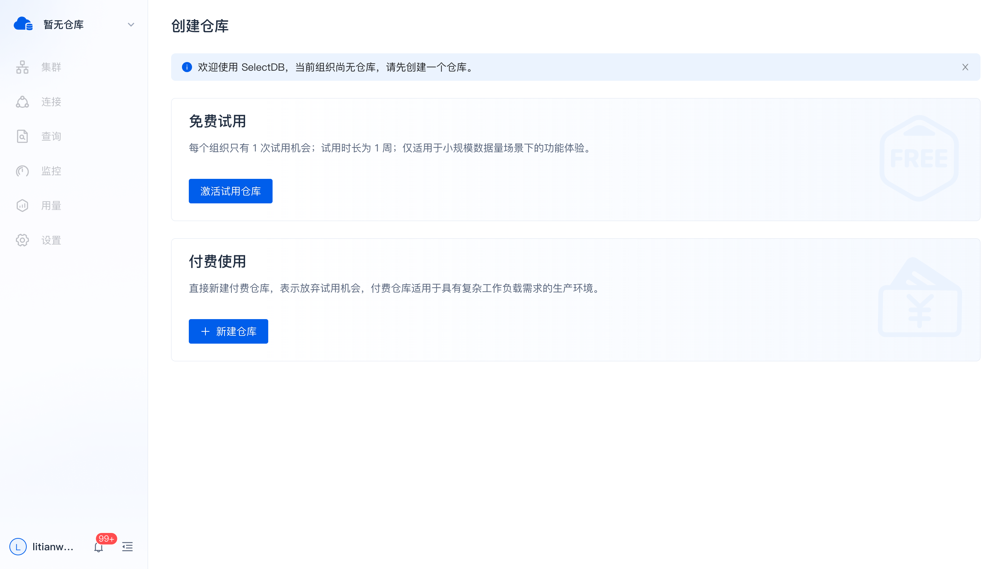
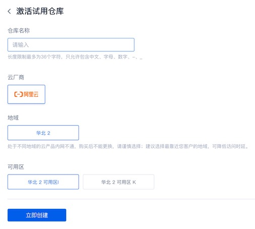
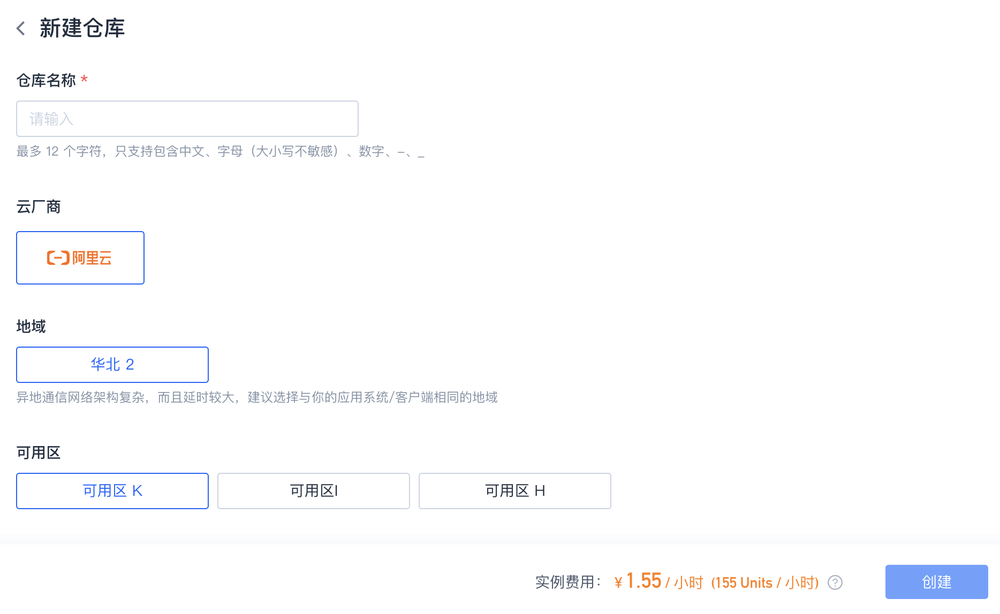
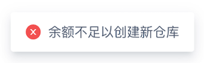
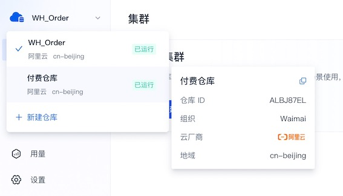
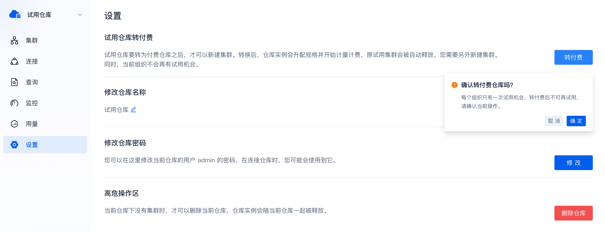
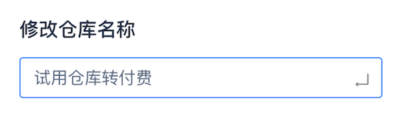
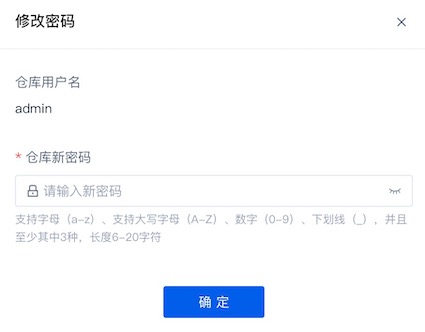
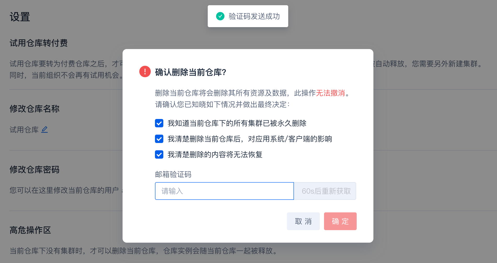

# 仓库管理

在 SelectDB Cloud，仓库是一个逻辑概念，包括仓库元数据、集群、数据存储这些物理对象。每个组织可以创建多个仓库，仓库之间资源和数据相互隔离，以满足不同业务系统的需要。

## 创建仓库

当前的组织尚无仓库时，会进入一个引导页，你可以参照提示创建第一个仓库。

你可以选择 **激活试用仓库** 免费试用，或者立即 **新建仓库** 付费使用。

* 每个组织只有 1 次试用机会，试用时长为 1 周。试用仓库仅适用于小规模数据量场景下的功能体验，试用仓库激活后，SelectDB Cloud 会自动创建一个试用集群。试用仓库不能创建付费集群，如果已完成试用体验，可以转付费仓库，转换成功后，方可创建付费集群。
* 如果直接新建仓库，表示放弃试用机会，当前的组织以后都不可以创建试用仓库。新建仓库会产生实例费用。付费仓库适用于具有复杂工作负载需求的生产环境。

### 激活试用仓库

单击  **激活试用仓库** ，进入仓库配置页，填写表单进行创建。

| **参数** | **说明**                                                     |
| -------- | ------------------------------------------------------------ |
| 仓库名称 | 必填项。组织内唯一，最多 12 个字符，只支持包含中文、字母、数字、-、_ |
| 云厂商   | 必选项。选择希望部署数据仓库在哪个云平台。目前，SelectDB Cloud 中国站已支持阿里云、腾讯云和华为云；国际站已支持 AWS，即将支持 Azure 和 GCP。 |
| 地域     | 必选项。选择希望部署数据仓库在哪个地域。由于异地通信网络架构复杂，而且延时较大，建议选择与你的应用系统/客户端相同的地域。目前，SelectDB Cloud 中国站已支持阿里云的华北2（北京）地域（cn-beijing），国际站已支持 AWS US West (N. California) 地域（us-west-1），根据客户需求情况，将陆续增加支持地域。 |
| 可用区   | 必选项。选择希望部署数据仓库在哪个可用区。建议选择应用系统/客户端所在的可用区，方便以后通过私网连接数据仓库。SelectDB Cloud 将根据客户需求情况，陆续增加支持可用区。 |

> **说明** 确认激活试用仓库后，用户就可以在左上角仓库列表看到新的仓库，状态为“创建中”，需要约 1 分钟。试用仓库状态从“创建中”变为“运行中”时，SelectDB Cloud 会自动帮用户创建一个试用集群，需要约 1 分钟，集群状态从“创建中”变为“运行中”。

### 新建付费仓库

在创建仓库默认页或者左上角仓库列表，单击  **新建仓库** ，进入仓库配置页，填写表单进行创建。

| **参数** | **说明**                                                     |
| -------- | ------------------------------------------------------------ |
| 仓库名称 | 必填项。组织内唯一，最多 12 个字符，只支持包含中文、字母、数字、-、_ |
| 云厂商   | 必选项。选择希望部署数据仓库在哪个云平台。目前，SelectDB Cloud 中国站已支持阿里云、腾讯云和华为云；国际站已支持 AWS，即将支持 Azure 和 GCP。 |
| 地域     | 必选项。选择希望部署数据仓库在哪个地域。由于异地通信网络架构复杂，而且延时较大，建议选择与你的应用系统/客户端相同的地域。目前，SelectDB Cloud 中国站已支持阿里云的华北2（北京）地域（cn-beijing），国际站已支持 AWS US West (N. California) 地域（us-west-1），根据客户需求情况，将陆续增加支持地域。 |
| 可用区   | 必选项。选择希望部署数据仓库在哪个可用区。建议选择应用系统/客户端所在的可用区，方便以后通过私网连接数据仓库。SelectDB Cloud 将根据客户需求情况，陆续增加支持可用区。 |

新建付费仓库会产生实例费用，因此在创建之前，请确保 Units 余额充足或者已开通使用其他扣费渠道，否则会报错。

> **说明**
>
> * Units 是 SelectDB Cloud 上衡量各种资源用量的单位。在中国站，100 Units = 1 元；在国际站，100 Units = 0.177 美元。
> * 确认创建仓库后，用户就可以在左上角仓库列表看到新的仓库，状态为“创建中”，需要约 1 分钟完成创建。创建完成后，仓库状态会从“创建中”变为“运行中”。

## 查看仓库详情

在页面左上角，单击仓库名称区，弹出下拉菜单，会列出当前用户有权限查看的仓库。

仓库列表会展示各个仓库的名称、所在云平台及其地域、状态等信息，打勾的即为当前仓库。

鼠标滑到某个仓库，界面自动弹出二级卡片，里面包括仓库名称、仓库ID、内核版本、所属组织、所在云平台、所在地域、创建时间等信息，支持一键复制仓库ID。

> **说明**
>
> * 仓库 ID 编码规则：固定 8 个字符，由大写字母和数字组成，前 4 个字母表示云厂商+地域（如阿里云北京，ALBJ），后 4 个由字母与数字随机组合表示仓库（如：87EL）。
> * 云厂商字母缩写如下：
>
>   * 阿里云中国：AL
>   * 腾讯云中国：TX
>   * 华为云中国：HW
>   * AWS 海外：AW
> * 地域字母缩写如下：
>
>   * 北京：BJ
>   * 上海：SH
>   * 广州：GZ
>   * 深圳：SZ
>   * 杭州：HZ

## 切换当前仓库

在仓库列表，你可以将滚动浏览，并切换当前仓库。

## 试用仓库转付费

如果你已提前完成试用体验，想复用试用仓库的数据和连接等配置，可以前往左侧导航栏的 **设置** 页，单击 **转付费**可转为付费仓库。

> **注意** 试用仓库如果不转付费仓库，试用期满后，将会被自动删除，其所有资源及数据都会被一并释放，无法恢复。

## 修改仓库名称

如果需要修改仓库名称，可以在 **设置** 页直接修改，输入新的仓库名称（建议命名能够见名知意），回车确认即可修改成功。如下所示：

> **注意** 仓库名称要求在当前组织内唯一，最多 12 个字符，只支持包含中文、字母、数字、-、_

## 修改仓库密码

连接仓库时需要用户名和密码，SelectDB Cloud 帮用户初始化了仓库的 admin 用户名及其密码。用户可以在 **设置** 页修改密码。

> **注意** 密码仅支持小写字母、大写字母、数字、_ ，并且至少包含其中 3 种，长度 6-20 字符。

## 删除当前仓库

由于删除仓库为高危操作，用户需要了解删除操作的影响，并通过邮箱验证码进行确认。

用户可以在 **设置** 页删除当前仓库。

> **注意** 删除仓库将会删除其所有资源及数据，无法恢复。

# 
