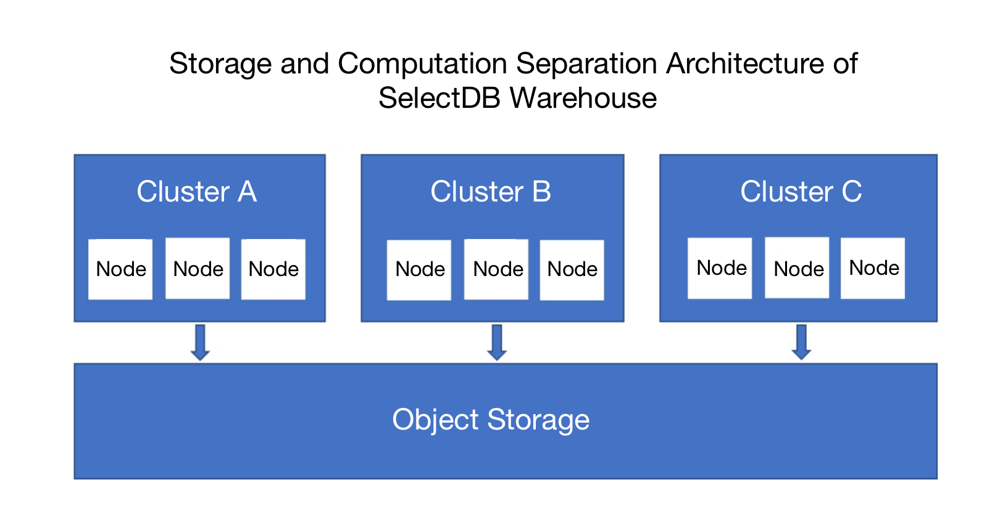

# Introduction

SelectDB is a cloud-native real-time data warehouse built on the basis of Apache Doris by the same core developers.

## Key Features

- **Extremely Fast**: SelectDB applies the highly effective columnar storage and data indexing, adopts the MPP distributed computing architecture, and uses a vectorized execution engine that is optimized for X64 and ARM64. It topped ClickBench, a global benchmark for analytical databases, for its exceptionally high performance.
- **Single-Unified**: SelectDB enables users to run multiple analytical workloads on one single system. It supports real-time/interactive/batch computing, structured/semi-structured data, and joint queries on external data lakes and databases.
- **Easy-to-Use**: SelectDB is compatible with MySQL network connection protocol. It provides WebUI-based database management tools that are powerful and user-friendly, and various connectors that are integrated with Spark/Flink/dbt/Kafka.
- **Cost-Effective**: SelectDB is highly adapted to cloud. It adopts an implemenation architecture that separates storage and computation. It allows automatic scaling to meet various computing requirements and applies cold and hot data separation in storage.
- **Open Source**: Since SelectDB is developed on the basis of Apache Doris, an open source analytical database, it allows free transfer of data between itself and Doris. It is able to run on multiple clouds and provides consistent user experience.
- **Providing Enterprise Features**: SelectDB provides well-developed mechanisms for user authentication, access control, data protection and data backup. In the future, it will provide more features, such as data desensitization, more granular privilege control, and data lineage, to satisfy more needs in data governance.

## Key Concepts

In SelectDB, organization is the billing unit. Each organization will be billed individually. We recommend that you divide organizations by cost unit. One user can be affiliated to multiple organizations. Multiple warehouses can be created under one organization.

Each warehouse adopts an architecture that separates storage and computation. The data will be stored on object storage of cloud providers. In one warehouse, you may create multiple clusters that are isolated from each other. Each cluster consists of multiple nodes, and all clusters share the same object storage.

## SelectDB VS Apache Doris

As SelectDB is built on the basis of Apache Doris, the SelectDB developers will continue to work closely with the Doris community in improving the Apache Doris kernel. Meanwhile, SelectDB provides the following enhanced features and services for enterprise users.

- **Apache Doris LTS Version**: SelectDB provides a free and open source Apache Doris LTS version that lasts 18 months to meet the enterprises' need for stronger stability.
- **Cloud-Native Kernel**: In addition to the enhanced open source Doris kernel, SelectDB provides a cloud-native kernel that is highly adapted to public cloud platforms to bring higher cost efficiency to enterprise customers.
- **Native Management Tools**: SelectDB provides powerful, easy-to-use Web-based database management and development tools that can work in substitution for Navicat. 
- **Professional Technical Support Services**: SelectDB offers professional technical support for both the open source kernel and the cloud-native kernel.

## Various Editions for Various Needs

Users may choose from the following two editions of SelectDB based on their own needs. 

- **SelectDB Cloud**: fully managed data warehouse services based on public clouds
- **SelectDB Enterprise**: able to be delivered as a local software and deployed on IDC of users or VPC of public cloud.

SelectDB 1.0  has been open for trial use application since July 2022. Dozens of companies have registered as a trial user.

SelectDB 2.0 Preview Version is currently available, too. SelectDB 2.0 and the subsequent versions will all come with its corresponding international version. If you need access to AWS, Azure, and GCP, please visit SelectDB International; if you need access to Alibaba Cloud, Tencent Cloud, and Huawei Cloud, you may visit SelectDB China.
