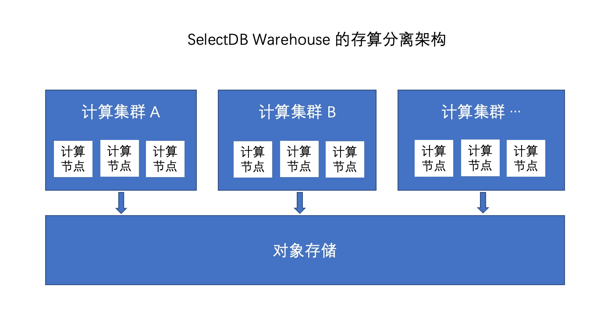

# SelectDB Cloud 介绍

SelectDB Cloud 是由 Apache Doris 的核心开发者基于 Apache Doris 内核开发的一个云原生的实时数据仓库。

## 核心特色

- **极致性能** ：存储上，采用高效的列式存储与数据索引；计算上，依赖 MPP 分布式计算架构和面向 X64 和 ARM64 优化的向量化执行引擎；在 ClickBench 公开性能评测中，处于全球领先水平。
- **融合统一** ：在单一系统上，可以运行多种分析负载。支持实时/交互/批量的计算类型，支持结构化/半结构化的数据类型，还支持对外部数据湖和数据库的联合查询。
- **简单易用：** 兼容 MySQL 的网络连接协议，拥有强大易用的基于 WebUI 的数据库管理工具，以及提供与 Spark/Flink/dbt/Kafka 等集成的丰富连接器。
- **高性价比** ：深度与云进行适配，采用存储与计算分离的实现架构。计算上，提供按需自动扩缩容，存储上采用冷热数据分层存储。
- **开源开放：** 基于开源的 Apache Doris 内核研发，并且数据可以与 Doris 进行自由迁移。运行在多云之上，提供一致的使用体验。
- **企业级特性** ：提供完善的用户认证与访问控制，数据保护与备份机制。未来也会针对数据治理的需求，提供数据脱敏、更细粒度权限管控和数据血缘的功能。

## 核心概念

组织是计费单位，同一组织下共享账单。我们推荐你以**成本结算单位**划分组织，一个用户可以属于多个组织。一个组织下可以创建多个仓库。

每个仓库采用存储和计算分离的架构。其中数据主要存储在云厂商的对象存储上，一个仓库可拥有多个互相隔离的计算集群，每个计算集群有多台计算节点组成。所有的计算集群共享底层的对象存储。

## 与 Apache Doris 的不同

SelectDB Cloud 是基于 Apache Doris 内核进行开发的，SelectDB Cloud 也针对企业客户提供了如下增强特性与服务。

- **云原生内核：** 除了开源 Doris 内核的增强，还针对公有云平台，提供深度适配的云原生内核，以便为企业提供更加极致的性价比和企业级特性。
- **原生的管理工具** ：提供强大易用的基于 Web 的数据库管理和开发工具。可以用来替换类似 Navicat 工具。
- **专业的技术支持服务** ：无论是针对开源内核还是云原生内核，提供专业的技术支持服务。

SelectDB Cloud 2.0 预览版现已开放申请试用。从 SelectDB Cloud 2.0 开始，SelectDB Cloud也正式上线国际版本，客户如需使用 AWS、Azure 和 GCP，请访问 SelectDB 国际站；客户如需使用阿里云、腾讯云和华为云，请访问 SelectDB 中国站。
