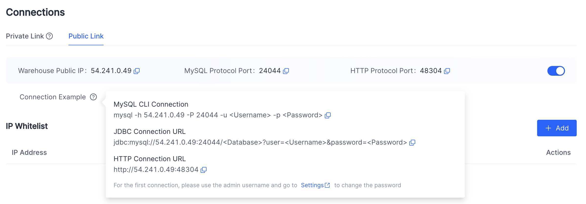
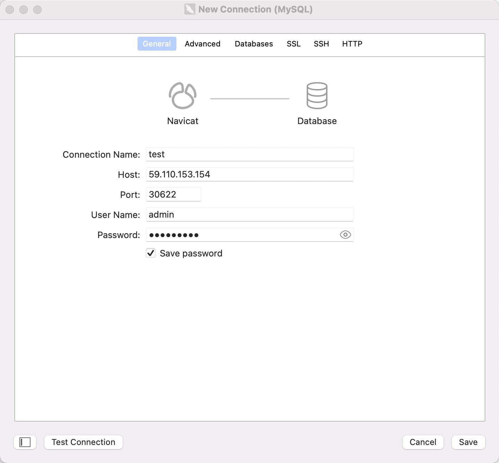
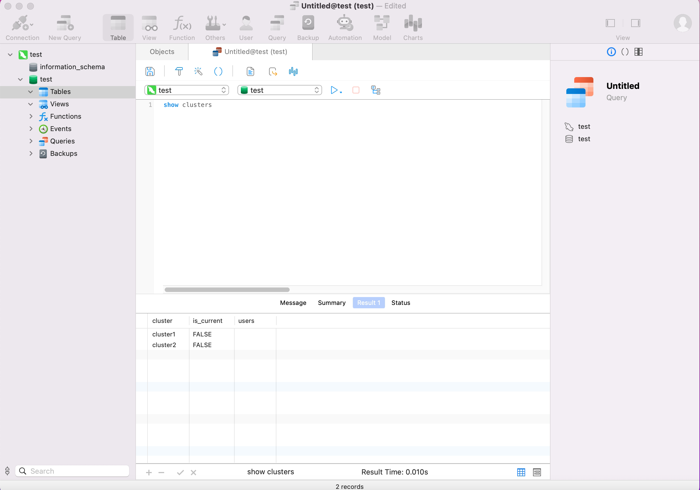

# Connect Warehouse

SelectDB Cloud uses the MySQL network connection protocol, so in terms of connection, it is compatible with MySQL command line tools, JDBC/ODBC and visualization tools, etc. The following uses MySQL Client, MySQL JDBC Connector and Navicat as examples.

## MySQL Client

Download the MySQL Client from the official MySQL website, or download the installation-free [MySQL Client](https://cdn.selectdb.com/download/mysql-client/mysql-5.7.22-linux-glibc2.12-x86_64.tar.gz) provided by us. Currently SelectDB Cloud is mainly compatible with MySQL 5.7 and above clients.

Get connection-related information from the "Connection" under the warehouse that needs to be connected in the management console of SelectDB Cloud.

> Notice:
>
> 1. The warehouse supports public network connection and private network (Privatelink) connection. Different connection methods require different connection information.
>
> 2. If the IP whitelist is enabled, the administrator needs to add the client's IP to the whitelist of the warehouse connection.
>
> 3. SelectDB Cloud initializes the admin user name and password of the warehouse for the user. Users can change the password on the **Settings** page of the corresponding warehouse in the management console.

The following assumes that the public network connection of the warehouse we want to connect to is as follows:




Unzip the downloaded MySQL client, and you can find the `mysql` command line tool in the `bin/` directory. Then execute the following command to connect to SelectDB.

```bash
mysql -h 54.241.0.49 -P 24044 -u admin 
```

After logging in, if the following is displayed, it is generally because your client IP has not been added to the IP whitelist of the management console.

```bash
ERROR 2013 (HY000): Lost connection to MySQL server at 'reading initial communication packet', system error: 2
```

If it is displayed as below, it means that your connection is successful.

```bash
Welcome to the MySQL monitor.  Commands end with ; or \g.
Your MySQL connection id is 119952
Server version: 5.7.37 SelectDB Core version: 2.0.0

Copyright (c) 2000, 2022, Oracle and/or its affiliates.

Oracle is a registered trademark of Oracle Corporation and/or its
affiliates. Other names may be trademarks of their respective
owners.

Type 'help;' or '\h' for help. Type '\c' to clear the current input statement.

mysql> 
```

## MySQL JDBC Connector

Please download the  JDBC Connector from the MySQL official website.

Configure the connection according to the JDBC connection information in the connection information on the console.

In the original Apache Doris, it is often necessary to configure multiple FE node addresses in order to provide highly available FE services. In SelectDB Cloud, there is no need to configure multiple FE node addresses, only a single IP given by the console is required. This IP is the IP of the load balancer, and there are multiple servers providing services at the backend, so load balancing and high availability can be guaranteed.

The following is to use JDBC to connect to our warehouse and display all cluster information under the current warehouse.

> In JDBC, where the database name was originally passed, we can pass three things.
>
> 1. database_name, such as jdbc:mysql://54.241.0.49:24044/test, then the database test will be used, and the user's default computing cluster will be used.
> 2. database_name@cluster_name, such as jdbc:mysql://54.241.0.49:24044/test@cluster1, then the database test will be used and the computing cluster cluster1 will be used.


```JAVA
String user = "admin";
String password = "admin_password";

String newUrl = "jdbc:mysql://54.241.0.49:24044/test@cluster1?useUnicode=true&characterEncoding=utf8&useTimezone=true&serverTimezone=Asia/Shanghai&useSSL=false&allowPublicKeyRetrieval=true";
try {
    Connection myCon = DriverManager.getConnection(newUrl, user, password);
    Statement stmt = myCon.createStatement();
    ResultSet result = stmt.executeQuery("show clusters");
    ResultSetMetaData metaData = result.getMetaData();
    int columnCount = metaData.getColumnCount();
    while (result.next()) {
        for (int i = 1; i <= columnCount; i++) {
            System.out.println(result.getObject(i));
        }
    }
} catch (SQLException e) {
    log.error("get JDBC connection exception.", e);
}
```


## Navicat

Create a MySQL connection to the SelectDB Cloud warehouse.



Confirm the connection is successful.



## Other connection methods

Although SelectDB Cloud is highly compatible with the MySQL protocol and usage methods, these client tools or GUI tools natively designed for MySQL are mainly for managing MySQL databases. When interacting with SelectDB Cloud, the experience will be not very good. Therefore, SelectDB is developing native command-line tools (SelectDB CLI) and user-friendly visual WebUI tools (SelectDB Studio), so stay tuned.
