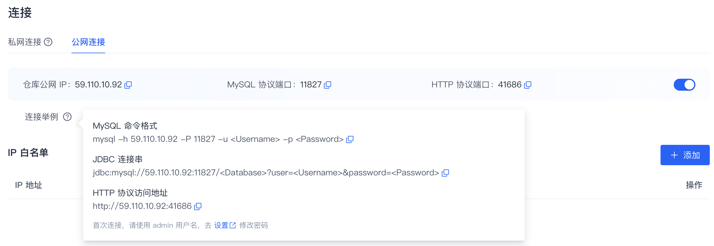
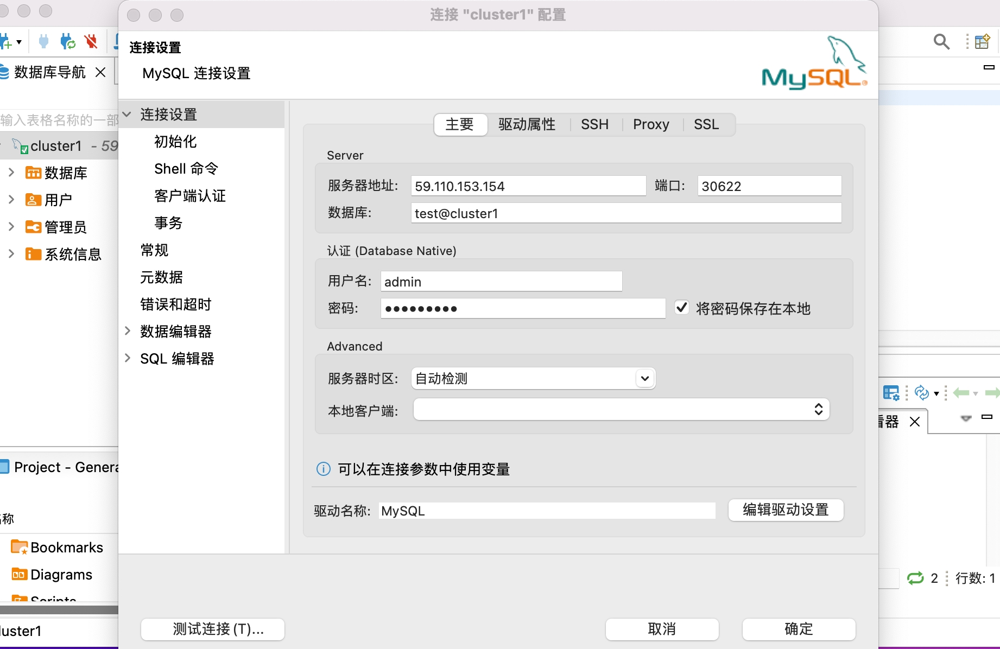
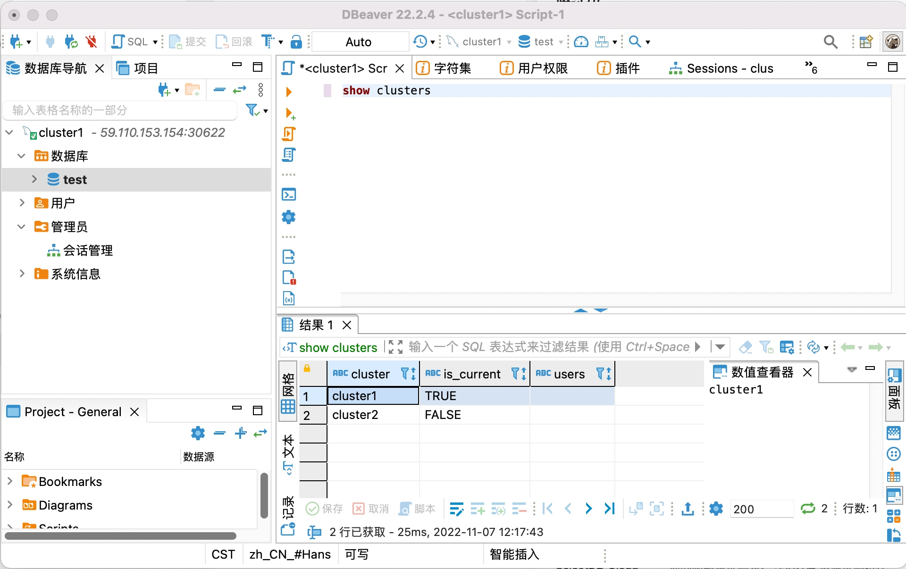
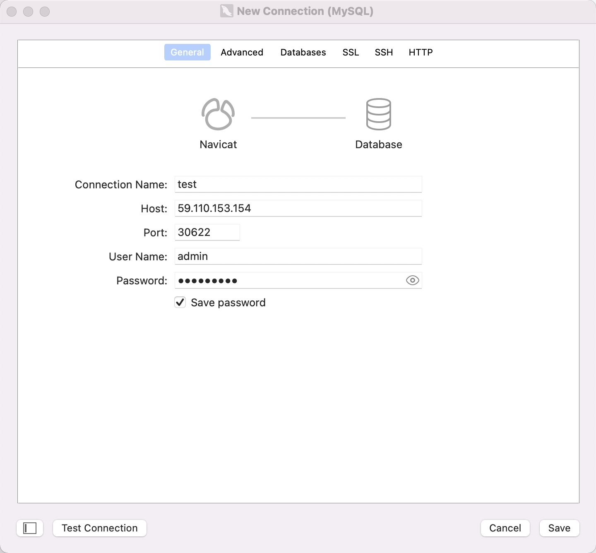
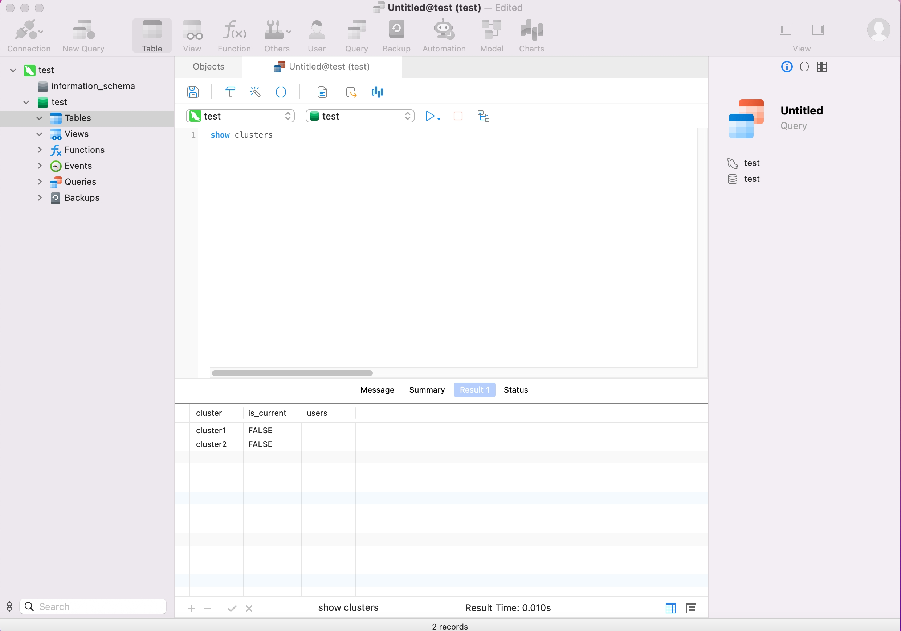

# 连接仓库

SelectDB采用了MySQL网络连接协议，所以在连接上，兼容MySQL生态的命令行工具、JDBC/ODBC和可视化工具等。下面分别以MySQL Client， MySQL JDBC Connector和DBeaver/Navicat来举例说明。


## MySQL Client

从MySQL官方网站下载MySQL Client，或者下载我们提供的免安装Linux的 [MySQL 客户端](https://cdn.selectdb.com/download/mysql-client/mysql-5.7.22-linux-glibc2.12-x86_64.tar.gz)。当前SelectDB主要兼容MySQL 5.7及其以上的客户端。

从SelectDB Cloud的管理控制台中需要连接的仓库下的“连接”中，获得连接相关的信息。

> 注意：
>
> 1. 仓库支持公网连接和私网（Privatelink）连接，不同的连接方式，连接信息不同
>
> 2. 如果开启了IP白名单，需要让管理员将客户端的IP加入仓库连接的白名单。
>
> 3. SelectDB Cloud帮用户初始化了仓库的 admin 用户名及其密码。用户可以在管理控制台相应的仓库 **设置** 页修改密码。
>

假如我们要连接的仓库公网连接如下：




解压下载的 MySQL 客户端，在 `bin/` 目录下可以找到 `mysql` 命令行工具。然后执行下面的命令连接 SelectDB。

```bash
mysql -h 59.110.153.154 -P 30622 -u admin 
```

登录后，如果显示如下，一般是由于你客户端的IP未加入到管理控制台的连接白名单中。

```bash
ERROR 2013 (HY000): Lost connection to MySQL server at 'reading initial communication packet', system error: 2
```

显示如下，则代表你连接成功了。

```bash
Welcome to the MySQL monitor.  Commands end with ; or \g.
Your MySQL connection id is 119952
Server version: 5.7.37 SelectDB Core version: 2.0.0

Copyright (c) 2000, 2022, Oracle and/or its affiliates.

Oracle is a registered trademark of Oracle Corporation and/or its
affiliates. Other names may be trademarks of their respective
owners.

Type 'help;' or '\h' for help. Type '\c' to clear the current input statement.

mysql> 
```


## MySQL JDBC Connector

请在MySQL官方网站下载相应的JDBC Connector。

根据控制台上的连接信息中的JDBC连接信息来配置连接。

在原来Apache Doris中，经常需要配置多个FE节点地址，以便提供高可用的FE服务。在SelectDB Cloud中，无需配置多个FE的节点地址，只需要使用控制台给出的单一IP。这个IP为负载均衡器IP，后端有多个服务器提供服务，所以可以保证负载均衡与高可用。

下面是使用JDBC来连接我们的仓库，并且显示当前仓库下的所有cluster信息。

> 在JDBC中，原来传递database name的地方，我们可以传递三个东西。
>
> 1. database_name, 比如 jdbc:mysql://59.110.153.154:30622/test，那么会使用数据库test，使用用户的默认计算集群。
> 2. database_name@cluster_name, 比如 jdbc:mysql://59.110.153.154:30622/test@cluster1，那么会使用数据库test，使用计算集群cluster1。

```JAVA
String user = "admin";
String password = "admin_password";

String newUrl = "jdbc:mysql://59.110.153.154:30622/test@cluster1?useUnicode=true&characterEncoding=utf8&useTimezone=true&serverTimezone=Asia/Shanghai&useSSL=false&allowPublicKeyRetrieval=true";
try {
    Connection myCon = DriverManager.getConnection(newUrl, user, password);
    Statement stmt = myCon.createStatement();
    ResultSet result = stmt.executeQuery("show clusters");
    ResultSetMetaData metaData = result.getMetaData();
    int columnCount = metaData.getColumnCount();
    while (result.next()) {
        for (int i = 1; i <= columnCount; i++) {
            System.out.println(result.getObject(i));
        }
    }
} catch (SQLException e) {
    log.error("get JDBC connection exception.", e);
}
```


## DBeaver和Navicat

### DBeaver

创建一个到SelectDB仓库的MySQL连接 




测试连接成功



### Navicat

创建一个到SelectDB仓库的MySQL连接。




测试连接成功




## 其他连接方式

SelectDB虽然高度兼容MySQL协议和使用方式，但是这些原生面向MySQL设计的客户端工具或者GUI工具，都主要还是为了管理MySQL数据库，在与SelectDB交互时，体验会有所欠缺。所以，SelectDB正在开发原生的命令行工具（SelectDB CLI）和体验友好的可视化WebUI工具（SelectDB WebUI），敬请期待。

SelectDB原生的CLI和WebUI，将主要基于HTTP API进行打造，在进行交互式使用时，体验会更好。
