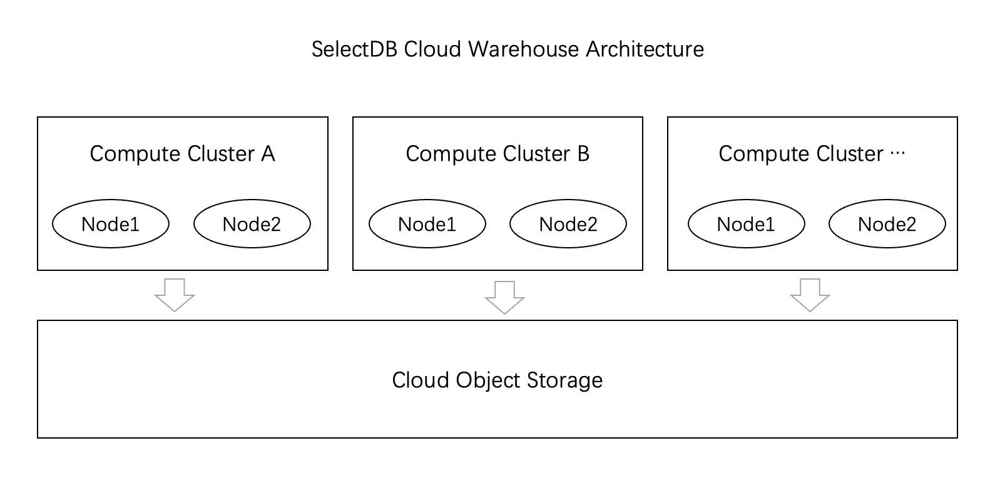

# Compute Cluster

SelectDB Cloud adopts an architecture that separates storage and computing.

The data is mainly stored on the object storage of cloud vendors. A warehouse can have multiple isolated computing clusters, and each computing cluster consists of multiple computing nodes. All computing clusters share the underlying object storage.

To create a computing cluster, please create it in the **Administration** Guide/Cluster Management section.




## Show clusters

You can view all computing clusters owned by the current warehouse through show clusters.

```text
mysql> show clusters;
+-------------------------------+------------+------------+
| cluster                       | is_current | users      |
+-------------------------------+------------+------------+
| regression_test_cluster_name0 | FALSE      | root, jack |
| regression_test_cluster_name5 | FALSE      |            |
+-------------------------------+------------+------------+
2 rows in set (0.01 sec)

mysql> SET PROPERTY 'default_cloud_cluster' = 'regression_test_cluster_name5';
Query OK, 0 rows affected (0.01 sec)
```


## Grant cluster access rights to users

1. Create a new user using mysql client
2. Grammar

```text
GRANT USAGE_PRIV ON CLUSTER {cluster_name} TO {user}
```

3. Example:

```text
// create user jack
mysql> CREATE USER jack IDENTIFIED BY '123456' DEFAULT ROLE "admin";
Query OK, 0 rows affected (0.01 sec)

mysql> GRANT USAGE_PRIV ON CLUSTER regression_test_cluster_name0 TO jack;
Query OK, 0 rows affected (0.01 sec)

mysql> use d1@regression_test_cluster_name0;
Database changed

mysql> show grants for jack\G
*************************** 1. row ***************************
 UserIdentity: 'jack'@'%'
     Password: Yes
  GlobalPrivs: Admin_priv  (false)
 CatalogPrivs: NULL
DatabasePrivs: internal.information_schema: Select_priv  (false)
   TablePrivs: NULL
ResourcePrivs: NULL
 CloudCluster: regression_test_cluster_name0: Usage_priv  (false)
   CloudStage: NULL
1 row in set (0.00 sec)

mysql> select * from t1;
+------+------+-------+
| id   | name | score |
+------+------+-------+
|    1 | aaa  |    20 |
|    2 | bbb  |   320 |
|    3 | ccc  |    30 |
|    4 | ddd  |   120 |
|    5 | eee  |    30 |
|    6 | fff  |    30 |
|    7 | ggg  |    90 |
|    8 | hhh  |    30 |
+------+------+-------+
8 rows in set (12.70 sec)

mysql> insert into t1 (id, name, score) values (8, "hhh", 30);
Query OK, 1 row affected (7.22 sec)
{'label':'insert_6f40c1713baf4d61_9c33c0962c68ab07', 'status':'VISIBLE', 'txnId':'5462662627547136'}
```


Grant a non-existent cluster to user jack, and no error will be reported. But an error will be reported when using @cluster

```text
mysql> GRANT USAGE_PRIV ON CLUSTER not_exist_cluster TO jack;
Query OK, 0 rows affected (0.05 sec)

mysql> show grants for jack\G
*************************** 1. row ***************************
 UserIdentity: 'jack'@'%'
     Password: Yes
  GlobalPrivs: Admin_priv  (false)
 CatalogPrivs: NULL
DatabasePrivs: internal.information_schema: Select_priv  (false)
   TablePrivs: NULL
ResourcePrivs: NULL
 CloudCluster: not_exist_cluster: Usage_priv  (false)
   CloudStage: NULL
1 row in set (0.00 sec)

Switch to user jack, use @not_exist_cluster, report error "not_exist_cluster"

mysql> use information_schema@not_exist_cluster;
No connection. Trying to reconnect...
Connection id:    1
Current database: *** NONE ***

ERROR 5091 (42000): Cluster not_exist_cluster not exist
```


## Revoke user access cluster permissions

1. Grammar

```text
REVOKE USAGE_PRIV ON CLUSTER {cluster_name} FROM {user}
```

2. Example:

```text
mysql> REVOKE USAGE_PRIV ON CLUSTER regression_test_cluster_name0 FROM jack;
Query OK, 0 rows affected (0.01 sec)

mysql> show grants for jack\G
*************************** 1. row ***************************
 UserIdentity: 'jack'@'%'
     Password: Yes
  GlobalPrivs: Admin_priv  (false)
 CatalogPrivs: NULL
DatabasePrivs: internal.information_schema: Select_priv  (false)
   TablePrivs: NULL
ResourcePrivs: NULL
 CloudCluster: NULL
   CloudStage: NULL
1 row in set (0.01 sec)
```


## Set default cluster

1. grammar

Set the default cluster for the current user

```text
SET PROPERTY 'default_cloud_cluster' = {clusterName};
```

Set the default cluster for other users, note that admin permissions are required

```text
SET PROPERTY FOR {user} 'default_cloud_cluster' = {clusterName};
```

Display the default cluster of the current user, the value of default_cloud_cluster is the default cluster

```text
SHOW PROPERTY;
```

Display the default cluster of other users, mainly the current user must have relevant permissions, and the value of default_cloud_cluster is the default cluster

```text
SHOW PROPERTY FOR {user};
```

Display all available clusters under the current warehouse

```text
SHOW CLUSTERS;
```

2. Notice:

- The current user has admin role, for example: CREATE USER jack IDENTIFIED BY '123456' DEFAULT ROLE "admin";
  - You can set the default cluster for yourself and the default cluster for other users
  - You can SHOW your own PROPERTY and other users' PROPERTY
- The current user does not have the admin role, such as CREATE USER jack1 IDENTIFIED BY '123456';
  - You can set the default cluster for yourself
  - You can SHOW your own PROPERTY
  - Cannot SHOW CLUSTERS, it will prompt grant ADMIN permission
- If the current user does not configure a default cluster, the current implementation will report an error when reading and writing data. You can use to `use @cluster`set the cluster used by the current context, or you can use SET PROPERTY to set the default cluster
- If the current user configures a default cluster, but later this cluster is dropped, an error will be reported when reading and writing data, you can use `use @cluster`the cluster used by the current context, or you can use SET PROPERTY to set the default cluster

3. Example:

```text
// set default cluster for current user
mysql> SET PROPERTY 'default_cloud_cluster' = 'regression_test_cluster_name0';
Query OK, 0 rows affected (0.02 sec)

mysql> show PROPERTY;
+------------------------+-------------------------------+
| Key                    | Value                         |
+------------------------+-------------------------------+
| cpu_resource_limit     | -1                            |
| default_cloud_cluster  | regression_test_cluster_name0 |
| exec_mem_limit         | -1                            |
| load_mem_limit         | -1                            |
| max_query_instances    | -1                            |
| max_user_connections   | 100                           |
| quota.high             | 800                           |
| quota.low              | 100                           |
| quota.normal           | 400                           |
| resource.cpu_share     | 1000                          |
| resource.hdd_read_iops | 80                            |
| resource.hdd_read_mbps | 30                            |
| resource.io_share      | 1000                          |
| resource.ssd_read_iops | 1000                          |
| resource.ssd_read_mbps | 30                            |
| resource_tags          |                               |
| sql_block_rules        |                               |
+------------------------+-------------------------------+
17 rows in set (0.00 sec)

// create user jack
mysql> CREATE USER jack IDENTIFIED BY '123456' DEFAULT ROLE "admin";
Query OK, 0 rows affected (0.01 sec)

// set default cluster for user jack
mysql> SET PROPERTY FOR jack 'default_cloud_cluster' = 'regression_test_cluster_name1';
Query OK, 0 rows affected (0.00 sec)

// show default cluster for jack
mysql> show PROPERTY for jack;
+------------------------+-------------------------------+
| Key                    | Value                         |
+------------------------+-------------------------------+
| cpu_resource_limit     | -1                            |
| default_cloud_cluster  | regression_test_cluster_name1 |
| exec_mem_limit         | -1                            |
| load_mem_limit         | -1                            |
| max_query_instances    | -1                            |
| max_user_connections   | 100                           |
| quota.high             | 800                           |
| quota.low              | 100                           |
| quota.normal           | 400                           |
| resource.cpu_share     | 1000                          |
| resource.hdd_read_iops | 80                            |
| resource.hdd_read_mbps | 30                            |
| resource.io_share      | 1000                          |
| resource.ssd_read_iops | 1000                          |
| resource.ssd_read_mbps | 30                            |
| resource_tags          |                               |
| sql_block_rules        |                               |
+------------------------+-------------------------------+
17 rows in set (0.00 sec)
```

If there is no default cluster to be set under the current warehouse, an error will be reported, prompting to use show clusters to display all valid clusters under the current warehouse, where the cluster column indicates the clusterName, the is_current column indicates whether the current user uses this cluster, and the users column indicates that these users set the default cluster is the cluster of the current row

```text
mysql> SET PROPERTY 'default_cloud_cluster' = 'not_exist_cluster';
ERROR 5091 (42000): errCode = 2, detailMessage = Cluster not_exist_cluster not exist, use SQL 'SHOW CLUSTERS' to get a valid cluster

mysql> show clusters;
+-------------------------------+------------+------------+
| cluster                       | is_current | users      |
+-------------------------------+------------+------------+
| regression_test_cluster_name0 | FALSE      | root, jack |
| regression_test_cluster_name5 | FALSE      |            |
+-------------------------------+------------+------------+
2 rows in set (0.01 sec)

mysql> SET PROPERTY 'default_cloud_cluster' = 'regression_test_cluster_name5';
Query OK, 0 rows affected (0.01 sec)
```


## Switch cluster

In the storage-computing separation version, specify the database and computing cluster used

**1. Grammar**

```text
USE { [catalog_name.]database_name[@cluster_name] | @cluster_name }
```

Note: If the database name or cluster name is a reserved keyword, you need to use backtick

```text
` `
```

enclose

**2. Examples**

1. Specify to use the database test_database

```text
USE test_database
or
USE `test_database`
```

2. Specify to use the computing cluster test_cluster

```text
USE @test_cluster
or
USE @`test_cluster`
```

3. At the same time, specify the database test_database and computing cluster test_cluster

```text
USE test_database@test_cluster
USE `test_database`@`test_cluster`
```
