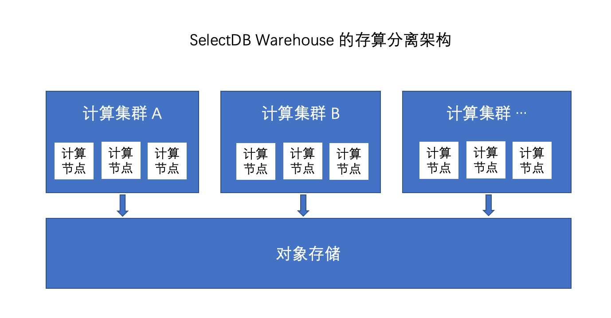

# 计算集群

SelectDB Cloud采用存储和计算分离的架构。

其中数据主要存储在云厂商的对象存储上，一个仓库可拥有多个互相隔离的计算集群，每个计算集群有多台计算节点组成。所有的计算集群共享底层的对象存储。

计算集群的创建，请在 **管理指南/集群管理** 部分进行创建。




## SHOW CLUSTERS

可以通过show clusters，查看当前仓库拥有的所有计算集群。

```
mysql> show clusters;
+-------------------------------+------------+------------+
| cluster                       | is_current | users      |
+-------------------------------+------------+------------+
| regression_test_cluster_name0 | FALSE      | root, jack |
| regression_test_cluster_name5 | FALSE      |            |
+-------------------------------+------------+------------+
2 rows in set (0.01 sec)

mysql> SET PROPERTY 'default_cloud_cluster' = 'regression_test_cluster_name5';
Query OK, 0 rows affected (0.01 sec)
```

## grant cluster访问权限给用户

1. 使用mysql client创建一个新用户

2. 语法
```
GRANT USAGE_PRIV ON CLUSTER {cluster_name} TO {user}
```

3. 示例：
```
// 使用root账号在mysql client中创建jack用户
mysql> CREATE USER jack IDENTIFIED BY '123456' DEFAULT ROLE "admin";
Query OK, 0 rows affected (0.01 sec)

mysql> GRANT USAGE_PRIV ON CLUSTER regression_test_cluster_name0 TO jack;
Query OK, 0 rows affected (0.01 sec)

// 使用jack登录mysql client
mysql> use d1@regression_test_cluster_name0;
Database changed

mysql> show grants for jack\G
*************************** 1. row ***************************
 UserIdentity: 'jack'@'%'
     Password: Yes
  GlobalPrivs: Admin_priv  (false)
 CatalogPrivs: NULL
DatabasePrivs: internal.information_schema: Select_priv  (false)
   TablePrivs: NULL
ResourcePrivs: NULL
 CloudCluster: regression_test_cluster_name0: Usage_priv  (false)
   CloudStage: NULL
1 row in set (0.00 sec)

mysql> select * from t1;
+------+------+-------+
| id   | name | score |
+------+------+-------+
|    1 | aaa  |    20 |
|    2 | bbb  |   320 |
|    3 | ccc  |    30 |
|    4 | ddd  |   120 |
|    5 | eee  |    30 |
|    6 | fff  |    30 |
|    7 | ggg  |    90 |
|    8 | hhh  |    30 |
+------+------+-------+
8 rows in set (12.70 sec)

mysql> insert into t1 (id, name, score) values (8, "hhh", 30);
Query OK, 1 row affected (7.22 sec)
{'label':'insert_6f40c1713baf4d61_9c33c0962c68ab07', 'status':'VISIBLE', 'txnId':'5462662627547136'}

```


给jack用户grant一个不存在的cluster，不会报错。但是在use @cluster的时候会报错
```
mysql> GRANT USAGE_PRIV ON CLUSTER not_exist_cluster TO jack;
Query OK, 0 rows affected (0.05 sec)

mysql> show grants for jack\G
*************************** 1. row ***************************
 UserIdentity: 'jack'@'%'
     Password: Yes
  GlobalPrivs: Admin_priv  (false)
 CatalogPrivs: NULL
DatabasePrivs: internal.information_schema: Select_priv  (false)
   TablePrivs: NULL
ResourcePrivs: NULL
 CloudCluster: not_exist_cluster: Usage_priv  (false)
   CloudStage: NULL
1 row in set (0.00 sec)

切换到jack账号, use @not_exist_cluster, 会报错提示not_exist_cluster不存在

mysql> use information_schema@not_exist_cluster;
No connection. Trying to reconnect...
Connection id:    1
Current database: *** NONE ***

ERROR 5091 (42000): Cluster not_exist_cluster not exist
```

## revoke 用户访问cluster权限

1. 语法
```
REVOKE USAGE_PRIV ON CLUSTER {cluster_name} FROM {user}
```

2. 示例：
```
// 使用root账号在mysql client中创建jack用户
mysql> REVOKE USAGE_PRIV ON CLUSTER regression_test_cluster_name0 FROM jack;
Query OK, 0 rows affected (0.01 sec)

mysql> show grants for jack\G
*************************** 1. row ***************************
 UserIdentity: 'jack'@'%'
     Password: Yes
  GlobalPrivs: Admin_priv  (false)
 CatalogPrivs: NULL
DatabasePrivs: internal.information_schema: Select_priv  (false)
   TablePrivs: NULL
ResourcePrivs: NULL
 CloudCluster: NULL
   CloudStage: NULL
1 row in set (0.01 sec)
```

## 设置default cluster

1. 语法

为当前用户设置默认cluster

```
SET PROPERTY 'default_cloud_cluster' = {clusterName};
```

为其他用户设置默认cluster，注意需要有admin权限

```
SET PROPERTY FOR {user} 'default_cloud_cluster' = {clusterName};
```

展示当前用户默认cluster，default_cloud_cluster的value既是默认cluster

```
SHOW PROPERTY;
```

展示其他用户默认cluster，主要当前用户要有相关权限，default_cloud_cluster的value既是默认cluster

```
SHOW PROPERTY FOR {user};
```

展示当前warehouse下所有可用的clusters

```
SHOW CLUSTERS;
```

2. 注意：
- 当前用户拥有admin role，例如：CREATE USER jack IDENTIFIED BY '123456' DEFAULT ROLE "admin";
   - 可以给自己设置default cluster和给其他用户设置default cluster
   - 可以SHOW自己的PROPERTY和其他用户的PROPERTY
- 当前用户不拥有admin role， 例如CREATE USER jack1 IDENTIFIED BY '123456';
   - 可以给自己设置default cluster
   - 可以SHOW自己的PROPERTY
   - 不能SHOW CLUSTERS，会提示需要grant ADMIN权限
- 若当前用户没有配置默认cluster，目前实现在读写数据的时候，会报错。可以使用`use @cluster`设置当前context使用的cluster，也可以使用SET PROPERTY设置默认cluster
- 若当前用户配置了默认cluster，但是后面此cluster被drop掉了，读写数据会报错，可以使用`use @cluster`设置当前context使用的cluster，也可以使用SET PROPERTY设置默认cluster

3. 示例：

```
// 设置当前用户默认cluster
mysql> SET PROPERTY 'default_cloud_cluster' = 'regression_test_cluster_name0';
Query OK, 0 rows affected (0.02 sec)

// 展示当前用户的默认cluster
mysql> show PROPERTY;
+------------------------+-------------------------------+
| Key                    | Value                         |
+------------------------+-------------------------------+
| cpu_resource_limit     | -1                            |
| default_cloud_cluster  | regression_test_cluster_name0 |
| exec_mem_limit         | -1                            |
| load_mem_limit         | -1                            |
| max_query_instances    | -1                            |
| max_user_connections   | 100                           |
| quota.high             | 800                           |
| quota.low              | 100                           |
| quota.normal           | 400                           |
| resource.cpu_share     | 1000                          |
| resource.hdd_read_iops | 80                            |
| resource.hdd_read_mbps | 30                            |
| resource.io_share      | 1000                          |
| resource.ssd_read_iops | 1000                          |
| resource.ssd_read_mbps | 30                            |
| resource_tags          |                               |
| sql_block_rules        |                               |
+------------------------+-------------------------------+
17 rows in set (0.00 sec)

// 使用root账号在mysql client中创建jack用户
mysql> CREATE USER jack IDENTIFIED BY '123456' DEFAULT ROLE "admin";
Query OK, 0 rows affected (0.01 sec)

// 给jack用户设置默认cluster
mysql> SET PROPERTY FOR jack 'default_cloud_cluster' = 'regression_test_cluster_name1';
Query OK, 0 rows affected (0.00 sec)

// 展示其他用户的默认cluster
mysql> show PROPERTY for jack;
+------------------------+-------------------------------+
| Key                    | Value                         |
+------------------------+-------------------------------+
| cpu_resource_limit     | -1                            |
| default_cloud_cluster  | regression_test_cluster_name1 |
| exec_mem_limit         | -1                            |
| load_mem_limit         | -1                            |
| max_query_instances    | -1                            |
| max_user_connections   | 100                           |
| quota.high             | 800                           |
| quota.low              | 100                           |
| quota.normal           | 400                           |
| resource.cpu_share     | 1000                          |
| resource.hdd_read_iops | 80                            |
| resource.hdd_read_mbps | 30                            |
| resource.io_share      | 1000                          |
| resource.ssd_read_iops | 1000                          |
| resource.ssd_read_mbps | 30                            |
| resource_tags          |                               |
| sql_block_rules        |                               |
+------------------------+-------------------------------+
17 rows in set (0.00 sec)
```

若当前warehouse下不存在将要设置的默认cluster会报错，提示使用show clusters展示当前warehouse下所有有效的cluster，其中cluster列表示clusterName，is_current列表示当前用户是否使用此cluster，users列表示这些用户设置默认cluster为当前行的cluster

```
mysql> SET PROPERTY 'default_cloud_cluster' = 'not_exist_cluster';
ERROR 5091 (42000): errCode = 2, detailMessage = Cluster not_exist_cluster not exist, use SQL 'SHOW CLUSTERS' to get a valid cluster

mysql> show clusters;
+-------------------------------+------------+------------+
| cluster                       | is_current | users      |
+-------------------------------+------------+------------+
| regression_test_cluster_name0 | FALSE      | root, jack |
| regression_test_cluster_name5 | FALSE      |            |
+-------------------------------+------------+------------+
2 rows in set (0.01 sec)

mysql> SET PROPERTY 'default_cloud_cluster' = 'regression_test_cluster_name5';
Query OK, 0 rows affected (0.01 sec)
```

## 切换cluster

在存算分离版本中，指定使用的数据库和计算集群

**1. 语法**

```
USE { [catalog_name.]database_name[@cluster_name] | @cluster_name }
```
Note: 如果database名字或者cluster名字是保留的关键字, 需要用backtick
```
` `
```
括起来

**2. 举例**

1. 指定使用该数据库test_database
```
USE test_database
或者
USE `test_database`
```

2. 指定使用该计算集群test_cluster

```
USE @test_cluster
或者
USE @`test_cluster`
```

3. 同时指定使用该数据库test_database和计算集群test_cluster

```
USE test_database@test_cluster
USE `test_database`@`test_cluster`
```

