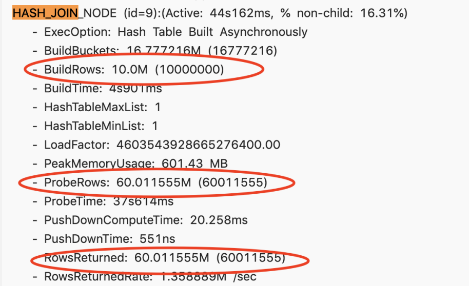
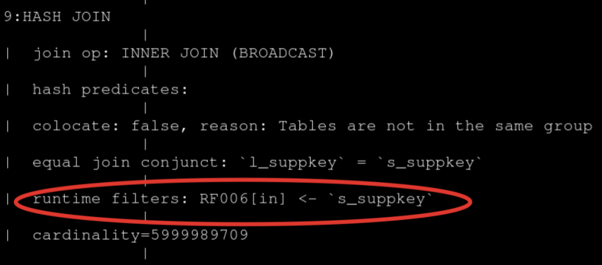
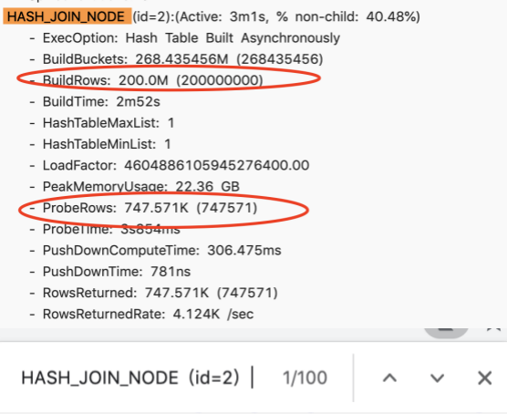
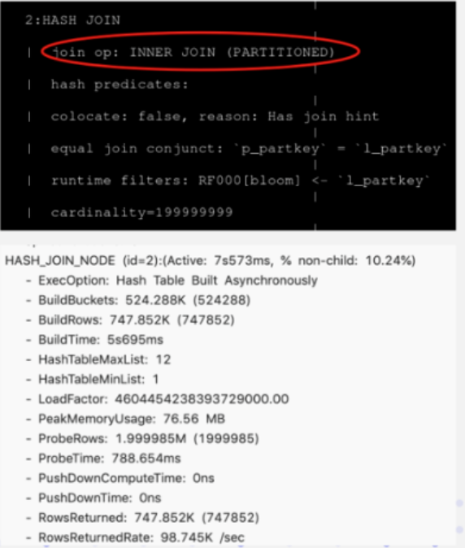

# Distributed Join

## Join optimization

In the MPP distributed computing engine, distributed join is the most complicated. Distributed join mainly relies on the shuffle of data in the intermediate calculation stage. Currently SelectDB supports 4 Shuffle methods. Before explaining each type of join, we first assume that we have relations S and R for join, N represents the number of nodes participating in the Join calculation; T represents the number of Tuples in the relation.

1. Broadcast join

   It requires sending all the data in the right table to the left table, that is, every node participating in Join has the full amount of data in the right table, that is, T(R).

   Its applicable scenarios are relatively general, and it can support Hash Join and Nest loop Join at the same time, and its network overhead is N * T(R).

   

   The data in the left table is not moved, and the data in the right table is sent to the scan node for the data in the left table.

2. Shuffle join

   When performing Hash Join, you can calculate the corresponding Hash value through the Join column, and perform Hash bucketing.

   Its network overhead is: T(R) + T(N), but it can only support Hash Join, because it also calculates buckets according to the conditions of Join.

   

   The left and right table data is sent to different partition nodes according to the partition and the calculated demerits.

3. Bucket shuffle join

   The table data of Doris is bucketed by Hash calculation, so the nature of the bucket column of the table itself can be used to shuffle the Join data. If two tables need to be joined, and the join column is the bucket column of the left table, then the data in the left table can actually be calculated without moving the data in the right table and sending data through the buckets of the data in the left table.

   Its network overhead is: T(R) is equivalent to only Shuffle the data in the right table.

   

   The data in the left table is not moved, and the data in the right table is sent to the scanning node of the left table according to the result of the partition calculation

4. Colocate join

   It is similar to Bucket Shuffle Join, which means that when data is imported, data Shuffle has been done according to the scene of the preset Join column. Then, during the actual query, the Join calculation can be performed directly without considering the data shuffle problem.

   

   The data has been pre-partitioned, and the Join calculation is performed locally

**Comparison of four Shuffle methods**

| Shuffle mode   | network overhead | physical operator          | Applicable scene                                             |
| -------------- | ---------------- | -------------------------- | ------------------------------------------------------------ |
| BroadCast      | N * T(R)         | Hash Join / Nest Loop Join | universal                                                    |
| Shuffle        | T(S) + T(R)      | Hash Join                  | universal                                                    |
| Bucket Shuffle | T(R)             | Hash Join                  | There are distributed columns of the left table in the join condition, and the left table is a single partition when executed |
| Colocate       | 0                | Hash Join                  | There are distributed columns in the left table in the Join condition, and the left and right tables belong to the same Colocate Group |

N : the number of Instances participating in the Join calculation

T(relationship): the number of Tuples in the relation

The flexibility of the above four methods is from high to low. Its requirements for data distribution are getting stricter, but the performance of Join calculation is getting better and better.

## Runtime Filter join optimization

SelectDB builds a hash table on the right table when performing Hash Join calculations, and the left table flows through the hash table on the right table to obtain the Join result. The RuntimeFilter makes full use of the Hash table of the right table. When the right table generates the hash table, a filter condition based on the hash table data is generated at the same time, and then pushed down to the data scanning node of the left table. In this way, SelectDB can perform data filtering at runtime.

If the left table is a large table and the right table is a small table, then most of the data to be filtered in the Join layer can be filtered in advance when the data is read by using the filter conditions generated by the right table. Improve the performance of Join queries.

Currently SelectDB supports three types of RuntimeFilter

- One is IN, which is well understood and pushes a hashset down to the data scanning node.
- The second is BloomFilter, which uses the data in the hash table to construct a BloomFilter, and then pushes the BloomFilter down to the scanning node for querying data. .
- The last one is MinMax, which is a Range range. After the Range range is determined through the data in the right table, it is pushed down to the data scanning node.

There are two requirements for the applicable scenarios of Runtime Filter:

- The first requirement is that the left table is large and the right table is small, because building a Runtime Filter requires computing costs, including some memory overhead.
- The second requirement is that there are very few results from the join of the left and right tables, indicating that this join can filter out most of the data in the left table.

When the above two conditions are met, turning on the Runtime Filter can achieve better results

When the Join column is the Key column of the left table, the RuntimeFilter will be pushed down to the storage engine. Doris itself supports delayed materialization,

Delayed materialization is simply like this: if you need to scan three columns A, B, and C, there is a filter condition on column A: A is equal to 2, if you want to scan 100 rows, you can first scan the 100 rows of column A, Then filter by the filter condition of A = 2. After filtering the completed results, read columns B and C, which can greatly reduce the data reading IO. Therefore, if the Runtime Filter is generated on the Key column, the delayed materialization of SelectDB itself can be used to further improve the performance of the query.

**Runtime Filter type**

SelectDB provides three different Runtime Filter types:

- **The advantage of IN** is that the filtering effect is obvious and fast. Its disadvantages are firstly that it is only applicable to BroadCast, and second, when the right table exceeds a certain amount of data, it will fail. Currently, Doris is currently configured with 1024, that is, if the right table is greater than 1024, the Runtime Filter of IN will directly failed.
- **The advantage of MinMax** is that the overhead is relatively small. Its disadvantage is that it has a better effect on numerical columns, but basically has no effect on non-numeric columns.
- **The characteristic of Bloom Filter** is that it is universal, suitable for various types, and the effect is relatively good. The disadvantage is that its configuration is more complicated and the calculation is higher.

## Join reorder

Once the database involves multi-table Join, the order of Join has a great impact on the performance of the entire Join query. Assuming there are three tables to join, refer to the picture below, on the left is the join between table a and table b, the intermediate result has 2000 rows, and then join calculation with table c.

Next, look at the picture on the right and adjust the order of Join. Join table a with table c first, the generated intermediate result is only 100, and then finally join with table b for calculation. The final Join result is the same, but the intermediate result it generates has a gap of 20 times, which will produce a large performance Diff.


SelectDB currently supports the rule-based Join Reorder algorithm. Its logic is:

- Let the large table join with the small table as much as possible, and the intermediate result generated by it is as small as possible.
- Put the conditional Join table forward, that is to say, try to filter the conditional Join table
- Hash Join has a higher priority than Nest Loop Join, because Hash Join itself is much faster than Nest Loop Join.

## Join tuning method

Join tuning method:

- Use the Profile provided by SelectDB itself to locate the bottleneck of the query. Profile will record all kinds of information in the entire query of SelectDB, which is the first-hand information for performance tuning. .
- Understand the Join mechanism of SelectDB, which is also the content shared with you in the second part. Only by knowing what it is, knowing why it is, and understanding its mechanism can we analyze why it is slower.
- Use Session variables to change some behaviors of Join, so as to realize the tuning of Join.
- See Query Plan to analyze whether this tuning takes effect.

The above 4 steps basically complete a standard Join tuning process, and then it is to actually query and verify it to see how the effect is.

If the previous 4 methods are connected in series, it still doesn't work. At this time, it may be necessary to rewrite the Join statement, or adjust the data distribution, and recheck whether the entire data distribution is reasonable, including querying the Join statement, and may need to make some manual adjustments. Of course, the mental cost of this method is relatively high, that is to say, it is necessary to do further analysis only when trying the previous method does not work.

## Tuning case practices

### Case 1

A query for joining of four tables, when passing the profile, it is found that the second join takes a very long time, taking 14 seconds.


After further analyzing the Profile, it is found that BuildRows, that is, the data volume of the right table is about 25 million. And ProbeRows (ProbeRows is the amount of data in the left table) is only more than 10,000. In this scenario, the right table is much larger than the left table, which is obviously an unreasonable situation. This obviously shows that there are some problems with the order of Join. At this time, try to change the Session variable and enable Join Reorder.

```text
set enable_cost_based_join_reorder = true
```

This time the time-consuming dropped from 14 seconds to 4 seconds, and the performance improved by more than 3 times.

At this time, when checking Profile again, the order of the left and right tables has been adjusted correctly, that is, the right table is the large table, and the left table is the small table. Building a hash table based on a small table has very little overhead. This is a typical scenario where Join Reorder is used to improve Join performance.


### Case 2

There is a slow query. After viewing the Profile, the entire Join node takes about 44 seconds. Its right table has 10 million, left table has 60 million, and the result returned is only 60 million.



Here it can be roughly estimated that the filtering rate is very high, so why does the Runtime Filter not take effect? Check it through Query Plan and find that it only enables the Runtime Filter of IN.



When the right table exceeds 1024 rows, IN will not take effect, so there is no filtering effect at all, so try to adjust the type of RuntimeFilter.

Here it is changed to BloomFilter, and the 60 million pieces of data in the left table are filtered out to 59 million pieces. Basically 99% of the data is filtered out, and this effect is significant. The query has also dropped from 44 seconds to 13 seconds, and the performance has improved by more than three times.

### Case 3

The following is an extreme case, and there is no way to solve it through some environment variable tuning, because it involves SQL Rewrite, so the original SQL is listed here.

```sql
select 100.00 * sum (case
        when P_type like 'PROMOS'
        then 1 extendedprice * (1 - 1 discount)
        else 0
        end ) / sum(1 extendedprice * (1 - 1 discount)) as promo revenue
from lineitem, part
where
    1_partkey = p_partkey
    and 1_shipdate >= date '1997-06-01'
    and 1 shipdate < date '1997-06-01' + interval '1' month
```

This Join query is very simple, simply a Join of left and right tables. Of course, there are some filter conditions on it. When I opened the Profile, I found that the entire query Hash Join was executed for more than three minutes. It is a BroadCast Join, and its right table has 200 million entries, while the left table only has 700,000. In this case, it is unreasonable to choose Broadcast Join, which is equivalent to making a Hash Table with 200 million entries, and then using 700,000 entries to traverse the 200 million Hash Table, which is obviously unreasonable.



Why is there an unreasonable Join order? In fact, the left table is a large table with a level of 1 billion records, and two filter conditions are added to it. After adding these two filter conditions, there are only 700,000 records of 1 billion records. But Doris currently does not have a good framework for statistical information collection, so it does not know what the filter rate of this filter condition is. Therefore, when the join order is arranged, the wrong order of the left and right tables of the join is selected, resulting in extremely low performance.

The figure below is a SQL statement after the rewriting is completed. A Join Hint is added after the Join, a square bracket is added after the Join, and then the required Join method is written. Shuffle Join is selected here, and you can see that the data in the actual query plan on the right is indeed partitioned. After the original 3-minute time-consuming is rewritten in this way, only 7 seconds are left, and the performance is significantly improved.



## Join tuning suggestions

Finally, we summarize the four suggestions for Join optimization and tuning:

- The first point: When doing Join, try to select columns of the same type or simple type. If they are of the same type, reduce its data Cast, and the calculation of the simple type itself is very fast.
- The second point: Try to choose the Key column for Join. The reason is also introduced in the Runtime Filter. The Key column can have a better effect on delaying materialization.
- The third point: Join between large tables, try to make it Co-location, because the network overhead between large tables is very large, if you need to do Shuffle, the cost is very high.
- The fourth point: Reasonable use of Runtime Filter, which is very effective in scenarios with high Join filter rate. But it is not a panacea, but has certain side effects, so it needs to be switched according to the granularity of the specific SQL.
- Finally: When it comes to multi-table join, you need to judge the rationality of join. Try to ensure that the left table is a large table and the right table is a small table, then Hash Join will be better than Nest Loop Join. If necessary, you can use Hint to adjust the order of Join through SQL Rewrite.

# Bucket shuffle join

Bucket Shuffle Join is designed to provide local optimization for some Join queries, to reduce the time-consuming data transmission between nodes, and to speed up queries.

## Glossary

- Left table: the table on the left when joining query. Probe operation. The order can be adjusted by Join Reorder.
- Right table: the table on the right when joining query. Perform the Build operation. The order can be adjusted by Join Reorder.

## Principle

The conventional distributed join methods supported by SelectDB include shuffle join and broadcast join. Both of these joins will cause considerable network overhead:

For example, there is currently a join query between table A and table B, and its join method is HashJoin. The overhead of different join types is as follows:

- **Broadcast Join** : If according to the data distribution, the query plan shows that table A has 3 HashJoinNodes for execution, then it is necessary to send the full amount of table B to the 3 HashJoinNodes, then its network overhead is `3B`as well as its memory overhead `3B`.
- **Shuffle Join** : Shuffle Join will distribute the data of the two tables A and B to the nodes of the cluster according to the hash calculation, so its network overhead is `A + B`, and the memory overhead is `B`.

SelectDB saves the data distribution information of each table. If the join statement hits the data distribution column of the table, we should use the data distribution information to reduce the network and memory overhead of the join statement. This is the source of the idea of Bucket Shuffle Join.


The picture above shows how Bucket Shuffle Join works. The SQL statement joins table A to table B, and the equivalent expression of the join hits the data distribution column of A. Bucket Shuffle Join will send the data in Table B to the corresponding data storage computing nodes in Table A based on the data distribution information in Table A. Bucket Shuffle Join overhead is as follows:

- Network overhead:`B < min(3B, A + B)`
- Memory overhead:`B <= min(3B, B)`

It can be seen that compared with Broadcast Join and Shuffle Join, Bucket Shuffle Join has obvious performance advantages. Reduce the time-consuming data transmission between nodes and the memory overhead during Join. Compared with the original Join method of Doris, it has the following advantages

- First, Bucket-Shuffle-Join reduces network and memory overhead, enabling some Join queries to have better performance. Especially when FE can perform partition pruning and bucket pruning of the left table.
- Second, at the same time, unlike Colocate Join, it is not intrusive to the data distribution method of the table, which is transparent to the user. There is no mandatory requirement for the data distribution of the table, and it is not easy to cause the problem of data skew.
- Finally, it can provide more possible optimization space for Join Reorder.

## How to use

### Set session variables

If the session variable `enable_bucket_shuffle_join`is set to `true`, the query that can be converted to Bucket Shuffle Join will be automatically planned as Bucket Shuffle Join by default during query planning.

```sql
set enable_bucket_shuffle_join = true;
```

When performing distributed query planning, the preferred order is Colocate Join -> Bucket Shuffle Join -> Broadcast Join -> Shuffle Join. But if the user explicitly hints the type of Join, such as:

```sql
select * from test join [shuffle] baseall on test.k1 = baseall.k1;
```

Then the above selection priority will not take effect.

The session variable defaults to `true`.

### View the type

You can use the `explain`command to check whether the Join is Bucket Shuffle Join:

```sql
|   2:HASH JOIN                                                           
|   |  join op: INNER JOIN (BUCKET_SHUFFLE)                               
|   |  hash predicates:                                                   
|   |  colocate: false, reason: table not in the same group               
|   |  equal join conjunct: `test`.`k1` = `baseall`.`k1`                                       
```
In the Join type, the Join method used will be indicated as: `BUCKET_SHUFFLE`.

## Planning rules

In most scenarios, users only need to turn on the session variable by default to transparently use the performance improvement brought by this Join method. However, if we understand the planning rules of Bucket Shuffle Join, it can help us use it to write more Efficient SQL.

- Bucket Shuffle Join only takes effect in scenarios where the Join conditions are equivalent. The reason is similar to that of Colocate Join. They both rely on hash to calculate a certain data distribution.
- The bucket column of the two tables is included in the join condition of equal value. When the bucket column of the left table is the join condition of equal value, it will be planned as Bucket Shuffle Join with a high probability.
- Since different data types have different hash value calculation results, Bucket Shuffle Join requires that the type of the bucket column in the left table be consistent with the type of the equivalent join column in the right table, otherwise the corresponding planning cannot be performed.
- Bucket Shuffle Join only works on Doris' native OLAP tables. For tables such as ODBC, MySQL, and ES, it cannot be planned to take effect when it is used as the left table.
- For partitioned tables, since the data distribution rules of each partition may be different, Bucket Shuffle Join can only be guaranteed to take effect when the left table is a single partition. Therefore, in SQL execution, it is necessary to use `where`conditions as much as possible to make the partition pruning strategy effective.
- If the left table is a Colocate table, then the data distribution rules for each partition are determined, and Bucket Shuffle Join can perform better on the Colocate table.

# Colocation Join

Colocation Join is designed to provide local optimization for certain Join queries to reduce the time spent on data transmission between nodes and speed up queries.

The Colocation Join function has undergone a revision, and its design and usage are slightly different from the original design. This document mainly introduces the principle, implementation, usage and precautions of Colocation Join.

## Glossary

- Colocation Group (CG): A CG will contain one or more Tables. Tables in the same Group have the same Colocation Group Schema, and have the same data fragmentation distribution.
- Colocation Group Schema (CGS): It is used to describe the Table in a CG and the general Schema information related to Colocation. Including bucket column type, number of buckets, number of copies, etc.

## Principle

The Colocation Join function is to combine a group of Tables with the same CGS into a CG. And ensure that the data fragments corresponding to these Tables will fall on the same BE node. So that when the table in CG performs the join operation on the bucket column, the local data join can be directly performed to reduce the time-consuming data transmission between nodes.

The data of a table will eventually fall into a certain bucket according to the Hash of the bucket column value and the modulo of the bucket number. Assuming that the number of buckets in a Table is 8, there are `[0, 1, 2, 3, 4, 5, 6, 7]`8 buckets in total, and we call such a sequence one `BucketsSequence`. There will be one or more data shards (Tablet) in each Bucket. When the table is a single-partition table, there is only one tablet in a Bucket. If it is a multi-partition table, there will be more than one.

In order to enable Tables to have the same data distribution, Tables in the same CG must ensure the following attributes are the same:

1. Bucket column and number of buckets

   Bucket column, that is `DISTRIBUTED BY HASH(col1, col2, ...)`, . The bucket column determines which column values are used to hash the data of a table into different tablets. Tables in the same CG must ensure that the type and number of bucket columns are exactly the same, and the number of buckets is consistent, so as to ensure that the data fragmentation of multiple tables can be controlled one by one.

2. Duplicate number

   The number of copies of all partitions (Partition) of all tables in the same CG must be consistent. If they are not consistent, there may be a certain copy of a certain tablet, and there is no corresponding copy of other table fragments on the same BE.

For tables in the same CG, the number, range, and type of partition columns are not required to be consistent.

After fixing the bucket column and the number of buckets, tables in the same CG will have the same BucketsSequence. The number of copies determines which BEs the multiple copies of the tablet in each bucket are stored on. Suppose BucketsSequence is , there are 4 `[0, 1, 2, 3, 4, 5, 6, 7]`BE nodes . `[A, B, C, D]`Then a possible data distribution is as follows:

```text
+---+ +---+ +---+ +---+ +---+ +---+ +---+ +---+
| 0 | | 1 | | 2 | | 3 | | 4 | | 5 | | 6 | | 7 |
+---+ +---+ +---+ +---+ +---+ +---+ +---+ +---+
| A | | B | | C | | D | | A | | B | | C | | D |
|   | |   | |   | |   | |   | |   | |   | |   |
| B | | C | | D | | A | | B | | C | | D | | A |
|   | |   | |   | |   | |   | |   | |   | |   |
| C | | D | | A | | B | | C | | D | | A | | B |
+---+ +---+ +---+ +---+ +---+ +---+ +---+ +---+
```


The data of all tables in CG will be uniformly distributed according to the above rules, which ensures that the data with the same bucket column value is on the same BE node, and local data join can be performed.

## How to use

### Build table

When creating a table , you `PROPERTIES`can specify attributes `"colocate_with" = "group_name"`in to indicate that this table is a Colocation Join table and belongs to a specified Colocation Group.

Example:

```sql
CREATE TABLE tbl (k1 int, v1 int sum)
DISTRIBUTED BY HASH(k1)
BUCKETS 8
PROPERTIES(
    "colocate_with" = "group1"
);
```


If the specified Group does not exist, Doris will automatically create a Group containing only the current table. If the Group already exists, Doris will check whether the current table satisfies the Colocation Group Schema. If satisfied, the table will be created and added to the Group. At the same time, the table will create fragments and copies according to the data distribution rules in the existing Group. A Group belongs to a Database, and the name of a Group is unique within a Database. The full name of the Group is stored internally `dbId_groupName`, but the user only perceives the groupName.

### Delete table

When the last table in the group is completely deleted (deleting completely refers to deleting from the recycle bin. Usually, after a table is deleted through the `DROP TABLE`command , it will stay in the recycle bin for one day by default before being deleted), the group will also be deleted is automatically deleted.

### View group

The following command can view the existing Group information in the cluster.

```sql
SHOW PROC '/colocation_group';

+-------------+--------------+--------------+------------+----------------+----------+----------+
| GroupId     | GroupName    | TableIds     | BucketsNum | ReplicationNum | DistCols | IsStable |
+-------------+--------------+--------------+------------+----------------+----------+----------+
| 10005.10008 | 10005_group1 | 10007, 10040 | 10         | 3              | int(11)  | true     |
+-------------+--------------+--------------+------------+----------------+----------+----------+
```


- GroupId: The unique identifier of a group in the entire cluster, the first half is the db id, and the second half is the group id.
- GroupName: The full name of the Group.
- TabletIds: The id list of the Table contained in this Group.
- BucketsNum: Number of buckets.
- ReplicationNum: Replication number.
- DistCols: Distribution columns, that is, bucket column type.
- IsStable: Whether the Group is stable 

You can further view the data distribution of a Group by using the following command:

```sql
SHOW PROC '/colocation_group/10005.10008';

+-------------+---------------------+
| BucketIndex | BackendIds          |
+-------------+---------------------+
| 0           | 10004, 10002, 10001 |
| 1           | 10003, 10002, 10004 |
| 2           | 10002, 10004, 10001 |
| 3           | 10003, 10002, 10004 |
| 4           | 10002, 10004, 10003 |
| 5           | 10003, 10002, 10001 |
| 6           | 10003, 10004, 10001 |
| 7           | 10003, 10004, 10002 |
+-------------+---------------------+
```


- BucketIndex: The subscript of the bucket sequence.
- BackendIds: A list of BE node ids where the data fragments in the bucket reside.

> The above commands require ADMIN authority. Ordinary users are not supported to view.

### Modify table colocate group attribute

You can modify the Colocation Group attribute of an already created table. Example:

```sql
ALTER TABLE tbl SET ("colocate_with" = "group2");
```

- If the table has not specified a Group before, the command checks the Schema and adds the table to the Group (if the Group does not exist, it will be created).
- If the table has specified other groups before, this command will first remove the table from the original group and add a new group (if the group does not exist, it will be created).

You can also delete the Colocation attribute of a table with the following command:

```sql
ALTER TABLE tbl SET ("colocate_with" = "");
```

## Query

The query method of the Colocation table is the same as that of a common table, and the user does not need to perceive the Colocation attribute. If the Group where the Colocation table is located is in the Unstable state, it will automatically degenerate into a normal Join.

for example:

Table 1:

```sql
CREATE TABLE `tbl1` (
    `k1` date NOT NULL COMMENT "",
    `k2` int(11) NOT NULL COMMENT "",
    `v1` int(11) SUM NOT NULL COMMENT ""
) ENGINE=OLAP
AGGREGATE KEY(`k1`, `k2`)
PARTITION BY RANGE(`k1`)
(
    PARTITION p1 VALUES LESS THAN ('2019-05-31'),
    PARTITION p2 VALUES LESS THAN ('2019-06-30')
)
DISTRIBUTED BY HASH(`k2`) BUCKETS 8
PROPERTIES (
    "colocate_with" = "group1"
);
```


Table 2:

```sql
CREATE TABLE `tbl2` (
    `k1` datetime NOT NULL COMMENT "",
    `k2` int(11) NOT NULL COMMENT "",
    `v1` double SUM NOT NULL COMMENT ""
) ENGINE=OLAP
AGGREGATE KEY(`k1`, `k2`)
DISTRIBUTED BY HASH(`k2`) BUCKETS 8
PROPERTIES (
    "colocate_with" = "group1"
);
```


View query plan:

```sql
DESC SELECT * FROM tbl1 INNER JOIN tbl2 ON (tbl1.k2 = tbl2.k2);

+----------------------------------------------------+
| Explain String                                     |
+----------------------------------------------------+
| PLAN FRAGMENT 0                                    |
|  OUTPUT EXPRS:`tbl1`.`k1` |                        |
|   PARTITION: RANDOM                                |
|                                                    |
|   RESULT SINK                                      |
|                                                    |
|   2:HASH JOIN                                      |
|   |  join op: INNER JOIN                           |
|   |  hash predicates:                              |
|   |  colocate: true                                |
|   |    `tbl1`.`k2` = `tbl2`.`k2`                   |
|   |  tuple ids: 0 1                                |
|   |                                                |
|   |----1:OlapScanNode                              |
|   |       TABLE: tbl2                              |
|   |       PREAGGREGATION: OFF. Reason: null        |
|   |       partitions=0/1                           |
|   |       rollup: null                             |
|   |       buckets=0/0                              |
|   |       cardinality=-1                           |
|   |       avgRowSize=0.0                           |
|   |       numNodes=0                               |
|   |       tuple ids: 1                             |
|   |                                                |
|   0:OlapScanNode                                   |
|      TABLE: tbl1                                   |
|      PREAGGREGATION: OFF. Reason: No AggregateInfo |
|      partitions=0/2                                |
|      rollup: null                                  |
|      buckets=0/0                                   |
|      cardinality=-1                                |
|      avgRowSize=0.0                                |
|      numNodes=0                                    |
|      tuple ids: 0                                  |
+----------------------------------------------------+
```


If Colocation Join is in effect, a Hash Join node is displayed `colocate: true`.

If not in effect, the query plan is as follows:

```sql
+----------------------------------------------------+
| Explain String                                     |
+----------------------------------------------------+
| PLAN FRAGMENT 0                                    |
|  OUTPUT EXPRS:`tbl1`.`k1` |                        |
|   PARTITION: RANDOM                                |
|                                                    |
|   RESULT SINK                                      |
|                                                    |
|   2:HASH JOIN                                      |
|   |  join op: INNER JOIN (BROADCAST)               |
|   |  hash predicates:                              |
|   |  colocate: false, reason: group is not stable  |
|   |    `tbl1`.`k2` = `tbl2`.`k2`                   |
|   |  tuple ids: 0 1                                |
|   |                                                |
|   |----3:EXCHANGE                                  |
|   |       tuple ids: 1                             |
|   |                                                |
|   0:OlapScanNode                                   |
|      TABLE: tbl1                                   |
|      PREAGGREGATION: OFF. Reason: No AggregateInfo |
|      partitions=0/2                                |
|      rollup: null                                  |
|      buckets=0/0                                   |
|      cardinality=-1                                |
|      avgRowSize=0.0                                |
|      numNodes=0                                    |
|      tuple ids: 0                                  |
|                                                    |
| PLAN FRAGMENT 1                                    |
|  OUTPUT EXPRS:                                     |
|   PARTITION: RANDOM                                |
|                                                    |
|   STREAM DATA SINK                                 |
|     EXCHANGE ID: 03                                |
|     UNPARTITIONED                                  |
|                                                    |
|   1:OlapScanNode                                   |
|      TABLE: tbl2                                   |
|      PREAGGREGATION: OFF. Reason: null             |
|      partitions=0/1                                |
|      rollup: null                                  |
|      buckets=0/0                                   |
|      cardinality=-1                                |
|      avgRowSize=0.0                                |
|      numNodes=0                                    |
|      tuple ids: 1                                  |
+----------------------------------------------------+
```


The HASH JOIN node will display the corresponding reason: `colocate: false, reason: group is not stable`. At the same time, an EXCHANGE node will be generated.

# Runtime Filter

Runtime Filter is designed to dynamically generate filter conditions for certain Join queries at runtime to reduce the amount of scanned data, avoid unnecessary I/O and network transmission, and speed up queries.

## Glossary

- Left table: the table on the left when joining query. Probe operation. The order can be adjusted by Join Reorder.
- Right table: the table on the right when joining query. Perform the Build operation. The order can be adjusted by Join Reorder.
- Fragment: FE will convert the execution of specific SQL statements into corresponding Fragments and send them to BE for execution. Execute the corresponding Fragment on BE, and return the results to FE.
- In Join on clause:, join conjuncts are generated `A join B on A.a=B.b`based `A.a=B.b`on this during query planning, including expr used by join Build and Probe, where Build expr is called src expr in Runtime Filter, and Probe expr is called target expr in Runtime Filter.

## Principle

Runtime Filter is generated during query planning, constructed in HashJoinNode, and applied in ScanNode.

For example, currently there is a join query between T1 table and T2 table, its join method is HashJoin, T1 is a fact table with 100,000 data rows, T2 is a dimension table with 2000 data rows, Doris join The actual situation is:

```text
|          >      HashJoinNode     <
|         |                         |
|         | 100000                  | 2000
|         |                         |
|   OlapScanNode              OlapScanNode
|         ^                         ^   
|         | 100000                  | 2000
|        T1                        T2
|
```

It is obvious that the scanning data of T2 is much faster than that of T1. If we actively wait for a period of time before scanning T1, after T2 sends the scanned data records to HashJoinNode, HashJoinNode calculates a filter condition based on the data of T2, such as the maximum value of T2 data and the minimum value, or build a Bloom Filter, and then send this filter condition to the ScanNode waiting to scan T1, which applies the filter condition and hands the filtered data to HashJoinNode, thereby reducing the number of probe hash tables and network overhead. This filter condition is Runtime Filter, the effect is as follows:

```text
|          >      HashJoinNode     <
|         |                         |
|         | 6000                    | 2000
|         |                         |
|   OlapScanNode              OlapScanNode
|         ^                         ^   
|         | 100000                  | 2000
|        T1                        T2
|
```

If the filter condition (Runtime Filter) can be pushed down to the storage engine, in some cases, the index can be used to directly reduce the amount of scanned data, thereby greatly reducing the time spent on scanning. The effect is as follows:

```text
|          >      HashJoinNode     <
|         |                         |
|         | 6000                    | 2000
|         |                         |
|   OlapScanNode              OlapScanNode
|         ^                         ^   
|         | 6000                    | 2000
|        T1                        T2
|
```

It can be seen that, unlike predicate pushdown and partition pruning, Runtime Filter is a filter condition dynamically generated at runtime, that is, the join on clause is parsed to determine the filter expression when the query is running, and the expression is broadcast to the ScanNode that is reading the left table , thereby reducing the amount of scanned data, thereby reducing the number of probe hash tables, and avoiding unnecessary I/O and network transmission.

Runtime Filter is mainly used to optimize the join of large tables and small tables. If the amount of data in the left table is too small, or the amount of data in the right table is too large, Runtime Filter may not achieve the expected effect.

## How to use

### Runtime Filter query options

For information about query options related to Runtime Filter, see the following sections:

- The first query option is to adjust the type of Runtime Filter used. In most cases, you only need to adjust this option, and keep the other options as default.
  - `runtime_filter_type`: Including Bloom Filter, MinMax Filter, IN predicate, IN Or Bloom Filter, IN Or Bloom Filter is used by default, and in some cases, the performance is higher when Bloom Filter, MinMax Filter, and IN predicate are used at the same time.
- Other query options usually only need to be further adjusted to achieve optimal results in certain specific scenarios. Optimizing for queries that are resource-intensive, take long enough to run, and occur frequently enough is usually only done after performance testing.
  - `runtime_filter_mode`: Used to adjust the push-down strategy of Runtime Filter, including OFF, LOCAL, GLOBAL three strategies, the default setting is GLOBAL strategy
  - `runtime_filter_wait_time_ms`: The time the ScanNode in the left table waits for each Runtime Filter, the default is 1000ms
  - `runtime_filters_max_num`: The maximum number of Bloom Filters in Runtime Filters that can be applied to each query, default 10
  - `runtime_bloom_filter_min_size`: The minimum length of the Bloom Filter in the Runtime Filter, the default is 1048576 (1M)
  - `runtime_bloom_filter_max_size`: The maximum length of the Bloom Filter in the Runtime Filter, the default is 16777216 (16M)
  - `runtime_bloom_filter_size`: The default length of the Bloom Filter in the Runtime Filter, the default is 2097152 (2M)
  - `runtime_filter_max_in_num`: If the number of data rows in the right table of join is greater than this value, we will not generate IN predicate, the default is 1024

The query options are further explained below.

#### 1.runtime_filter_type

The type of Runtime Filter used.

**Type** : number (1, 2, 4, 8) or the corresponding mnemonic string (IN, BLOOM_FILTER, MIN_MAX, `IN_OR_BLOOM_FILTER`), the default is 8 ( `IN_OR_BLOOM_FILTER`), separate with commas when using more than one, note that quotation marks are required, or put Add any number of types, for example:

```sql
set runtime_filter_type="BLOOM_FILTER,IN,MIN_MAX";
```

Equivalent to:

```sql
set runtime_filter_type=7;
```

**Precautions for use**

- IN or Bloom Filter

   : According to the actual number of rows in the right table during execution, the system automatically determines whether to use IN predicate or Bloom Filter

  - By default, the IN predicate will be used when the number of data rows in the right table is less than 1024 (can be adjusted in the session variable `runtime_filter_max_in_num`), otherwise the Bloom filter will be used.

- Bloom Filter

   : There is a certain misjudgment rate, resulting in a little less filtered data than expected, but it will not lead to inaccurate final results. In most cases, Bloom Filter can improve performance or have no significant impact on performance, but in some cases will result in reduced performance.

  - The construction and application overhead of Bloom Filter is high, so when the filtering rate is low, or the amount of data in the left table is small, Bloom Filter may cause performance degradation.
  - At present, only the Key column in the left table can be pushed down to the storage engine by applying the Bloom Filter. However, the test results show that performance degradation often results when the Bloom Filter is not pushed down to the storage engine.
  - At present, Bloom Filter only has short-circuit logic when using expression filtering on ScanNode, that is, when the false positive rate is too high, Bloom Filter will not continue to be used, but there is no short-circuit logic when Bloom Filter is pushed down to the storage engine. So when the filter rate is low, it may lead to performance degradation.

- MinMax Filter

   : Contains the maximum value and minimum value, thereby filtering data smaller than the minimum value and greater than the maximum value. The filtering effect of MinMax Filter is related to the type of the Key column in the join on clause and the data distribution of the left and right tables.

  - When the type of the Key column in the join on clause is int/bigint/double, etc., in extreme cases, if the maximum and minimum values of the left and right tables are the same, there will be no effect. Otherwise, the maximum value of the right table is smaller than the minimum value of the left table, or the minimum value of the right table If it is greater than the maximum value in the left table, the effect is the best.
  - When the type of the Key column in the join on clause is varchar, etc., applying the MinMax Filter often leads to performance degradation.

- IN predicate

   : Construct the IN predicate based on all the values listed in the right table of the Key in the join on clause, and use the built IN predicate to filter on the left table. Compared with the construction and application of Bloom Filter, the overhead of building and applying is lower, and the amount of data in the right table is smaller. Less tends to be more performant.

  - By default, only the number of data rows in the right table is less than 1024 will be pushed down (can be adjusted in the session variable `runtime_filter_max_in_num`).
  - Currently IN predicate has implemented the merge method.
  - When the In predicate and other filters are specified at the same time, and the filter value of in does not reach runtime_filter_max_in_num, it will try to remove other filters. The reason is that In predicate is a precise filter condition, and it can filter efficiently even without other filters. If used at the same time, other filters will do useless work. At present, only when the producer and consumer of the Runtime filter are in the same fragment will there be logic to remove the non-in filter.

#### 2.runtime_filter_mode

Used to control the scope of Runtime Filter transmission between instances.

**Type** : number (0, 1, 2) or corresponding mnemonic string (OFF, LOCAL, GLOBAL), default 2 (GLOBAL).

**Precautions for use**

LOCAL: Relatively conservative, the built Runtime Filter can only be used in the same Fragment on the same instance (the smallest unit of query execution), that is, the Runtime Filter producer (the HashJoinNode that builds the Filter) and the consumer (the ScanNode that uses the RuntimeFilter) in The same Fragment, such as the general scene of broadcast join;

GLOBAL: Relatively radical. In addition to the scenarios that meet the LOCAL policy, the Runtime Filter can also be merged and transmitted to different Fragments on different instances through the network. For example, the Runtime Filter producer and consumer are in different Fragments, such as shuffle join.

In most cases, the GLOBAL strategy can optimize queries in a wider range of scenarios. However, in some shuffle joins, the overhead of generating and merging Runtime Filters exceeds the performance benefits brought to queries. You can consider changing to the LOCAL strategy.

If the join queries involved in the cluster will not improve performance due to Runtime Filter, you can change the setting to OFF, thus turning off the feature completely.

#### 3.runtime_filter_wait_time_ms

The waiting time of Runtime Filter is time-consuming.

**Type** : integer, default 1000, unit ms

**Precautions for use**

After the Runtime Filter is turned on, the ScanNode in the left table will wait for a period of time for each Runtime Filter assigned to it before scanning data, that is, if the ScanNode is assigned 3 Runtime Filters, it will wait up to 3000ms.

Because the construction and merging of Runtime Filters takes time, ScanNode will try to push down the Runtime Filters that arrive within the waiting time to the storage engine. If the waiting time exceeds, ScanNode will use the Runtime Filters that have arrived to directly start scanning data.

If the Runtime Filter arrives after the ScanNode starts scanning, the ScanNode will not push the Runtime Filter down to the storage engine. Instead, the ScanNode will filter the data that has been scanned from the storage engine using an expression based on the Runtime Filter. The Runtime Filter will not be applied to the scanned data, so that the size of the intermediate data obtained will be larger than the optimal solution, but serious cracking can be avoided.

If the cluster is busy and there are many resource-intensive or time-consuming queries on the cluster, consider increasing the waiting time to avoid missing optimization opportunities for complex queries. If the cluster load is light, and there are many small queries on the cluster that only take a few seconds, you can consider reducing the waiting time to avoid adding 1s to each query.

#### 4.runtime_filters_max_num

The upper limit of the number of Bloom Filters in the runtime filters generated by each query.

**Type** : integer, default 10

**Precautions for use** Currently, only the number of Bloom Filters is limited, because Bloom Filters are more expensive to construct and apply than MinMax Filters and IN predicates.

If the generated Bloom Filter exceeds the maximum number allowed, the Bloom Filter with a high selectivity is retained, and a high selectivity means that more rows can be expected to be filtered. This setting prevents Bloom Filter from consuming too much memory overhead and causing potential problems.

```text
Selectivity=(HashJoinNode Cardinality / HashJoinNode left child Cardinality)
-- Because FE is currently not allowed to obtain Cardinality, the selectivity of Bloom Filter calculation here is not accurate with reality, so in the end, only some Bloom Filters may be randomly reserved.
```


This query option needs to be tuned only when tuning certain long and time-consuming queries involving joins between large tables.

#### 5. Bloom Filter length related parameters

Including `runtime_bloom_filter_min_size`, `runtime_bloom_filter_max_size`, `runtime_bloom_filter_size`are used to determine the size (in bytes) of the Bloom Filter data structure used by the Runtime Filter.

**Type** : integer

**Precautions for use** Because it is necessary to ensure that the length of the Bloom Filter constructed by each HashJoinNode is the same before merging, the length of the Bloom Filter is currently calculated during FE query planning.

If you can get the number of data rows (Cardinality) in the statistical information on the right table of join, you will try to estimate the optimal size of the Bloom Filter based on Cardinality, and round up to the nearest power of 2 (log value with base 2). If the Cardinality of the right table cannot be obtained, the default Bloom Filter length will be used `runtime_bloom_filter_size`. `runtime_bloom_filter_min_size`And `runtime_bloom_filter_max_size`the minimum and maximum length of the Bloom Filter used to limit the final use.

Larger Bloom Filters are more efficient when processing high-cardinality input sets, but consume more memory. If you need to filter high-cardinality columns (such as millions of different values) in the query, you can consider adding `runtime_bloom_filter_size`the value to conduct some benchmark tests, which will help make the Bloom Filter more accurate and achieve the expected performance improvement.

The effectiveness of the Bloom Filter depends on the data distribution of the query. Therefore, the length of the Bloom Filter is usually only adjusted for some specific queries, rather than global modification. Generally, it is only tuned for some long and time-consuming queries involving joins between large tables. , you need to tune this query option.

### View the Runtime Filter

`explain`The query plan that can be displayed by the command includes the join on clause information used by each Fragment, as well as the comments of the Fragment generating and using the Runtime Filter, so as to confirm whether the Runtime Filter is applied to the expected join on clause.

- An example of the comments contained in the Fragment that generates the Runtime Filter `runtime filters: filter_id[type] <- table.column`.
- Fragment using Runtime Filter contains annotations eg `runtime filters: filter_id[type] -> table.column`.

The query in the following example uses a Runtime Filter with ID RF000.

```sql
CREATE TABLE test (t1 INT) DISTRIBUTED BY HASH (t1) BUCKETS 2 PROPERTIES("replication_num" = "1");
INSERT INTO test VALUES (1), (2), (3), (4);

CREATE TABLE test2 (t2 INT) DISTRIBUTED BY HASH (t2) BUCKETS 2 PROPERTIES("replication_num" = "1");
INSERT INTO test2 VALUES (3), (4), (5);

EXPLAIN SELECT t1 FROM test JOIN test2 where test.t1 = test2.t2;
+-------------------------------------------------------------------+
| Explain String                                                    |
+-------------------------------------------------------------------+
| PLAN FRAGMENT 0                                                   |
|  OUTPUT EXPRS:`t1`                                                |
|                                                                   |
|   4:EXCHANGE                                                      |
|                                                                   |
| PLAN FRAGMENT 1                                                   |
|  OUTPUT EXPRS:                                                    |
|   PARTITION: HASH_PARTITIONED: `default_cluster:ssb`.`test`.`t1`  |
|                                                                   |
|   2:HASH JOIN                                                     |
|   |  join op: INNER JOIN (BUCKET_SHUFFLE)                         |
|   |  equal join conjunct: `test`.`t1` = `test2`.`t2`              |
|   |  runtime filters: RF000[in] <- `test2`.`t2`                   |
|   |                                                               |
|   |----3:EXCHANGE                                                 |
|   |                                                               |
|   0:OlapScanNode                                                  |
|      TABLE: test                                                  |
|      runtime filters: RF000[in] -> `test`.`t1`                    |
|                                                                   |
| PLAN FRAGMENT 2                                                   |
|  OUTPUT EXPRS:                                                    |
|   PARTITION: HASH_PARTITIONED: `default_cluster:ssb`.`test2`.`t2` |
|                                                                   |
|   1:OlapScanNode                                                  |
|      TABLE: test2                                                 |
+-------------------------------------------------------------------+

-- The line of `runtime filters` above shows that `2:HASH JOIN` of `PLAN FRAGMENT 1` generates an IN predicate with ID RF000,
-- The key values of `test2`.`t2` are only known at runtime,
-- This IN predicate is used in `0:OlapScanNode` to filter unnecessary data when reading `test`.`t1`.

SELECT t1 FROM test JOIN test2 where test.t1 = test2.t2; 
-- Return 2 rows of results [3, 4];

-- Through the profile of the query (set enable_profile=true;), you can view the details of the internal work of the query,
-- Including whether each Runtime Filter is pushed down, the waiting time, and the total time from OLAP_SCAN_NODE from prepare to receiving the Runtime Filter.
RuntimeFilter:in:
    -  HasPushDownToEngine:  true
    -  AWaitTimeCost:  0ns
    -  EffectTimeCost:  2.76ms

-- In addition, in the OLAP_SCAN_NODE of the profile, you can also view the filtering effect and time-consuming after the Runtime Filter is pushed down.
    -  RowsVectorPredFiltered:  9.320008M  (9320008)
    -  VectorPredEvalTime:  364.39ms
```


## Planning rules

1. It only supports generating Runtime Filter for equivalent conditions in join on clause, excluding Null-safe conditions, because it may filter out null values in the left table of join.
2. Pushing down the Runtime Filter to the left table of left outer, full outer, and anti join is not supported;
3. Does not support src expr or target expr being constant;
4. Equality of src expr and target expr is not supported;
5. `HLL`The type equal to or of src expr is not supported `BITMAP`;
6. Currently only supports pushing Runtime Filter to OlapScanNode;
7. It is not supported that target expr contains NULL-checking expressions, for example `COALESCE/IFNULL/CASE`, because when the join on clause of other joins above the outer join contains NULL-checking expressions and generates a Runtime Filter, it may be possible to push the Runtime Filter down to the left table of the outer join lead to incorrect results;
8. The column (slot) in target expr is not supported and an equivalent column cannot be found in the original table;
9. Column conduction is not supported, which includes two cases:
   - One is, for example, when the join on clause includes Ak = Bk and Bk = Ck, currently Ck can only be pushed down to Bk, but not Ak;
   - Second, for example, the join on clause contains Aa + Bb = Cc. If Aa can be transmitted to Ba, that is, Aa and Ba are equivalent columns, then Aa can be replaced with Ba, and then the Runtime Filter can be pushed down to B (if Aa and Ba are not equivalent columns, so they cannot be pushed down to B, because target expr must be bound to the only join left table);
10. The types of Target expr and src expr must be equal, because Bloom Filter is based on hash, if the types are not equal, it will try to convert the type of target expr to the type of src expr;
11. The pushdown of the generated Runtime Filter is not supported . Unlike the sum `PlanNode.Conjuncts`of HashJoinNode , the generated Runtime Filter may lead to wrong results when found in the test. For example , when the subquery is converted to a join, the automatically generated join on clause will be saved in . Applying a Runtime Filter at this time may cause the result to be missing some rows.`eqJoinConjuncts``otherJoinConjuncts``PlanNode.Conjuncts``IN``PlanNode.Conjuncts`
