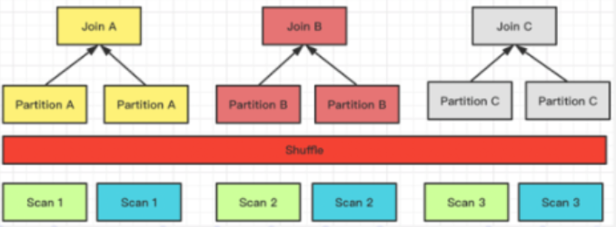
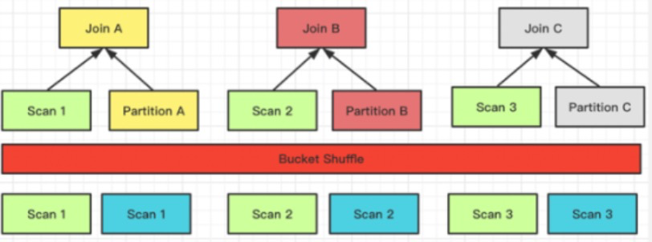
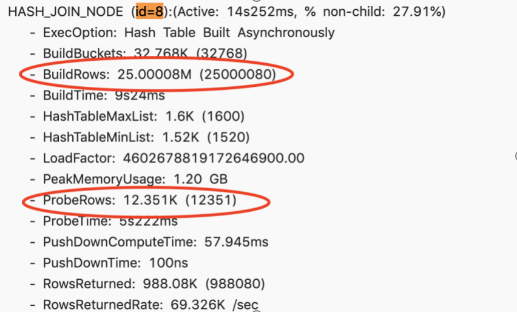
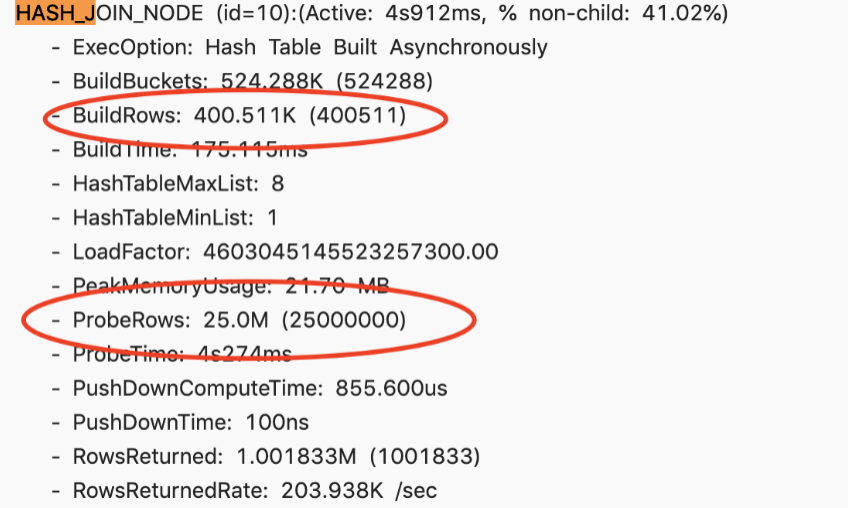

# 分布式JOIN

## Join 优化原理

在MPP分布式计算引擎中，JOIN计算是最复杂的。而分布式JOIN主要依赖中间计算阶段数据的shuffle。当前SelectDB支持 4 种 Shuffle 方式。在阐述每一种JOIN前，我们先假设我们有关系S和R进行JOIN，N 表示参与 Join 计算的节点的数量；T 则表示关系的 Tuple 数目。

1. Broadcast Join

   它要求把右表全量的数据都发送到左表上，即每一个参与 Join 的节点，它都拥有右表全量的数据，也就是 T(R)。

   它适用的场景是比较通用的，同时能够支持 Hash Join 和 Nest loop Join，它的网络开销 N * T(R)。

   

   左表数据不移动，右表数据发送到左表数据的扫描节点。

2. Shuffle Join

   当进行 Hash Join 时候，可以通过 Join 列计算对应的 Hash 值，并进行 Hash 分桶。

   它的网络开销则是：T（R） + T（N），但它只能支持 Hash Join，因为它是根据 Join 的条件也去做计算分桶的。


   

   左右表数据根据分区，计算的记过发送到不同的分区节点上。

3. Bucket Shuffle Join

   Doris 的表数据本身是通过 Hash 计算分桶的，所以就可以利用表本身的分桶列的性质来进行 Join 数据的 Shuffle。假如两张表需要做 Join，并且 Join 列是左表的分桶列，那么左表的数据其实可以不用去移动右表通过左表的数据分桶发送数据就可以完成  Join  的计算。

   它的网络开销则是：T（R）相当于只 Shuffle 右表的数据就可以了。

  


   左表数据不移动，右表数据根据分区计算的结果发送到左表扫表的节点

4. Colocate

   它与 Bucket Shuffle Join 相似，相当于在数据导入的时候，根据预设的 Join 列的场景已经做好了数据的 Shuffle。那么实际查询的时候就可以直接进行 Join 计算而不需要考虑数据的 Shuffle 问题了。

  

   数据已经预先分区，直接在本地进行 Join 计算

**四种 Shuffle 方式对比**

| Shuffle方式    | 网络开销    | 物理算子                   | 适用场景                                                     |
| -------------- | ----------- | -------------------------- | ------------------------------------------------------------ |
| BroadCast      | N * T(R)    | Hash Join / Nest Loop Join | 通用                                                         |
| Shuffle        | T(S) + T(R) | Hash Join                  | 通用                                                         |
| Bucket Shuffle | T(R)        | Hash Join                  | Join条件中存在左表的分布式列，且左表执行时为单分区           |
| Colocate       | 0           | Hash Join                  | Join条件中存在左表的分布式列，切左右表同属于一个Colocate Group |

N ： 参与 Join 计算的 Instance 个数

T(关系) : 关系的 Tuple 数目

上面这 4 种方式灵活度是从高到低的，它对这个数据分布的要求是越来越严格，但 Join 计算的性能也是越来越好的。

## Runtime Filter  Join 优化

SelectDB 在进行 Hash Join 计算时会在右表构建一个哈希表，左表流式的通过右表的哈希表从而得出 Join 结果。而 RuntimeFilter 就是充分利用了右表的 Hash 表，在右表生成哈希表的时，同时生成一个基于哈希表数据的一个过滤条件，然后下推到左表的数据扫描节点。通过这样的方式，SelectDB 可以在运行时进行数据过滤。

假如左表是一张大表，右表是一张小表，那么利用右表生成的过滤条件就可以把绝大多数在 Join 层要过滤的数据在数据读取时就提前过滤，这样就能大幅度的提升 Join 查询的性能。

当前 SelectDB 支持三种类型 RuntimeFilter

- 一种是 IN，很好理解，将一个 hashset 下推到数据扫描节点。
- 第二种就是 BloomFilter，就是利用哈希表的数据构造一个 BloomFilter，然后把这个 BloomFilter 下推到查询数据的扫描节点。。
- 最后一种就是 MinMax，就是个 Range 范围，通过右表数据确定 Range 范围之后，下推给数据扫描节点。

Runtime Filter 适用的场景有两个要求：

- 第一个要求就是左表大右表小，因为构建 Runtime Filter是需要承担计算成本的，包括一些内存的开销。
- 第二个要求就是左右表 Join 出来的结果很少，说明这个 Join 可以过滤掉左表的绝大部分数据。

当符合上面两个条件的情况下，开启 Runtime Filter 就能收获比较好的效果

当 Join 列为左表的 Key 列时，RuntimeFilter 会下推到存储引擎。Doris 本身支持延迟物化，

延迟物化简单来说是这样的：假如需要扫描 A、B、C 三列，在 A 列上有一个过滤条件: A 等于 2，要扫描 100 行的话，可以先把 A 列的 100 行扫描出来，再通过 A = 2 这个过滤条件过滤。之后通过过滤完成后的结果，再去读取 B、C 列，这样就能极大的降低数据的读取 IO。所以说 Runtime Filter 如果在 Key 列上生成，同时利用 SelectDB 本身的延迟物化来进一步提升查询的性能。

**Runtime Filter 类型**

SelectDB 提供了三种不同的 Runtime Filter 类型：

- **IN** 的优点就是效果过滤效果明显，且快速。它的缺点首先第一个它只适用于 BroadCast，第二，它右表超过一定数据量的时候就失效了，当前 Doris 目前配置的是1024，即右表如果大于 1024，IN 的 Runtime Filter 就直接失效了。
- **MinMax** 的优点是开销比较小。它的缺点就是对数值列还有比较好的效果，但对于非数值列，基本上就没什么效果。
- **Bloom Filter** 的特点就是通用，适用于各种类型、效果也比较好。缺点就是它的配置比较复杂并且计算较高。


## Join Reorder

数据库一旦涉及到多表 Join，Join 的顺序对整个 Join 查询的性能是影响很大的。假设有三张表 Join，参考下面这张图，左边是 a 表跟 b 张表先做 Join，中间结果的有 2000 行，然后与 c 表再进行 Join 计算。

接下来看右图，把 Join 的顺序调整了一下。把 a 表先与 c 表 Join，生成的中间结果只有 100，然后最终再与 b 表 Join 计算。最终的 Join 结果是一样的，但是它生成的中间结果有 20 倍的差距，这就会产生一个很大的性能 Diff 了。


SelectDB 目前支持基于规则的 Join Reorder 算法。它的逻辑是：

- 让大表、跟小表尽量做 Join，它生成的中间结果是尽可能小的。
- 把有条件的 Join 表往前放，也就是说尽量让有条件的 Join 表进行过滤
- Hash Join 的优先级高于 Nest Loop Join，因为 Hash join 本身是比 Nest Loop Join 快很多的。

##  Join 调优方法

Join 调优的方法：

- 利用 SelectDB 本身提供的 Profile，去定位查询的瓶颈。Profile 会记录 SelectDB 整个查询当中各种信息，这是进行性能调优的一手资料。。
- 了解 SelectDB 的 Join 机制，这也是第二部分跟大家分享的内容。知其然知其所以然、了解它的机制，才能分析它为什么比较慢。
- 利用 Session 变量去改变 Join 的一些行为，从而实现 Join 的调优。
- 查看 Query Plan 去分析这个调优是否生效。

上面的 4 步基本上完成了一个标准的 Join 调优流程，接着就是实际去查询验证它，看看效果到底怎么样。

如果前面 4 种方式串联起来之后，还是不奏效。这时候可能就需要去做 Join 语句的改写，或者是数据分布的调整、需要重新去 Recheck 整个数据分布是否合理，包括查询 Join 语句，可能需要做一些手动的调整。当然这种方式是心智成本是比较高的，也就是说要在尝试前面方式不奏效的情况下，才需要去做进一步的分析。

## 调优案例实战

### 案例一

一个四张表 Join 的查询，通过 Profile 的时候发现第二个 Join 耗时很高，耗时 14 秒。



进一步分析 Profile 之后，发现 BuildRows，就是右表的数据量是大概 2500 万。而 ProbeRows （ ProbeRows 是左表的数据量）只有 1 万多。这种场景下右表是远远大于左表，这显然是个不合理的情况。这显然说明 Join 的顺序出现了一些问题。这时候尝试改变 Session 变量，开启 Join Reorder。

```
set enable_cost_based_join_reorder = true
```

这次耗时从 14 秒降到了 4 秒，性能提升了 3 倍多。

此时再 Check Profile 的时候，左右表的顺序已经调整正确，即右表是大表，左表是小表。基于小表去构建哈希表，开销是很小的，这就是典型的一个利用 Join Reorder 去提升 Join 性能的一个场景



### 案例二

存在一个慢查询，查看 Profile 之后，整个 Join 节点耗时大概44秒。它的右表有 1000 万，左表有 6000 万，最终返回的结果也只有 6000 万。


这里可以大致的估算出过滤率是很高的，那为什么 Runtime Filter 没有生效呢？通过 Query Plan 去查看它，发现它只开启了 IN 的 Runtime Filter。


当右表超过1024行的话， IN 是不生效的，所以根本起不到什么过滤的效果，所以尝试调整 RuntimeFilter 的类型。

这里改为了 BloomFilter，左表的 6000 万条数据过滤了 5900 万条。基本上 99% 的数据都被过滤掉了，这个效果是很显著的。查询也从原来的 44 秒降到了 13 秒，性能提升了大概也是三倍多。

### 案例三

下面是一个比较极端的 Case，通过一些环境变量调优也没有办法解决，因为它涉及到 SQL Rewrite，所以这里列出来了原始的 SQL 。

```sql
select 100.00 * sum (case
        when P_type like 'PROMOS'
        then 1 extendedprice * (1 - 1 discount)
        else 0
        end ) / sum(1 extendedprice * (1 - 1 discount)) as promo revenue
from lineitem, part
where
    1_partkey = p_partkey
    and 1_shipdate >= date '1997-06-01'
    and 1 shipdate < date '1997-06-01' + interval '1' month
```

这个 Join 查询是很简单的，单纯的一个左右表的 Join 。当然它上面有一些过滤条件，打开 Profile 的时候，发现整个查询 Hash Join 执行了三分多钟，它是一个 BroadCast 的 Join，它的右表有 2 亿条，左表只有 70 万。在这种情况下选择了 Broadcast Join 是不合理的，这相当于要把 2 亿条做一个 Hash Table，然后用 70 万条遍历两亿条的 Hash Table ，这显然是不合理的。


为什么会产生不合理的 Join 顺序呢？其实这个左表是一个 10 亿条级别的大表，它上面加了两个过滤条件，加完这两个过滤条件之后， 10 亿条的数据就剩 70 万条了。但 Doris 目前没有一个好的统计信息收集的框架，所以它不知道这个过滤条件的过滤率到底怎么样。所以这个 Join 顺序安排的时候，就选择了错误的 Join 的左右表顺序，导致它的性能是极其低下的。

下图是改写完成之后的一个 SQL 语句，在 Join 后面添加了一个Join Hint，在Join 后面加一个方括号，然后把需要的 Join 方式写入。这里选择了 Shuffle Join，可以看到右边它实际查询计划里面看到这个数据确实是做了 Partition ，原先 3 分钟的耗时通过这样的改写完之后只剩下 7 秒，性能提升明显


## Join 调优建议

最后我们总结  Join 优化调优的四点建议：

- 第一点：在做 Join 的时候，要尽量选择同类型或者简单类型的列，同类型的话就减少它的数据 Cast，简单类型本身 Join 计算就很快。
- 第二点：尽量选择 Key 列进行 Join， 原因前面在 Runtime Filter 的时候也介绍了，Key 列在延迟物化上能起到一个比较好的效果。
- 第三点：大表之间的 Join ，尽量让它 Co-location ，因为大表之间的网络开销是很大的，如果需要去做 Shuffle 的话，代价是很高的。
- 第四点：合理的使用 Runtime Filter，它在 Join 过滤率高的场景下效果是非常显著的。但是它并不是万灵药，而是有一定副作用的，所以需要根据具体的 SQL 的粒度做开关。
- 最后：要涉及到多表 Join 的时候，需要去判断 Join 的合理性。尽量保证左表为大表，右表为小表，然后 Hash Join 会优于 Nest Loop Join。必要的时可以通过 SQL Rewrite，利用 Hint 去调整 Join 的顺序。


# Bucket Shuffle Join

Bucket Shuffle Join 是旨在为某些 Join 查询提供本地性优化，来减少数据在节点间的传输耗时，来加速查询。

## 名词解释

- 左表：Join查询时，左边的表。进行Probe操作。可被Join Reorder调整顺序。
- 右表：Join查询时，右边的表。进行Build操作。可被Join Reorder调整顺序。

## 原理

SelectDB支持的常规分布式Join方式包括了shuffle join 和broadcast join。这两种join都会导致不小的网络开销:

举个例子，当前存在A表与B表的Join查询，它的Join方式为HashJoin，不同Join类型的开销如下：

- **Broadcast Join**: 如果根据数据分布，查询规划出A表有3个执行的HashJoinNode，那么需要将B表全量的发送到3个HashJoinNode，那么它的网络开销是`3B`，它的内存开销也是`3B`。
- **Shuffle Join**: Shuffle Join会将A，B两张表的数据根据哈希计算分散到集群的节点之中，所以它的网络开销为 `A + B`，内存开销为`B`。

SelectDB保存了每个表的数据分布信息，如果join语句命中了表的数据分布列，我们应该使用数据分布信息来减少join语句的网络与内存开销，这就是Bucket Shuffle Join的思路来源。


上面的图片展示了Bucket Shuffle Join的工作原理。SQL语句为 A表 join B表，并且join的等值表达式命中了A的数据分布列。而Bucket Shuffle Join会根据A表的数据分布信息，将B表的数据发送到对应的A表的数据存储计算节点。Bucket Shuffle Join开销如下：

- 网络开销： `B < min(3B, A + B)`
- 内存开销： `B <= min(3B, B)`

可见，相比于Broadcast Join与Shuffle Join， Bucket Shuffle Join有着较为明显的性能优势。减少数据在节点间的传输耗时和Join时的内存开销。相对于Doris原有的Join方式，它有着下面的优点

- 首先，Bucket-Shuffle-Join降低了网络与内存开销，使一些Join查询具有了更好的性能。尤其是当FE能够执行左表的分区裁剪与桶裁剪时。
- 其次，同时与Colocate Join不同，它对于表的数据分布方式并没有侵入性，这对于用户来说是透明的。对于表的数据分布没有强制性的要求，不容易导致数据倾斜的问题。
- 最后，它可以为Join Reorder提供更多可能的优化空间。

## 使用方式

### 设置Session变量

将session变量`enable_bucket_shuffle_join`设置为`true`，则在进行查询规划时就会默认将能够转换为Bucket Shuffle Join的查询自动规划为Bucket Shuffle Join。

```sql
set enable_bucket_shuffle_join = true;
```

在进行分布式查询规划时，优先选择的顺序为 Colocate Join -> Bucket Shuffle Join -> Broadcast Join -> Shuffle Join。但是如果用户显式hint了Join的类型，如：

```sql
select * from test join [shuffle] baseall on test.k1 = baseall.k1;
```

则上述的选择优先顺序则不生效。

该session变量默认为`true`。

### 查看Join的类型

可以通过`explain`命令来查看Join是否为Bucket Shuffle Join：

```sql
|   2:HASH JOIN                                                           
|   |  join op: INNER JOIN (BUCKET_SHUFFLE)                               
|   |  hash predicates:                                                   
|   |  colocate: false, reason: table not in the same group               
|   |  equal join conjunct: `test`.`k1` = `baseall`.`k1`                                       
```

在Join类型之中会指明使用的Join方式为：`BUCKET_SHUFFLE`。

## Bucket Shuffle Join的规划规则

在绝大多数场景之中，用户只需要默认打开session变量的开关就可以透明的使用这种Join方式带来的性能提升，但是如果了解Bucket Shuffle Join的规划规则，可以帮助我们利用它写出更加高效的SQL。

- Bucket Shuffle Join只生效于Join条件为等值的场景，原因与Colocate Join类似，它们都依赖hash来计算确定的数据分布。
- 在等值Join条件之中包含两张表的分桶列，当左表的分桶列为等值的Join条件时，它有很大概率会被规划为Bucket Shuffle Join。
- 由于不同的数据类型的hash值计算结果不同，所以Bucket Shuffle Join要求左表的分桶列的类型与右表等值join列的类型需要保持一致，否则无法进行对应的规划。
- Bucket Shuffle Join只作用于Doris原生的OLAP表，对于ODBC，MySQL，ES等外表，当其作为左表时是无法规划生效的。
- 对于分区表，由于每一个分区的数据分布规则可能不同，所以Bucket Shuffle Join只能保证左表为单分区时生效。所以在SQL执行之中，需要尽量使用`where`条件使分区裁剪的策略能够生效。
- 假如左表为Colocate的表，那么它每个分区的数据分布规则是确定的，Bucket Shuffle Join能在Colocate表上表现更好。


# Colocation Join

Colocation Join 是旨在为某些 Join 查询提供本地性优化，来减少数据在节点间的传输耗时，加速查询。

Colocation Join 功能经过一次改版，设计和使用方式和最初设计稍有不同。本文档主要介绍 Colocation Join 的原理、实现、使用方式和注意事项。

## 名词解释

- Colocation Group（CG）：一个 CG 中会包含一张及以上的 Table。在同一个 Group 内的 Table 有着相同的 Colocation Group Schema，并且有着相同的数据分片分布。
- Colocation Group Schema（CGS）：用于描述一个 CG 中的 Table，和 Colocation 相关的通用 Schema 信息。包括分桶列类型，分桶数以及副本数等。

## 原理

Colocation Join 功能，是将一组拥有相同 CGS 的 Table 组成一个 CG。并保证这些 Table 对应的数据分片会落在同一个 BE 节点上。使得当 CG 内的表进行分桶列上的 Join 操作时，可以通过直接进行本地数据 Join，减少数据在节点间的传输耗时。

一个表的数据，最终会根据分桶列值 Hash、对桶数取模的后落在某一个分桶内。假设一个 Table 的分桶数为 8，则共有 `[0, 1, 2, 3, 4, 5, 6, 7]` 8 个分桶（Bucket），我们称这样一个序列为一个 `BucketsSequence`。每个 Bucket 内会有一个或多个数据分片（Tablet）。当表为单分区表时，一个 Bucket 内仅有一个 Tablet。如果是多分区表，则会有多个。

为了使得 Table 能够有相同的数据分布，同一 CG 内的 Table 必须保证以下属性相同：

1. 分桶列和分桶数

   分桶列，即在建表语句中 `DISTRIBUTED BY HASH(col1, col2, ...)` 中指定的列。分桶列决定了一张表的数据通过哪些列的值进行 Hash 划分到不同的 Tablet 中。同一 CG 内的 Table 必须保证分桶列的类型和数量完全一致，并且桶数一致，才能保证多张表的数据分片能够一一对应的进行分布控制。

2. 副本数

   同一个 CG 内所有表的所有分区（Partition）的副本数必须一致。如果不一致，可能出现某一个 Tablet 的某一个副本，在同一个 BE 上没有其他的表分片的副本对应。

同一个 CG 内的表，分区的个数、范围以及分区列的类型不要求一致。

在固定了分桶列和分桶数后，同一个 CG 内的表会拥有相同的 BucketsSequence。而副本数决定了每个分桶内的 Tablet 的多个副本，存放在哪些 BE 上。假设 BucketsSequence 为 `[0, 1, 2, 3, 4, 5, 6, 7]`，BE 节点有 `[A, B, C, D]` 4个。则一个可能的数据分布如下：

```text
+---+ +---+ +---+ +---+ +---+ +---+ +---+ +---+
| 0 | | 1 | | 2 | | 3 | | 4 | | 5 | | 6 | | 7 |
+---+ +---+ +---+ +---+ +---+ +---+ +---+ +---+
| A | | B | | C | | D | | A | | B | | C | | D |
|   | |   | |   | |   | |   | |   | |   | |   |
| B | | C | | D | | A | | B | | C | | D | | A |
|   | |   | |   | |   | |   | |   | |   | |   |
| C | | D | | A | | B | | C | | D | | A | | B |
+---+ +---+ +---+ +---+ +---+ +---+ +---+ +---+
```

CG 内所有表的数据都会按照上面的规则进行统一分布，这样就保证了，分桶列值相同的数据都在同一个 BE 节点上，可以进行本地数据 Join。

## 使用方式

### 建表

建表时，可以在 `PROPERTIES` 中指定属性 `"colocate_with" = "group_name"`，表示这个表是一个 Colocation Join 表，并且归属于一个指定的 Colocation Group。

示例：

```sql
CREATE TABLE tbl (k1 int, v1 int sum)
DISTRIBUTED BY HASH(k1)
BUCKETS 8
PROPERTIES(
    "colocate_with" = "group1"
);
```

如果指定的 Group 不存在，则 Doris 会自动创建一个只包含当前这张表的 Group。如果 Group 已存在，则 Doris 会检查当前表是否满足 Colocation Group Schema。如果满足，则会创建该表，并将该表加入 Group。同时，表会根据已存在的 Group 中的数据分布规则创建分片和副本。 Group 归属于一个 Database，Group 的名字在一个 Database 内唯一。在内部存储是 Group 的全名为 `dbId_groupName`，但用户只感知 groupName。

### 删表

当 Group 中最后一张表彻底删除后（彻底删除是指从回收站中删除。通常，一张表通过 `DROP TABLE` 命令删除后，会在回收站默认停留一天的时间后，再删除），该 Group 也会被自动删除。

### 查看 Group

以下命令可以查看集群内已存在的 Group 信息。

```sql
SHOW PROC '/colocation_group';

+-------------+--------------+--------------+------------+----------------+----------+----------+
| GroupId     | GroupName    | TableIds     | BucketsNum | ReplicationNum | DistCols | IsStable |
+-------------+--------------+--------------+------------+----------------+----------+----------+
| 10005.10008 | 10005_group1 | 10007, 10040 | 10         | 3              | int(11)  | true     |
+-------------+--------------+--------------+------------+----------------+----------+----------+
```

- GroupId： 一个 Group 的全集群唯一标识，前半部分为 db id，后半部分为 group id。
- GroupName： Group 的全名。
- TabletIds： 该 Group 包含的 Table 的 id 列表。
- BucketsNum： 分桶数。
- ReplicationNum： 副本数。
- DistCols： Distribution columns，即分桶列类型。
- IsStable： 该 Group 是否稳定（稳定的定义，见 `Colocation 副本均衡和修复` 一节）。

通过以下命令可以进一步查看一个 Group 的数据分布情况：

```sql
SHOW PROC '/colocation_group/10005.10008';

+-------------+---------------------+
| BucketIndex | BackendIds          |
+-------------+---------------------+
| 0           | 10004, 10002, 10001 |
| 1           | 10003, 10002, 10004 |
| 2           | 10002, 10004, 10001 |
| 3           | 10003, 10002, 10004 |
| 4           | 10002, 10004, 10003 |
| 5           | 10003, 10002, 10001 |
| 6           | 10003, 10004, 10001 |
| 7           | 10003, 10004, 10002 |
+-------------+---------------------+
```

- BucketIndex： 分桶序列的下标。
- BackendIds： 分桶中数据分片所在的 BE 节点 id 列表。

> 以上命令需要 ADMIN 权限。暂不支持普通用户查看。

### 修改表 Colocate Group 属性

可以对一个已经创建的表，修改其 Colocation Group 属性。示例：

```sql
ALTER TABLE tbl SET ("colocate_with" = "group2");
```

- 如果该表之前没有指定过 Group，则该命令检查 Schema，并将该表加入到该 Group（Group 不存在则会创建）。
- 如果该表之前有指定其他 Group，则该命令会先将该表从原有 Group 中移除，并加入新 Group（Group 不存在则会创建）。

也可以通过以下命令，删除一个表的 Colocation 属性：

```sql
ALTER TABLE tbl SET ("colocate_with" = "");
```

## 查询

对 Colocation 表的查询方式和普通表一样，用户无需感知 Colocation 属性。如果 Colocation 表所在的 Group 处于 Unstable 状态，将自动退化为普通 Join。

举例说明：

表1：

```sql
CREATE TABLE `tbl1` (
    `k1` date NOT NULL COMMENT "",
    `k2` int(11) NOT NULL COMMENT "",
    `v1` int(11) SUM NOT NULL COMMENT ""
) ENGINE=OLAP
AGGREGATE KEY(`k1`, `k2`)
PARTITION BY RANGE(`k1`)
(
    PARTITION p1 VALUES LESS THAN ('2019-05-31'),
    PARTITION p2 VALUES LESS THAN ('2019-06-30')
)
DISTRIBUTED BY HASH(`k2`) BUCKETS 8
PROPERTIES (
    "colocate_with" = "group1"
);
```

表2：

```sql
CREATE TABLE `tbl2` (
    `k1` datetime NOT NULL COMMENT "",
    `k2` int(11) NOT NULL COMMENT "",
    `v1` double SUM NOT NULL COMMENT ""
) ENGINE=OLAP
AGGREGATE KEY(`k1`, `k2`)
DISTRIBUTED BY HASH(`k2`) BUCKETS 8
PROPERTIES (
    "colocate_with" = "group1"
);
```

查看查询计划：

```sql
DESC SELECT * FROM tbl1 INNER JOIN tbl2 ON (tbl1.k2 = tbl2.k2);

+----------------------------------------------------+
| Explain String                                     |
+----------------------------------------------------+
| PLAN FRAGMENT 0                                    |
|  OUTPUT EXPRS:`tbl1`.`k1` |                        |
|   PARTITION: RANDOM                                |
|                                                    |
|   RESULT SINK                                      |
|                                                    |
|   2:HASH JOIN                                      |
|   |  join op: INNER JOIN                           |
|   |  hash predicates:                              |
|   |  colocate: true                                |
|   |    `tbl1`.`k2` = `tbl2`.`k2`                   |
|   |  tuple ids: 0 1                                |
|   |                                                |
|   |----1:OlapScanNode                              |
|   |       TABLE: tbl2                              |
|   |       PREAGGREGATION: OFF. Reason: null        |
|   |       partitions=0/1                           |
|   |       rollup: null                             |
|   |       buckets=0/0                              |
|   |       cardinality=-1                           |
|   |       avgRowSize=0.0                           |
|   |       numNodes=0                               |
|   |       tuple ids: 1                             |
|   |                                                |
|   0:OlapScanNode                                   |
|      TABLE: tbl1                                   |
|      PREAGGREGATION: OFF. Reason: No AggregateInfo |
|      partitions=0/2                                |
|      rollup: null                                  |
|      buckets=0/0                                   |
|      cardinality=-1                                |
|      avgRowSize=0.0                                |
|      numNodes=0                                    |
|      tuple ids: 0                                  |
+----------------------------------------------------+
```

如果 Colocation Join 生效，则 Hash Join 节点会显示 `colocate: true`。

如果没有生效，则查询计划如下：

```sql
+----------------------------------------------------+
| Explain String                                     |
+----------------------------------------------------+
| PLAN FRAGMENT 0                                    |
|  OUTPUT EXPRS:`tbl1`.`k1` |                        |
|   PARTITION: RANDOM                                |
|                                                    |
|   RESULT SINK                                      |
|                                                    |
|   2:HASH JOIN                                      |
|   |  join op: INNER JOIN (BROADCAST)               |
|   |  hash predicates:                              |
|   |  colocate: false, reason: group is not stable  |
|   |    `tbl1`.`k2` = `tbl2`.`k2`                   |
|   |  tuple ids: 0 1                                |
|   |                                                |
|   |----3:EXCHANGE                                  |
|   |       tuple ids: 1                             |
|   |                                                |
|   0:OlapScanNode                                   |
|      TABLE: tbl1                                   |
|      PREAGGREGATION: OFF. Reason: No AggregateInfo |
|      partitions=0/2                                |
|      rollup: null                                  |
|      buckets=0/0                                   |
|      cardinality=-1                                |
|      avgRowSize=0.0                                |
|      numNodes=0                                    |
|      tuple ids: 0                                  |
|                                                    |
| PLAN FRAGMENT 1                                    |
|  OUTPUT EXPRS:                                     |
|   PARTITION: RANDOM                                |
|                                                    |
|   STREAM DATA SINK                                 |
|     EXCHANGE ID: 03                                |
|     UNPARTITIONED                                  |
|                                                    |
|   1:OlapScanNode                                   |
|      TABLE: tbl2                                   |
|      PREAGGREGATION: OFF. Reason: null             |
|      partitions=0/1                                |
|      rollup: null                                  |
|      buckets=0/0                                   |
|      cardinality=-1                                |
|      avgRowSize=0.0                                |
|      numNodes=0                                    |
|      tuple ids: 1                                  |
+----------------------------------------------------+
```

HASH JOIN 节点会显示对应原因：`colocate: false, reason: group is not stable`。同时会有一个 EXCHANGE 节点生成。


# Runtime Filter

Runtime Filter 是旨在为某些 Join 查询在运行时动态生成过滤条件，来减少扫描的数据量，避免不必要的I/O和网络传输，从而加速查询。

## 名词解释

- 左表：Join查询时，左边的表。进行Probe操作。可被Join Reorder调整顺序。
- 右表：Join查询时，右边的表。进行Build操作。可被Join Reorder调整顺序。
- Fragment：FE会将具体的SQL语句的执行转化为对应的Fragment并下发到BE进行执行。BE上执行对应Fragment，并将结果汇聚返回给FE。
- Join on clause: `A join B on A.a=B.b`中的`A.a=B.b`，在查询规划时基于此生成join conjuncts，包含join Build和Probe使用的expr，其中Build expr在Runtime Filter中称为src expr，Probe expr在Runtime Filter中称为target expr。

## 原理

Runtime Filter在查询规划时生成，在HashJoinNode中构建，在ScanNode中应用。

举个例子，当前存在T1表与T2表的Join查询，它的Join方式为HashJoin，T1是一张事实表，数据行数为100000，T2是一张维度表，数据行数为2000，Doris join的实际情况是:

```text
|          >      HashJoinNode     <
|         |                         |
|         | 100000                  | 2000
|         |                         |
|   OlapScanNode              OlapScanNode
|         ^                         ^   
|         | 100000                  | 2000
|        T1                        T2
|
```

显而易见对T2扫描数据要远远快于T1，如果我们主动等待一段时间再扫描T1，等T2将扫描的数据记录交给HashJoinNode后，HashJoinNode根据T2的数据计算出一个过滤条件，比如T2数据的最大和最小值，或者构建一个Bloom Filter，接着将这个过滤条件发给等待扫描T1的ScanNode，后者应用这个过滤条件，将过滤后的数据交给HashJoinNode，从而减少probe hash table的次数和网络开销，这个过滤条件就是Runtime Filter，效果如下:

```text
|          >      HashJoinNode     <
|         |                         |
|         | 6000                    | 2000
|         |                         |
|   OlapScanNode              OlapScanNode
|         ^                         ^   
|         | 100000                  | 2000
|        T1                        T2
|
```

如果能将过滤条件（Runtime Filter）下推到存储引擎，则某些情况下可以利用索引来直接减少扫描的数据量，从而大大减少扫描耗时，效果如下:

```text
|          >      HashJoinNode     <
|         |                         |
|         | 6000                    | 2000
|         |                         |
|   OlapScanNode              OlapScanNode
|         ^                         ^   
|         | 6000                    | 2000
|        T1                        T2
|
```

可见，和谓词下推、分区裁剪不同，Runtime Filter是在运行时动态生成的过滤条件，即在查询运行时解析join on clause确定过滤表达式，并将表达式广播给正在读取左表的ScanNode，从而减少扫描的数据量，进而减少probe hash table的次数，避免不必要的I/O和网络传输。

Runtime Filter主要用于大表join小表的优化，如果左表的数据量太小，或者右表的数据量太大，则Runtime Filter可能不会取得预期效果。

## 使用方式

### Runtime Filter查询选项

与Runtime Filter相关的查询选项信息，请参阅以下部分:

- 第一个查询选项是调整使用的Runtime Filter类型，大多数情况下，您只需要调整这一个选项，其他选项保持默认即可。
  - `runtime_filter_type`: 包括Bloom Filter、MinMax Filter、IN predicate、IN Or Bloom Filter，默认会使用IN Or Bloom Filter，部分情况下同时使用Bloom Filter、MinMax Filter、IN predicate时性能更高。
- 其他查询选项通常仅在某些特定场景下，才需进一步调整以达到最优效果。通常只在性能测试后，针对资源密集型、运行耗时足够长且频率足够高的查询进行优化。
  - `runtime_filter_mode`: 用于调整Runtime Filter的下推策略，包括OFF、LOCAL、GLOBAL三种策略，默认设置为GLOBAL策略
  - `runtime_filter_wait_time_ms`: 左表的ScanNode等待每个Runtime Filter的时间，默认1000ms
  - `runtime_filters_max_num`: 每个查询可应用的Runtime Filter中Bloom Filter的最大数量，默认10
  - `runtime_bloom_filter_min_size`: Runtime Filter中Bloom Filter的最小长度，默认1048576（1M）
  - `runtime_bloom_filter_max_size`: Runtime Filter中Bloom Filter的最大长度，默认16777216（16M）
  - `runtime_bloom_filter_size`: Runtime Filter中Bloom Filter的默认长度，默认2097152（2M）
  - `runtime_filter_max_in_num`: 如果join右表数据行数大于这个值，我们将不生成IN predicate，默认1024

下面对查询选项做进一步说明。

#### 1.runtime_filter_type

使用的Runtime Filter类型。

**类型**: 数字(1, 2, 4, 8)或者相对应的助记符字符串(IN, BLOOM_FILTER, MIN_MAX, `IN_OR_BLOOM_FILTER`)，默认8(`IN_OR_BLOOM_FILTER`)，使用多个时用逗号分隔，注意需要加引号，或者将任意多个类型的数字相加，例如:

```sql
set runtime_filter_type="BLOOM_FILTER,IN,MIN_MAX";
```

等价于:

```sql
set runtime_filter_type=7;
```

**使用注意事项**

- **IN or Bloom Filter**: 根据右表在执行过程中的真实行数，由系统自动判断使用 IN predicate 还是 Bloom Filter
  - 默认在右表数据行数少于1024时会使用IN predicate（可通过session变量中的`runtime_filter_max_in_num`调整），否则使用Bloom filter。
- **Bloom Filter**: 有一定的误判率，导致过滤的数据比预期少一点，但不会导致最终结果不准确，在大部分情况下Bloom Filter都可以提升性能或对性能没有显著影响，但在部分情况下会导致性能降低。
  - Bloom Filter构建和应用的开销较高，所以当过滤率较低时，或者左表数据量较少时，Bloom Filter可能会导致性能降低。
  - 目前只有左表的Key列应用Bloom Filter才能下推到存储引擎，而测试结果显示Bloom Filter不下推到存储引擎时往往会导致性能降低。
  - 目前Bloom Filter仅在ScanNode上使用表达式过滤时有短路(short-circuit)逻辑，即当假阳性率过高时，不继续使用Bloom Filter，但当Bloom Filter下推到存储引擎后没有短路逻辑，所以当过滤率较低时可能导致性能降低。
- **MinMax Filter**: 包含最大值和最小值，从而过滤小于最小值和大于最大值的数据，MinMax Filter的过滤效果与join on clause中Key列的类型和左右表数据分布有关。
  - 当join on clause中Key列的类型为int/bigint/double等时，极端情况下，如果左右表的最大最小值相同则没有效果，反之右表最大值小于左表最小值，或右表最小值大于左表最大值，则效果最好。
  - 当join on clause中Key列的类型为varchar等时，应用MinMax Filter往往会导致性能降低。
- **IN predicate**: 根据join on clause中Key列在右表上的所有值构建IN predicate，使用构建的IN predicate在左表上过滤，相比Bloom Filter构建和应用的开销更低，在右表数据量较少时往往性能更高。
  - 默认只有右表数据行数少于1024才会下推（可通过session变量中的`runtime_filter_max_in_num`调整）。
  - 目前IN predicate已实现合并方法。
  - 当同时指定In predicate和其他filter，并且in的过滤数值没达到runtime_filter_max_in_num时，会尝试把其他filter去除掉。原因是In predicate是精确的过滤条件，即使没有其他filter也可以高效过滤，如果同时使用则其他filter会做无用功。目前仅在Runtime filter的生产者和消费者处于同一个fragment时才会有去除非in filter的逻辑。

#### 2.runtime_filter_mode

用于控制Runtime Filter在instance之间传输的范围。

**类型**: 数字(0, 1, 2)或者相对应的助记符字符串(OFF, LOCAL, GLOBAL)，默认2(GLOBAL)。

**使用注意事项**

LOCAL：相对保守，构建的Runtime Filter只能在同一个instance（查询执行的最小单元）上同一个Fragment中使用，即Runtime Filter生产者（构建Filter的HashJoinNode）和消费者（使用RuntimeFilter的ScanNode）在同一个Fragment，比如broadcast join的一般场景；

GLOBAL：相对激进，除满足LOCAL策略的场景外，还可以将Runtime Filter合并后通过网络传输到不同instance上的不同Fragment中使用，比如Runtime Filter生产者和消费者在不同Fragment，比如shuffle join。

大多数情况下GLOBAL策略可以在更广泛的场景对查询进行优化，但在有些shuffle join中生成和合并Runtime Filter的开销超过给查询带来的性能优势，可以考虑更改为LOCAL策略。

如果集群中涉及的join查询不会因为Runtime Filter而提高性能，您可以将设置更改为OFF，从而完全关闭该功能。

#### 3.runtime_filter_wait_time_ms

Runtime Filter的等待耗时。

**类型**: 整数，默认1000，单位ms

**使用注意事项**

在开启Runtime Filter后，左表的ScanNode会为每一个分配给自己的Runtime Filter等待一段时间再扫描数据，即如果ScanNode被分配了3个Runtime Filter，那么它最多会等待3000ms。

因为Runtime Filter的构建和合并均需要时间，ScanNode会尝试将等待时间内到达的Runtime Filter下推到存储引擎，如果超过等待时间后，ScanNode会使用已经到达的Runtime Filter直接开始扫描数据。

如果Runtime Filter在ScanNode开始扫描之后到达，则ScanNode不会将该Runtime Filter下推到存储引擎，而是对已经从存储引擎扫描上来的数据，在ScanNode上基于该Runtime Filter使用表达式过滤，之前已经扫描的数据则不会应用该Runtime Filter，这样得到的中间数据规模会大于最优解，但可以避免严重的裂化。

如果集群比较繁忙，并且集群上有许多资源密集型或长耗时的查询，可以考虑增加等待时间，以避免复杂查询错过优化机会。如果集群负载较轻，并且集群上有许多只需要几秒的小查询，可以考虑减少等待时间，以避免每个查询增加1s的延迟。

#### 4.runtime_filters_max_num

每个查询生成的Runtime Filter中Bloom Filter数量的上限。

**类型**: 整数，默认10

**使用注意事项** 目前仅对Bloom Filter的数量进行限制，因为相比MinMax Filter和IN predicate，Bloom Filter构建和应用的代价更高。

如果生成的Bloom Filter超过允许的最大数量，则保留选择性大的Bloom Filter，选择性大意味着预期可以过滤更多的行。这个设置可以防止Bloom Filter耗费过多的内存开销而导致潜在的问题。

```text
选择性=(HashJoinNode Cardinality / HashJoinNode left child Cardinality)
-- 因为目前FE拿到Cardinality不准，所以这里Bloom Filter计算的选择性与实际不准，因此最终可能只是随机保留了部分Bloom Filter。
```

仅在对涉及大表间join的某些长耗时查询进行调优时，才需要调整此查询选项。

#### 5.Bloom Filter长度相关参数

包括`runtime_bloom_filter_min_size`、`runtime_bloom_filter_max_size`、`runtime_bloom_filter_size`，用于确定Runtime Filter使用的Bloom Filter数据结构的大小（以字节为单位）。

**类型**: 整数

**使用注意事项** 因为需要保证每个HashJoinNode构建的Bloom Filter长度相同才能合并，所以目前在FE查询规划时计算Bloom Filter的长度。

如果能拿到join右表统计信息中的数据行数(Cardinality)，会尝试根据Cardinality估计Bloom Filter的最佳大小，并四舍五入到最接近的2的幂(以2为底的log值)。如果无法拿到右表的Cardinality，则会使用默认的Bloom Filter长度`runtime_bloom_filter_size`。`runtime_bloom_filter_min_size`和`runtime_bloom_filter_max_size`用于限制最终使用的Bloom Filter长度最小和最大值。

更大的Bloom Filter在处理高基数的输入集时更有效，但需要消耗更多的内存。假如查询中需要过滤高基数列（比如含有数百万个不同的取值），可以考虑增加`runtime_bloom_filter_size`的值进行一些基准测试，这有助于使Bloom Filter过滤的更加精准，从而获得预期的性能提升。

Bloom Filter的有效性取决于查询的数据分布，因此通常仅对一些特定查询额外调整其Bloom Filter长度，而不是全局修改，一般仅在对涉及大表间join的某些长耗时查询进行调优时，才需要调整此查询选项。

### 查看query生成的Runtime Filter

`explain`命令可以显示的查询计划中包括每个Fragment使用的join on clause信息，以及Fragment生成和使用Runtime Filter的注释，从而确认是否将Runtime Filter应用到了期望的join on clause上。

- 生成Runtime Filter的Fragment包含的注释例如`runtime filters: filter_id[type] <- table.column`。
- 使用Runtime Filter的Fragment包含的注释例如`runtime filters: filter_id[type] -> table.column`。

下面例子中的查询使用了一个ID为RF000的Runtime Filter。

```sql
CREATE TABLE test (t1 INT) DISTRIBUTED BY HASH (t1) BUCKETS 2 PROPERTIES("replication_num" = "1");
INSERT INTO test VALUES (1), (2), (3), (4);

CREATE TABLE test2 (t2 INT) DISTRIBUTED BY HASH (t2) BUCKETS 2 PROPERTIES("replication_num" = "1");
INSERT INTO test2 VALUES (3), (4), (5);

EXPLAIN SELECT t1 FROM test JOIN test2 where test.t1 = test2.t2;
+-------------------------------------------------------------------+
| Explain String                                                    |
+-------------------------------------------------------------------+
| PLAN FRAGMENT 0                                                   |
|  OUTPUT EXPRS:`t1`                                                |
|                                                                   |
|   4:EXCHANGE                                                      |
|                                                                   |
| PLAN FRAGMENT 1                                                   |
|  OUTPUT EXPRS:                                                    |
|   PARTITION: HASH_PARTITIONED: `default_cluster:ssb`.`test`.`t1`  |
|                                                                   |
|   2:HASH JOIN                                                     |
|   |  join op: INNER JOIN (BUCKET_SHUFFLE)                         |
|   |  equal join conjunct: `test`.`t1` = `test2`.`t2`              |
|   |  runtime filters: RF000[in] <- `test2`.`t2`                   |
|   |                                                               |
|   |----3:EXCHANGE                                                 |
|   |                                                               |
|   0:OlapScanNode                                                  |
|      TABLE: test                                                  |
|      runtime filters: RF000[in] -> `test`.`t1`                    |
|                                                                   |
| PLAN FRAGMENT 2                                                   |
|  OUTPUT EXPRS:                                                    |
|   PARTITION: HASH_PARTITIONED: `default_cluster:ssb`.`test2`.`t2` |
|                                                                   |
|   1:OlapScanNode                                                  |
|      TABLE: test2                                                 |
+-------------------------------------------------------------------+
-- 上面`runtime filters`的行显示了`PLAN FRAGMENT 1`的`2:HASH JOIN`生成了ID为RF000的IN predicate，
-- 其中`test2`.`t2`的key values仅在运行时可知，
-- 在`0:OlapScanNode`使用了该IN predicate用于在读取`test`.`t1`时过滤不必要的数据。

SELECT t1 FROM test JOIN test2 where test.t1 = test2.t2; 
-- 返回2行结果[3, 4];

-- 通过query的profile（set enable_profile=true;）可以查看查询内部工作的详细信息，
-- 包括每个Runtime Filter是否下推、等待耗时、以及OLAP_SCAN_NODE从prepare到接收到Runtime Filter的总时长。
RuntimeFilter:in:
    -  HasPushDownToEngine:  true
    -  AWaitTimeCost:  0ns
    -  EffectTimeCost:  2.76ms

-- 此外，在profile的OLAP_SCAN_NODE中还可以查看Runtime Filter下推后的过滤效果和耗时。
    -  RowsVectorPredFiltered:  9.320008M  (9320008)
    -  VectorPredEvalTime:  364.39ms
```

## Runtime Filter的规划规则

1. 只支持对join on clause中的等值条件生成Runtime Filter，不包括Null-safe条件，因为其可能会过滤掉join左表的null值。
2. 不支持将Runtime Filter下推到left outer、full outer、anti join的左表；
3. 不支持src expr或target expr是常量；
4. 不支持src expr和target expr相等；
5. 不支持src expr的类型等于`HLL`或者`BITMAP`；
6. 目前仅支持将Runtime Filter下推给OlapScanNode；
7. 不支持target expr包含NULL-checking表达式，比如`COALESCE/IFNULL/CASE`，因为当outer join上层其他join的join on clause包含NULL-checking表达式并生成Runtime Filter时，将这个Runtime Filter下推到outer join的左表时可能导致结果不正确；
8. 不支持target expr中的列（slot）无法在原始表中找到某个等价列；
9. 不支持列传导，这包含两种情况：
   - 一是例如join on clause包含A.k = B.k and B.k = C.k时，目前C.k只可以下推给B.k，而不可以下推给A.k；
   - 二是例如join on clause包含A.a + B.b = C.c，如果A.a可以列传导到B.a，即A.a和B.a是等价的列，那么可以用B.a替换A.a，然后可以尝试将Runtime Filter下推给B（如果A.a和B.a不是等价列，则不能下推给B，因为target expr必须与唯一一个join左表绑定）；
10. Target expr和src expr的类型必须相等，因为Bloom Filter基于hash，若类型不等则会尝试将target expr的类型转换为src expr的类型；
11. 不支持`PlanNode.Conjuncts`生成的Runtime Filter下推，与HashJoinNode的`eqJoinConjuncts`和`otherJoinConjuncts`不同，`PlanNode.Conjuncts`生成的Runtime Filter在测试中发现可能会导致错误的结果，例如`IN`子查询转换为join时，自动生成的join on clause将保存在`PlanNode.Conjuncts`中，此时应用Runtime Filter可能会导致结果缺少一些行。
