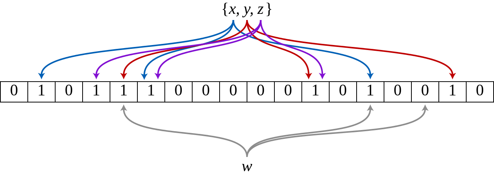

# Table Index

Indexes are used to help filter or find data quickly. Currently, two types of indexes are mainly supported:

- Built-in  index, including ZoneMap index and prefix index.
- User-created secondary indexes, including BloomFilter indexes and Bitmap inverted indexes.

## ZoneMap index

The ZoneMap index is the index information that is automatically maintained for each column in the column storage format, including Min/Max, the number of Null values, and so on. This indexing is transparent to the user.

## Prefix index

SelectDB data is stored in a data structure similar to SSTable (Sorted String Table). This structure is an ordered data structure, which can be sorted and stored according to the specified column. On this kind of data structure, it will be very efficient to use the sorting column as the condition to search.

In Aggregate, Unique and Duplicate three table engines. The underlying data storage is sorted and stored according to the columns specified in AGGREGATE KEY, UNIQUE KEY, and DUPLICATE KEY in the respective table creation statements.

The prefix index, on the basis of sorting, implements an index method for quickly querying data according to a given prefix column.

### Example

We use the first **36 bytes** of a row of data as the prefix index of this row of data. When encountering the VARCHAR type, the prefix index will be truncated directly. Let us illustrate with an example:

1. The prefix index of the following table structure is user_id(8 Bytes) + age(4 Bytes) + message(prefix 20 Bytes).

   | ColumnName     | Type         |
   | -------------- | ------------ |
   | user_id        | BIGINT       |
   | age            | INT          |
   | message        | VARCHAR(100) |
   | max_dwell_time | DATETIME     |
   | min_dwell_time | DATETIME     |

2. The prefix index of the following table structure is user_name (20 Bytes). Even if it does not reach 36 bytes, it will be truncated directly because it encounters VARCHAR, and will not continue further.

   | ColumnName     | Type         |
   | -------------- | ------------ |
   | user_name      | VARCHAR(20)  |
   | age            | INT          |
   | message        | VARCHAR(100) |
   | max_dwell_time | DATETIME     |
   | min_dwell_time | DATETIME     |

When our query condition is **the prefix of the prefix index** , the query speed can be greatly accelerated. For example, in the first example, we execute the following query:

```sql
SELECT * FROM table WHERE user_id=1829239 and age=20；
```

This query will be much more efficient **than** the following query:

```sql
SELECT * FROM table WHERE age=20；
```

Therefore, when building **a table, choosing the correct column order can greatly improve query efficiency** .

### Adjust prefix index using rollup

Because the column order has been specified when the table is created, there is only one prefix index for a table. For queries that use other columns that cannot hit the prefix index as conditions, the efficiency may not meet the requirements. Therefore, we can artificially adjust the column order by creating ROLLUP.

## BloomFilter index

BloomFilter is a fast lookup algorithm for multi-hash function mapping proposed by Bloom in 1970. It is usually used in situations where it is necessary to quickly determine whether an element belongs to a collection, but it is not strictly required to be 100% correct. BloomFilter has the following characteristics:

- A space-efficient probabilistic data structure for checking whether an element is in a set.
- For a call to detect the existence of an element, BloomFilter will tell the caller one of two results: it may exist or it must not exist.
- The disadvantage is that there is a misjudgment, telling you that it may exist, but it may not necessarily exist.

The Bloom filter is actually composed of a very long binary bit array and a series of hash functions. The binary bit array is initially all 0. When an element to be queried is given, the element will be calculated and mapped to a series of values by a series of hash functions, and all values are treated as 1 at the offset of the bit array.

The figure below shows an example of Bloom Filter with m=18, k=3 (m is the size of the Bit array, k is the number of Hash functions). The three elements x, y, z in the set are hashed into bit arrays by 3 different hash functions. When querying element w, w is not in the set because one bit is 0 after calculation by the Hash function.



So how to judge whether an element is in the collection? Also, all the offset positions of this element are obtained after the hash function is calculated. If these positions are all 1, it is judged that this element is in this set. If one of them is not 1, it is judged that this element is not in this set.

### Create a BloomFilter index

BloomFilter is essentially a bitmap structure used to quickly determine whether a given value is in a set. This kind of judgment will produce a small probability of misjudgment. That is, if it returns false, it must not be in this collection. And if the scope is true, it is possible to be in this collection.

BloomFilter indexes are also created at the granularity of Block. In each block, the value of the specified column is used as a set to generate a BloomFilter index entry, which is used to quickly filter data that does not meet the conditions during the query.

The BloomFilter index of SelectDB can be specified when creating the table, or completed through the ALTER operation of the table.

The BloomFilter index is created by adding "bloom_filter_columns"="k1, k2, k3" to the PROPERTIES of the table creation statement. For this property, k1, k2, and k3 are the Key column names of the BloomFilter index you want to create. For example, we set the The saleser_id and category_id in the table create a BloomFilter index.

```sql
CREATE TABLE IF NOT EXISTS sale_detail_bloom  (
    sale_date date NOT NULL,
    customer_id int NOT NULL,
    saler_id int NOT NULL,
    sku_id int NOT NULL,
    category_id int NOT NULL,
    sale_count int NOT NULL,
    sale_price DECIMAL(12,2) NOT NULL,
    sale_amt DECIMAL(20,2)
)
Duplicate  KEY(sale_date, customer_id,saler_id,sku_id,category_id)
PROPERTIES (
"bloom_filter_columns"="saler_id,category_id",
);
```


### View BloomFilter index

To view the BloomFilter index we created on the table is to use:

```sql
SHOW CREATE TABLE <table_name>;
```

### Delete BloomFilter index

To delete an index is to remove the index column from the bloom_filter_columns property:

```sql
ALTER TABLE <db.table_name> SET ("bloom_filter_columns" = "");
```

### Modify BloomFilter index

To modify the index is to modify the bloom_filter_columns attribute of the table:

```sql
ALTER TABLE <db.table_name> SET ("bloom_filter_columns" = "k1,k3");
```

### BloomFilter use cases

You can consider building a Bloom Filter index on a column when the following conditions are met:

1. First BloomFilter applies to non-prefix filtering.
2. The query will be frequently filtered according to this column, and most of the query conditions are in and = filtering.
3. Unlike Bitmap, BloomFilter works on high cardinality columns. Such as UserID. Because if it is created on a low-cardinality column, such as the "gender" column, each block will contain almost all values, making the BloomFilter index meaningless.

### Notices for using BloomFilter

1. Bloom filter indexes are not supported for columns of Tinyint, Float, and Double types.
2. The Bloom Filter index only accelerates the in and = filter queries.
3. If you want to check whether a query hits the Bloom Filter index, you can check the profile information of the query.

## Bitmap index

bitmap index, bitmap index, is a fast data structure that can speed up queries. Here mainly introduces how to create an index job, as well as some precautions and common problems when creating an index.

### create index

For example, create a bitmap index for the siteid column on table1

```sql
CREATE INDEX [IF NOT EXISTS] index_name ON table1 (siteid) USING BITMAP;
```

### view index

Display the lower index of the specified table_name

```sql
SHOW INDEX FROM example_db.table_name;
```

### delete index

Delete the lower index of the specified table_name

```sql
DROP INDEX [IF EXISTS] index_name ON [db_name.]table_name;
```

### Notices

- Bitmap indexes are only created on a single column.
- Bitmap indexes can be applied to all columns `Duplicate`of the `Uniq` data `Aggregate`model key columns of the model.
- The data types supported by bitmap index are as follows:
  - `TINYINT`
  - `SMALLINT`
  - `INT`
  - `BIGINT`
  - `CHAR`
  - `VARCHAR`
  - `DATE`
  - `DATETIME`
  - `LARGEINT`
  - `DECIMAL`
  - `BOOL`
